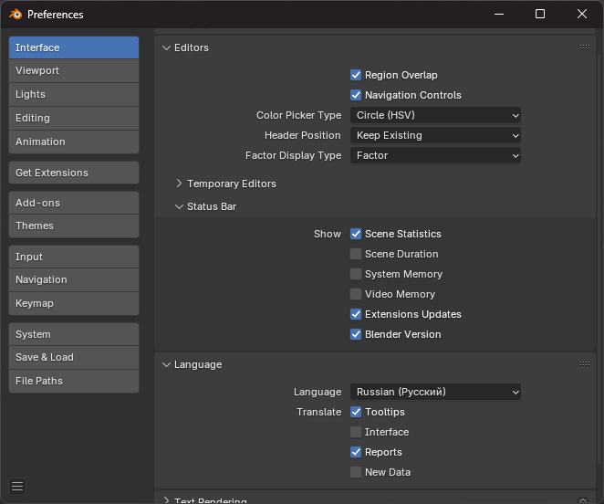
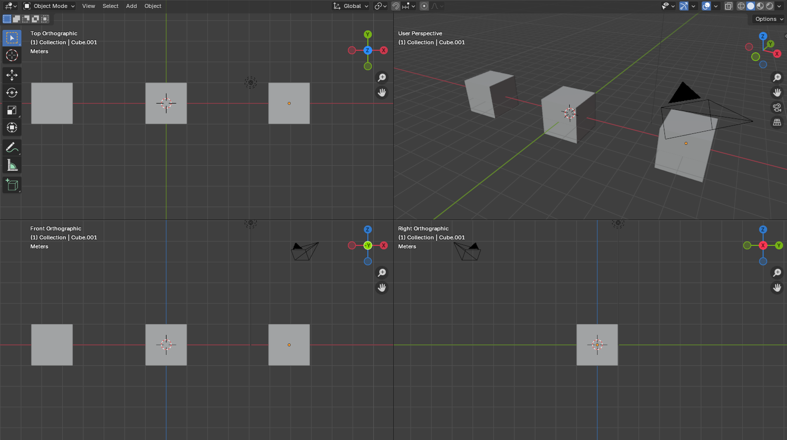

# Основы работы во Viewport

## Обзор Blender UI

* Окно splashcreen (открыть его обратно можно нажав на иконку слева от File)
* Edit / Preferences / Interface
    - Включить в Editors / Status Bar: Screne statistics
    - Включить русский язык для подсказок (для интерфейса не включать!)
* Дополнительно:
    - В System / Memory & Limits можно увеличить глубину сохраняемой истории действий
    - В Cycles Render Devices можно указать видеокарту для рендера

> **⚠️ Настройки не сохраняются пока не закроется Blender**
> 
> Если Blender вылетет, настройки не сохранятся. Для сохранения настроек нужно в левом нижем углу в окне Preferences открыть меню и нажать Save Preferences.

Основные окна (в стандартном Layout):
* Меню
* Viewport - просмотр сцены, работа с 3D моделями
* Outliner - обхор графа сцены
* Properities - правка свойств сцены или активного объекта
* Timeline - временная шкала для управления анимацией и т.п.

Все окна в Blender маштабируются и могут быть перемещены, закрыты, дублированы, изменены.

> ℹ️ Любое окно в Blender можно увеличить используя `Ctrl + Spacebar`. Повторное использование отключит увеличение окна. Увеличится то окно, над которым был курсор в момент использования хоткея.

### Создание нового файла

Файл создается в меню File / New. Есть определенные прессеты. Выбирать лучше всего General. Стандартная сцена с кубом, камерой и светом может быть изменена.

Хоткеи:
* `Ctrl + N`

---

## Основы 3D Viewport

### Управление камерой

* Вращение работает на `СКМ`
* Перемещение в плоскости камеры - `Shift + СКМ`
* Маштабирование (приближение) - Колесо мыши или `Ctrl + СКМ`
* Режим полета - `Shift + ~`
    - Отменить пермещение - `ESC`
    - Зафиксировать перемещение - `Enter`
    - Ускорение - `Shift`
    - Управление скоростью - Колесо мыши
    - Вверх / Вниз - `E` / `Q`

### Gizmo

> ⚠️ В случае отсуствия Gizmo проверить `Ctrl + ~`

---

## Создание объектов

Добавление новых объектов через меню Add.

Хоткеи:
* `Shift + A`

---

## Базовое редактирование параметров объекта (Position, Scale)

### Сайдбар

Изменение параметров объекта через Sidebar

Открыть Sidebar можно нажав на < около Gizmo. Для закрытия потянуть границу Sidebar до правого края окна. Лучше всего открывать Sidebar через хоткей.

Хоткеи:
* `N` - открыть Sidebar

### Редактор свойств объекта
*(GIF: Работа с Editor Properties)*

---

## Объекты в сцене (Outliner)

### Скрытие объектов

Хоткеи:
* `H` - скрыть объект
* `Shift + H` - скрыть все объекты
* `Alt + H` - показать все скрытые объекты (снять скрытие со всех)

---

## Удаление объектов

Хоткеи:
* `X` - удалить объект

---

## Отмена и восстановление изменений

Хоткеи:
* `Ctrl + Z` - отменить последнее действие
* `Ctrl + Shift + Z` - вернуть последнее отмененное действие

---

## Создание примитивов и управление параметрами примитивов при их создании

Настройка параметров примитивов при создании

Изменить данные параметры после их применения (любое действие автоматически применяет параметры) - нельзя. Только заново создавать объект. При этом сохраняются последние настройки. По ПКС + Reset All to Default Values можно сбросить параметры до стандартных.

---

## Работа с базовыми инструментами

### Перемещение

Хоткеи:
* `G` - переместить объект

### Масштабирование

Хоткеи:
* `S` - маштабировать объект

### Вращение

Хоткеи:
* `R` - вращать объект (по-умолчанию в плоскости камеры)
* `R / R` - свободное вращение объекта 

---

## Базовые принципы работы инструментов

### Фиксация и отмена изменений

В Blender при использовании инструмента если нажать `ESC` - дейтсвие будет отменено (произойдет откат). Если нажать `Enter` - изменение зафиксируется. Это справедливо для большинства инструментов в Blender. Во многих случаях (для Move, Scale, Rotate) достаточно нажать `ЛКМ`.

### Редактирование параметров изменения

После применения инструмента, можно отредактировать его параметры (на сколько переместить, угол поворота и прочее). Это справедливо для всех инструментов в Blender.

---

## Работа с осями

### По одной оси (X, Y, Z)

Хоткеи:
* `X`, `Y`, `Z` - по соотвествушим осям после начала применения инструмента

### В плоскости

Хоткеи:
* `Shift + X`, `Shift + Y`, `Shift + Z` - по соотвествушим плоскостям после начала применения инструмента

---

## Боковая панель инструментов

### Выделение и его виды

Различные типы выделения:

* Tweak - выделить и перенести
* Select Box - выделение прямоугольником
* Select Circle - выделение окружностью
    - Радиус увеличивается ползунком, который появляется после выбора инструмента
    - При нажитии `C` можно временно увеличить радиус (используя колесо мыши)
* Select Lasso - выделение с помощью обводки

### Курсор

#### Принципы работы с курсором

3D курсор используется для:

* Определения местоположения размещения новых объектов
* Для ручного позиционирования и ориентации гизмо трансформацией (т.е. центра трансформации и ориентации трансформации)
* Для перемещения origin точки объекта

У курсора есть как местоположение, так и вращение.

#### Быстрая установка курсора на объектах

Быстро в ручную установить курсор можно с помощью `Shift + ПКМ`.

Есть и другие способы, расположенные в выпадающем меню `Shift + S`.

В сайдбаре во вкладке Tool (или в левом верхнем углу Viewport) есть настройки для инструмента Cursor. Можно определить ориентацию (поворот) у устанавливаемого курсора. Настройки не будут распространятся на быстрое использование `Shift + ПКМ`.

Управлять курсором напрямую можно через настройки в Sidebar:

#### Сброс курсора

Быстро разместить курсор в точку (0; 0; 0) можно используя пункт Cursor to World Origin в выпадающем меню `Shift + S`.

### Классические инструменты с Gizmo

Стандартные инструменты:
* Перемещение
* Масштабирование
* Вращение

Дополнительно хоткеи:
* `Ctrl` - для пошагового изменения
* `Shift` - для более точного изменения

> ⚠️ Лучше не пользоваться без особой необходимости этими интсрументами. Стандарные `G`, `R`, `S` вызывать быстрее.

Для быстрого переключения между инструментами можно воспользоваться `Shift + Spacebar`.

#### Трансформация (мультитул)

Данный инструмент позволяет одновременно изменять положение, вращение и размеры объекта.

### Аннотация

#### Рисование аннотаций

Помимо выбора инструмента, самый быстрый способ рисовать аннотации - зажать `D + ЛКМ`. Аннотации рисуются в плоскости камеры Viewport, при этом плоскость проходит через 3D Cursor (по умолчанию). Данное поведение настраивается в инструменте Annotation.

#### Удаление аннотаций

`D + ПКМ` позволяет стирать аннотации. В самом инструменте Annotation для стирания нужно зажать `Ctrl`.

Удалить все аннотации разом - не совсем легко и просто:
* Нужно в Sidebar во вкладке View открыть раздел Annotations
* Удалить слой Note или скрыть его
* После этого можно создать новый слой или просто воспользоваться инструментом снова - слой автоматически будет создан

### Инструмент интерактивного измерения расстояний и углов

* `Ctrl` позволяет прилипать к ребрам и точкам
* Повторное назадние на линейку позволяет сделать ломаную линию и измерить угол

Удаляются линейки через `X` или откат. Все линейки удаляются аналогично аннотациям, но есть баги (актуально для 4.3.2):

* После удаления линейки могут не пропасть, тогда нужно переключить инструмент
* После добавления новых линеек, слой для аннотаций с линейками может не появится в Sidebar / View. Для этого надо переключить вкладку (не обновляется состояние сразу)

### Инструмент интерактивного создания куба

Создание куба через интерактивный инструмент:

---

## Выделение объектов

### Выделение всех объектов

Хоткеи:
* `A` - выделить все объекты

### Инвертирование выделения

Хоткеи:
* `Ctrl + I` - полностью инвертировать выделение
* Зажатый `Ctrl` при использовании, например, Select Box

### Выделение нескольких объектов

Хоткеи:
* `Shift` - для выделения нескольких объектов

---

## Параметры 3D Viewport

### Изменение вида на Top, Right, Front и т.д.

При переключении вида может применятся Numpad. Хоткеи совпадают с Maya и 3Ds Max. Автор данного курса активно хейтит Numpad и использует TKL клавиатуры, поэтому информация как использовать Numpad в курсе отсутсвует.

Для переключения видов воспользуйтесь `~` (тильда). При зажиме клавиши раскроется меню со всеми доступными видами, а так же возможностью быстро указать центр вращения камеры.

Альтернативный вариант: использование Gizmo в правом верхнем углу (нажание на X / Y / Z переключит виды)

### Quad View

Хоткеи:
* `Ctrl + Alt + Q` - переключение в Quad View

### Центрирование вида на выделенном объекте

* Можно воспользовться `~` / View Selected
* `Alt + СКМ` - переключит вид на место клика

### Перспективный и ортографический вид

* Переключить вид можно в меню View / Perspective/Ortographic 
* Использовать кнопку во Viewport с права под Gizmo (четвертая кнопка)
* `Numpad 5`

Ортографический вид автоматически применяется для Top / Bottom / Front и т.п.

### Переключение режимов отображения

#### Wireframe

Позволяет видеть ребра и точки. В данном режиме можно выделать сквозь объекты.

#### Solid

Стандартный вид, не отображающий материалы

#### Local View

* Использование `/` позволяет быстро скрыть все объекты, кроме выделенных
* Повторное использование `/` отключает данный режим
* `Alt + /` в данном режиме позволяет удалить (скрыть) объект (который, например, был случайно выделен)

---

## Переименование объектов

* Объекты можно переименовать используя `F2`.
* + см переименования в Outliner

---

## Создание связей между объектами, иерархия

### Назначение родителя объекту (+ показать в параметрах)
*(GIF: Назначение родителя через Ctrl + P)*

* `Ctrl + P` - назначение родителя через 
* Properities / Object / Relation / Parent

Keep Transform позволяет сохранить трансформации при изменении родителя. Ниже представлен небольшой эксперимент-демонстрация:

### Удаление родителя (+ показать в параметрах)

* Properities / Object / Relation / Parent
* `Alt + P` - удаление родителя

---

## Коллекция объектов

Коллекции позволяют организовывать сцену. С помощью коллекций можно быстро скрывать группу объектов, или экспортировать только необходимое.

Объекты могут принадлежать нескольким коллекциям одновременно.

### Создание коллекции

* Коллекцию можно создать в Outliner
* `Ctrl + G` создает коллекцию, НО ОНА НЕ БУДЕТ СВЯЗАНА С АКТИВНОЙ СЦЕНОЙ (желательно не показывать / не использовать)

### Добавление в коллекцию (+ показать в параметрах)

* `M` - перемещение объекта в коллекцию
* `Shift + M` - привязка объекта к коллекции
* Properities / Object / Collections
* `Ctrl + Alt + G` - удаление из коллекции

### Управление (скрытие, маркировка цветом, переименование) коллекций

* Цвет можно указать в Outliner при нажатии на иконку коллекции
* Скрыть коллекцию можно в Outliner
* Переименование доступно в Outliner при нажатии `F2` 

---

## Настройка отображения объекта

### Включение отображения имени, осей, сети и прочего

Properities / Object / Viewport Display

Раздел Show позволяет включить отображение разных полезных вещей, например подпись названия объекта.

В Display As можно переопределить режим отображения объекта (то, что меняется в `Z` для всех)

### Изменение отображаемого цвета

Properities / Object / Viewport Display

Color позволяет определить цвет объекта.

> ⚠️ Это просто цвет для режима Solid. Его не будет видно на рендере или при экспорте

Режим Solid не показывает цвет материала. Указания Color в данном случае не влияет на материал объекта.

---

## Инструменты Snapping (привязки)

Инструменты привязки расположены сверху по центру Viewport.

Хоткеи:
* `Ctrl + Shift + Tab` - открыть меню настройки привязок
* `Shift + Tab` - включение или выключение привязок

### Привязка по шагам (сетки)

### Привязка по вершинам

### Переключение режима привязки

Хоткеи:
* `Ctrl + Shift + Tab` - открыть меню настройки привязок
* `Shift + Tab` - включение или выключение привязок

