# Редактирование меша

## Вход в режим редактирования меша (Edit Mode)

Хоткеи:
* `TAB`

## Переключение элементов редактирования

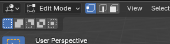

Можно выбирать в меню, либо используя клавиши:

* `1` - Vertex (вершины)
* `2` - Edge (ребра)
* `3` - Face (грани)

## Основы режима редактирования (Edit Mode)

В 3D моделировании меш состоит из:

* Вершин (Vertices) - точки в пространстве.
* Ребер (Edges) - линии, соединяющие вершины.
* Граней (Faces) - плоских поверхностей, ограниченных ребрами.

### Vertex (вершины)

#### Перемещение вершин вдоль ребер

* Выделить вершину
* `G + G`
* Движение по ребру

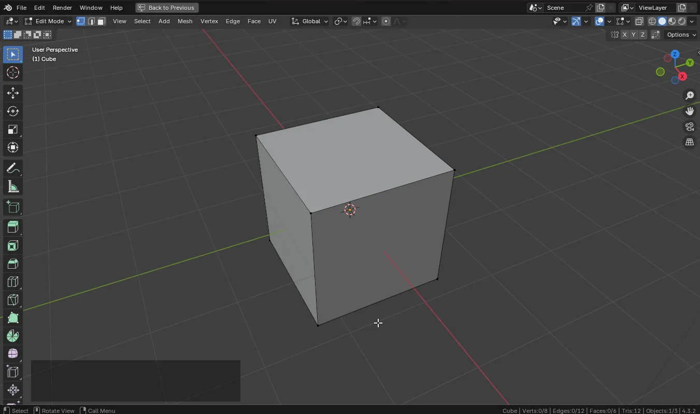

#### Создание новых ребер между вершинами

* Выделить две вершины
* `F`

> ⚠️ Это не создает грани. Полученное ребро не будет частью грани
>
> Пример ниже: ребро между двумя точками. После того, как мы опустили две другие точки - оказалось что ребро не принадлежит грани
>
> 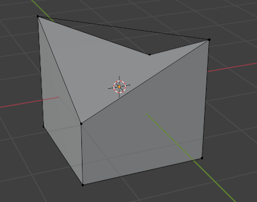

Используйте `J` для создания пути из ребер от точки до точки. Это создаст так же и новые грани.

#### Создание новых произвольных ребер

* Выделить вершину
* `E` - создаст вершину и ребро
* Переместить курсор / Разместить вершину

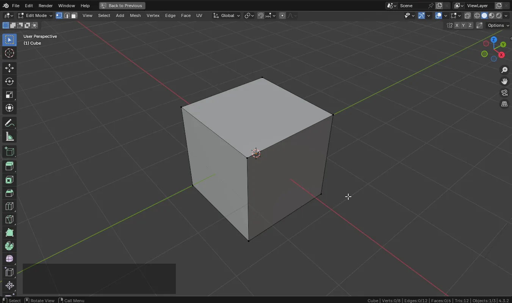

Альтернативный вариант:

* `Ctrl + ПКМ` позволяет создать произвольную вершину в любом месте
* `Ctrl + ПКМ` создает ребро между выделенной вершинной и новой вершиной, которая будет создана в месте клика

#### Присоединение (слияние) точек

* Выделить несколько вершин
* `M`
* Выбрать из меню подходящий вариант

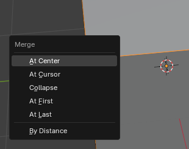

* At Center - объединяет все выделенные вершины в одну, расположенную в центре
* At Cursor - перемещает и объединяет вершины в точке 3D-курсора
* Collapse - объединяет вершины внутри выделенной группы (используется для нескольких кластеров вершин)
* At First - объединяет все вершины в первую выделенную

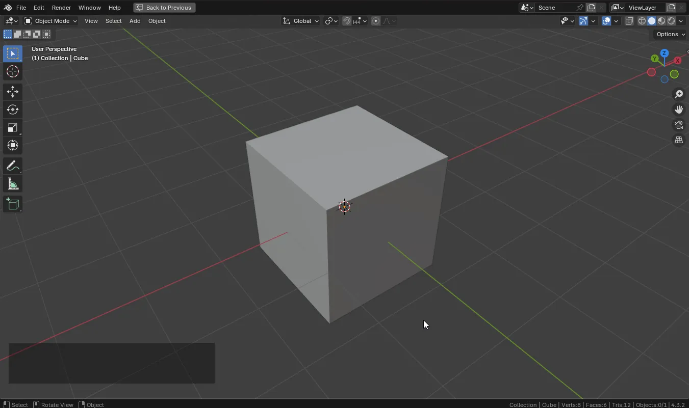

#### Удаление точек

* Выделить вершину / вершины
* `X`

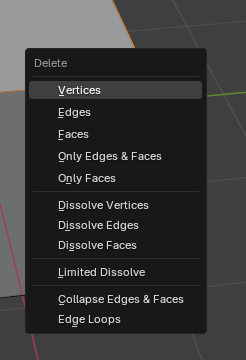

* Vertices - полностью удаляет вершины и все связанные с ними ребра и грани
* Dissolve Vertices - удаляет вершины, сохраняя геометрию (если возможно)
* Limited Dissolve - удаляет избыточные вершины, упрощая геометрию
* Collapse Edges & Faces - схлопывает вершины, сохраняя контур
* Edge Loops - удаляет замкнутые петли вершин без нарушения структур

### Edge (ребра)

#### Экструзия ребра

* Выделить ребро
* `E`
* Переместить новое ребро

Между ребрами будет создаваться грань

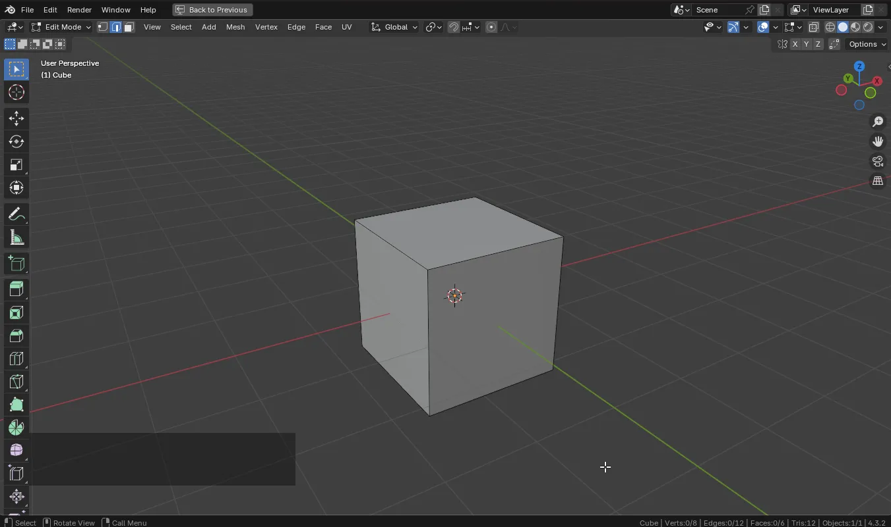

#### Создание фаски ребра

* Выделить ребро
* `Ctrl + B`
* Переместить
* `Enter` - зафиксировать

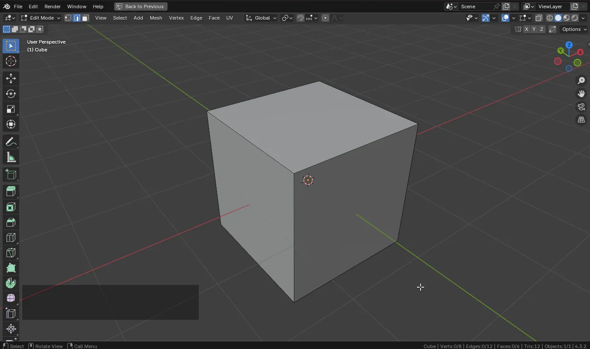

Колесом мыши можно настроить количество сегментов

#### Разрез петлей (Loop cut)

* `Ctrl + R`
* Навести на меш (ребра)
* `ЛКМ`
* Переместить
* `Enter` (или `ЛКМ`) - зафиксировать

Колесом мыши можно управлять количеством разрезов

Нажатие `ESC`, после начала операции, позволяет сделать разрез ровно по центру

#### Быстрое создание разреза (Offset Edge Slide)

#### Использование ножа (Knife Topology Tool)

* `K`
* Клик по ребрам / граням
* `Enter` - применить

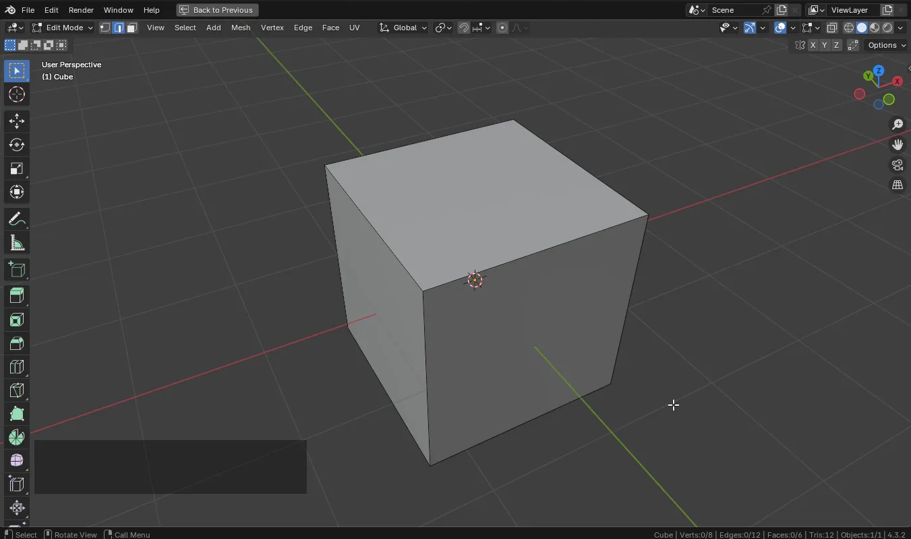

Хоткеи для ножа:

* `ПКМ` - завершить текущий разрез, но не выходить из инструмента
* `Ctrl` - временно отключает привязку 
* `Shift` - привязка к центру ближайшего ребра
* `C` - разрез проходит сквозь всю модель (игнорирует видимые грани)
* `X` / `Y` / `Z` - делает линию разреза строго горизонтальной / вертикальной / по диагонали
* `A` - привязка по углам
* `Ctrl + Z` - отменить последнюю точку разреза

#### Удаление ребер

* Выделить ребра
* `X`

Способы:

* Edges - удаляет только ребра (грани сохраняются)
* Dissolve Edges - удаляет ребро, сохраняя форму модели
* Edge Loops - удаляет замкнутую петлю ребер

### Face (грани)

#### Экструзия граней

* Выделить грань
* `E`
* Переместить

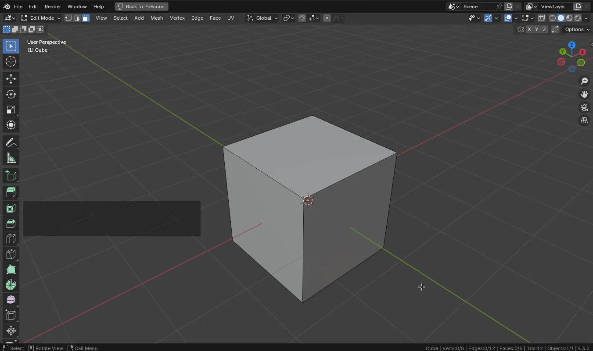

#### Выдавливание новых граней внутрь (Inset)

* Выделить грань
* `I`
* Переместить

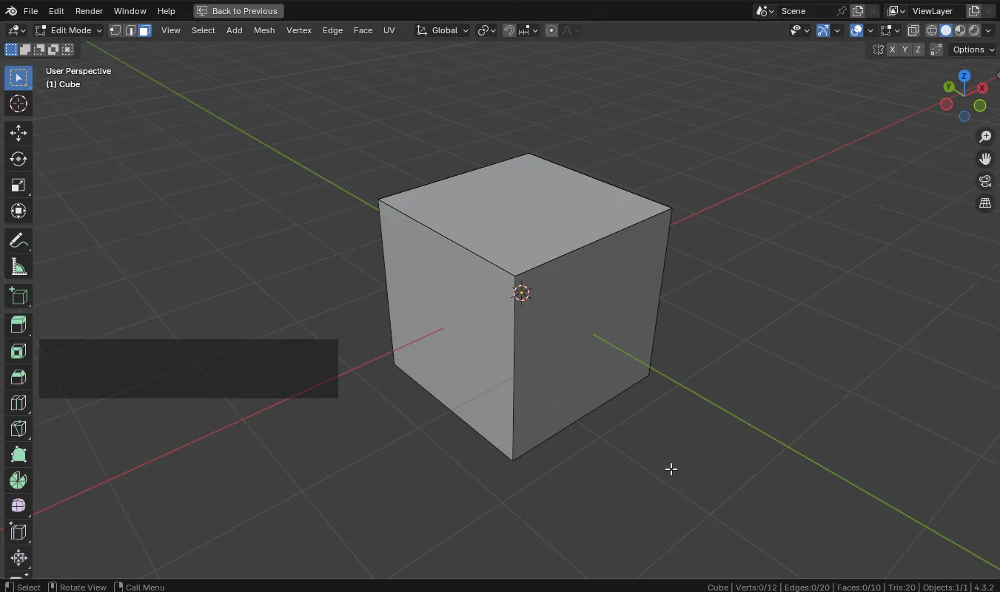

#### Создание граней в замкнутом кольце из ребер

* Выделить минимум 3 ребра
* `F`

#### Удаление граней

* Выделить грань
* `X`

Способы:

* Faces - удаляет только грани, сохраняя вершины и ребра
* Only Faces - удаляет грани, но оставляет связные ребра
* Dissolve Faces - удаляет грани, сохраняя поверхность (если возможно)

---

## Операции над мешем

> *TODO*

---

## Ретопология

> *TODO*
