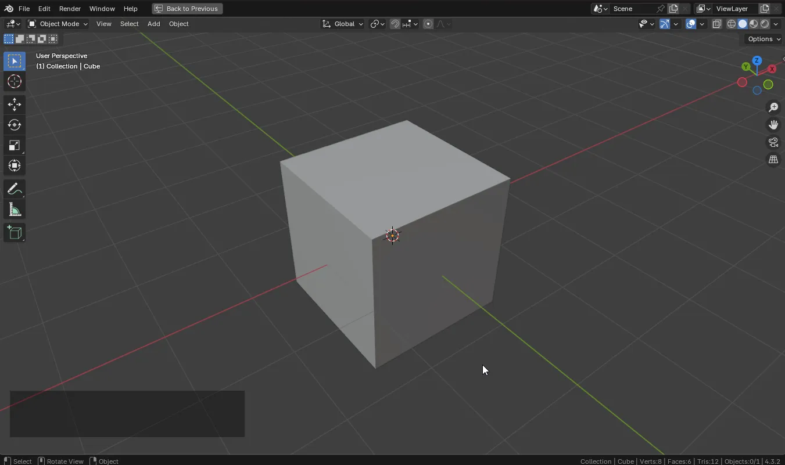
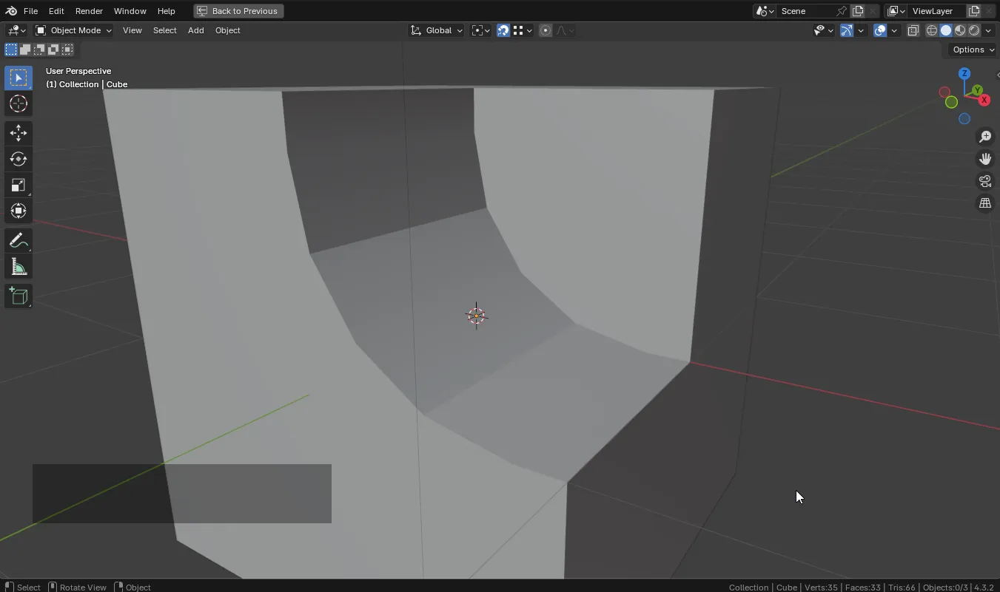

# Основы редактирования меша

## Вход в режим редактирования меша (Edit Mode)

Хоткеи:
* `TAB`

## Переключение элементов редактирования

Можно выбирать в меню, либо используя клавиши:

* `1` - Vertex (вершины)
* `2` - Edge (ребра)
* `3` - Face (грани)

## Основы режима редактирования (Edit Mode)

В 3D моделировании меш состоит из:

* Вершин (Vertices) - точки в пространстве.
* Ребер (Edges) - линии, соединяющие вершины.
* Граней (Faces) - плоских поверхностей, ограниченных ребрами.

### Vertex (вершины)

#### Перемещение вершин вдоль ребер

* Выделить вершину
* `G + G`
* Движение по ребру

#### Создание новых ребер между вершинами

* Выделить две вершины
* `F`

> ⚠️ Это не создает грани. Полученное ребро не будет частью грани
>
> Пример ниже: ребро между двумя точками. После того, как мы опустили две другие точки - оказалось что ребро не принадлежит грани
>
> 

Используйте `J` для создания пути из ребер от точки до точки. Это создаст так же и новые грани.

#### Создание новых произвольных ребер

* Выделить вершину
* `E` - создаст вершину и ребро
* Переместить курсор / Разместить вершину

Альтернативный вариант:

* `Ctrl + ПКМ` позволяет создать произвольную вершину в любом месте
* `Ctrl + ПКМ` создает ребро между выделенной вершинной и новой вершиной, которая будет создана в месте клика

#### Присоединение (слияние) точек

* Выделить несколько вершин
* `M`
* Выбрать из меню подходящий вариант

* At Center - объединяет все выделенные вершины в одну, расположенную в центре
* At Cursor - перемещает и объединяет вершины в точке 3D-курсора
* Collapse - объединяет вершины внутри выделенной группы (используется для нескольких кластеров вершин)
* At First - объединяет все вершины в первую выделенную

#### Удаление точек

* Выделить вершину / вершины
* `X`

* Vertices - полностью удаляет вершины и все связанные с ними ребра и грани
* Dissolve Vertices - удаляет вершины, сохраняя геометрию (если возможно)
* Limited Dissolve - удаляет избыточные вершины, упрощая геометрию
* Collapse Edges & Faces - схлопывает вершины, сохраняя контур
* Edge Loops - удаляет замкнутые петли вершин без нарушения структур

### Edge (ребра)

#### Экструзия ребра

* Выделить ребро
* `E`
* Переместить новое ребро

Между ребрами будет создаваться грань

#### Создание фаски ребра

* Выделить ребро
* `Ctrl + B`
* Переместить
* `Enter` - зафиксировать

Колесом мыши можно настроить количество сегментов

#### Разрез петлей (Loop cut)

* `Ctrl + R`
* Навести на меш (ребра)
* `ЛКМ`
* Переместить
* `Enter` (или `ЛКМ`) - зафиксировать

Колесом мыши можно управлять количеством разрезов

Нажатие `ESC`, после начала операции, позволяет сделать разрез ровно по центру

#### Быстрое создание разреза (Offset Edge Slide)

#### Использование ножа (Knife Topology Tool)

* `K`
* Клик по ребрам / граням
* `Enter` - применить

Хоткеи для ножа:
* `ПКМ` - завершить текущий разрез, но не выходить из инструмента
* `Ctrl` - временно отключает привязку 
* `Shift` - привязка к центру ближайшего ребра
* `C` - разрез проходит сквозь всю модель (игнорирует видимые грани)
* `X` / `Y` / `Z` - делает линию разреза строго горизонтальной / вертикальной / по диагонали
* `A` - привязка по углам
* `Ctrl + Z` - отменить последнюю точку разреза

#### Удаление ребер

* Выделить ребра
* `X`

Способы:

* Edges - удаляет только ребра (грани сохраняются)
* Dissolve Edges - удаляет ребро, сохраняя форму модели
* Edge Loops - удаляет замкнутую петлю ребер

### Face (грани)

#### Экструзия граней

* Выделить грань
* `E`
* Переместить

#### Выдавливание новых граней внутрь (Inset)

* Выделить грань
* `I`
* Переместить

#### Создание граней в замкнутом кольце из ребер

* Выделить минимум 3 ребра
* `F`

#### Удаление граней

* Выделить грань
* `X`

Способы:

* Faces - удаляет только грани, сохраняя вершины и ребра
* Only Faces - удаляет грани, но оставляет связные ребра
* Dissolve Faces - удаляет грани, сохраняя поверхность (если возможно)

---

## Редактирование меша

### Соединение замкнутых колец из ребер (bridge)

* Выделить два кольца (с зажатым `Alt`)
* `Ctrl + E`
* Выбрать Bridge Edge Loops

### Быстрое выделение колец ребер (петлей)

Щелкнуть по ребру (петли) с зажатым `Alt`

### Поиск пути (выделение ребер)

* Выбрать вершину или ребро (откуда)
* `Ctrl + ЛКМ` по вершине или ребру (куда)

### ⚠️ Объяснение принципа отмены операции в Blender

Если нажать ESC - многие операции не отменяются, отменяется лишь перенос. Ниже есть демонстрации

Например при выдавливании созданная новая грань остается сущетсовать. Это может быть большой проблемой в будущем. Проверить наличие проблемы можно немного подвинув грани. Другой маркер проблемы - z-fighting (наслоение граней на друг-друга).

Сразу избавится от проблемы не сложно - просто используйте `Ctrl + Z`. Если проблема была обнаружена позно, есть несколько вариантов решения:

* Выделить все точки объекта, `M` / By Distance
* Выделить определенные точки объекта, `M` / By Distance

Хотя это и выглядит как баг, но, вообще говоря, это особенность работы Blender - далее после ESC пользователю может понадобится использовать ручные настройки инструмента (включая смещение). Использование ESC позволяет быстро применить операцию, при этом оставив все параметры на нуле.

### Принципы работы Pivot (Origin)

Origin - опорная точка объекта.

* Влияет на трансформации
* Является точкой отсчета для своих детей в иерархии

#### Демонстрация работы с Origin

* Все трансформации по-умолчанию опираются на опорную точку (вращение и изменение маштаба)
* Median Point - это не среднее у объекта, как может показаться. Это среднее, между опорными точками для множества выделенных объектов

#### Режим редактирования (Ctrl + >)

* Выделить объект
* `Ctrl + >`
* Инструментами вращение и перенос установить опорную точку в нужном месте (можно использовать привязки)

#### Перемещение Origin с помощью Cursor

* Установить курсор в нужном месте
    * Можно использовать `Ctrl + S` / Cursor to Selected и т.п.
* Меню: Object / Origin to 3D Cursor (в Edit Mode данного меню не будет) ИЛИ через поиск в `F3` (Origin to 3D Cursor)

### Сквозное выделение (в режиме Wireframe / X-Ray Mode)

Режим X-Ray позволяет выделять сквозб объекты. Включается через `Alt + Z` или во Viewport в правом верхнем углу.

Wireframe выбирается в меню-колесе `Z`.

### Разделение геометрии на разные мешы

* Выделить нужные грани, использовать `Y`
* Выделить ребра, по которым нужно сделать разрез, `ПКМ` / Edge Split

### Выделение связанной геометрии (все, что соединено Ctrl + L)

В Edit Mode можно выделять целиком всю геометрию, которая связана используя `Ctrl + L`

### Разделение геометрии на разные объекты

* Выделить нужные грани, использовать `P` / Selection
* Выделить нужные грани, использовать `Y`, потом выделить все, `P` / By Loose Parts
* Выделить ребра, по которым нужно сделать разрез, `ПКМ` / Edge Split, потом выделить все, `P` / By Loose Parts

### Соединение разных объектов в одну геометрию

* Выделить несколько объектов
* `Ctrl + J`

### Соединение разделенных мешей в один меш

* Использовать `F` между разными мешами для их ручного соединения
* Использовать `Ctrl + E` и инструменты, на подобии Bridge
* Использовать `M`

### Режим пропорционального редактирования

* `O` - включить/выключить
* Колесо мыши увеличивает или уменьшает радиус действия

### Зеркальное редактирование

Данный вид зеркалирования не очень функциональный и удобный. В дальнейшем зеркалирование будем использовать через модификатор Mirror

### Настройки шейдинга между полигонами

Настраивается в меню по `ПКМ` в Edit Mode в режиме граней.

В меню Object есть Shade Auto Smooth (в Object Mode) позволяющий автоматически настроить шейдинг в зависимости от угла (в параметрах инструмента)

### Ориентация полигонов, исправление ориентации

Иногда при экструзии граней может возникнуть ситуация, при которой у грани не правильная сторона.

У каждого полигона есть нормаль, указывающая на направление этого полигона. Если нормаль будет не правильной, то может ломаться шейдинг.

`Alt + N` - позволяет вручную настроить нормали

#### Инструмент для отображения ориентации полигонов

Способ для Object Mode (и Edit Mode):

Способ для Edit Mode (+ доступны другие нормали, например для вершин):

#### Пересчет нормалей

`Shift + N` - автоматически пересчитывает нормали для выделенных элементов. Чтобы не сделать хуже, выделять лучше всего весь объект (чтобы выпуклая часть была очевидна)

### Инвертирование нормалей, демонстрация Backface Culling

Иногда может потребоваться специально инвертированные нормали. Большинство игровых движков не рисуют обратную сторону граней. Можно такой эффет включить для Blender и использовать для комнат.

Backface Сulling включается в настройках Viewport. Для рендера в EEVEE нужно так же включить его в настройках материала 

### Применение референсов для моделирования

#### Добавление изображений в сцену

* В меню (или в `Shift + A`) Add / Image / Reference
* Выбрать файл изображения
* В настройках (правый верхний угол) можно выбрать Align -> World для того, чтобы  расположить изображение по осям координат

#### Размещение изображений в разных проекциях

* Для размещения изображения в нужной проекции, его достаточно развернуть под нужным углом используя Properities или инструмент поворота `R` (набор цифр и выбор оси позволит указать точный угол)
* В настройках изображения можно включить режим отображения только при выборе Top / Front / ... ортографического вида (настройка Only Axis Aligned)
  * Этот режим может мешать совмещать изображения на первых этапах, по этому его имеет смысл включать позже, при непосредственном моделировании
* Для дополнительного удобства можно настроить Opacity для изображения, чтобы оно было полупрозрачным и не мешало видеть объекты под ним

