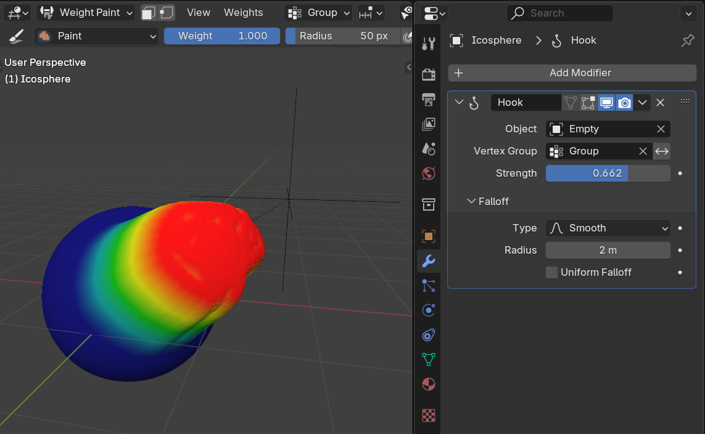

# Основы работы с модификаторами

Модификаторы — это инструменты, которые позволяют:

* Изменять форму объектов без прямого изменения исходной геометрии (увеличивать количество полигонов, изгибать, сглаживать и т.п.)
* Вносить изменения в параметры геометрии (например в веса вершин, UV карту и прочее)
* Реализовать сложную анимацию (например скелетную и т.п.)
* Реализовывать физику

Модификаторы являются **не деструктивным редактированием**, т.е. вы можете в любой момент вернуться к исходному состоянию объекта и повторно применить или настроить модификаторы. Помимо этого Blender (как и другие пакеты для 3D моделирования) предлагает составлять композицию из модификаторов, влияющих на объект последовательно (слоями).

Для того, чтобы приступить к работе с модификаторами, нужно выбрать объект с геометрией и открыть вкладку Properties / Modifiers.

## Генерация геометрии

Ниже перечислены некоторые модификаторы из раздела (не все).

Полный список модификаторов Generate доступен в [официальной документации Blender](https://docs.blender.org/manual/ru/dev/modeling/modifiers/generate/index.html)

### Array

Позволяет создать копии объектов со смещением.

В настройках нет, например, смещения по Rotate. Его можно создать с указанием Object Offset с параметров которого будут копироваться данные для смещения.

### Bevel

Добавляет фаску (срез углов) с определенными параметрами. Можно задать угол при котором применяется модификатор к геометрии.

### Boolean

Позволяет вырезать из объекта другую геометрию, или делать слияние с ней.

> ⚠️ Применять с осторожностью. Часто сильно ломает топологию и приводит к очень плохой сетке.

### Build

Скрывает и показывает грани объекта с течением времени (зависит от timeline'а)

### Decimate

Позволяет упростить геометрию объекта - уменьшает количество вершин и граней с минимальными изменениями формы.

### Mask

Позволяет скрывать геометрию объекта на основе групп вершин (весов)

### Mirror

Позволяет отзеркалить геометрию.

Перед применением следует разрезать объект на две половины и удалить ту часть, в которую будет отзеркалирован объект.

После применения модификатора:

Альтернативный вариант - использовать опцию Bisect, которая сама сделает разрез и удаление лишней части объекта.

### Remesh

Данный модификатор позволяет заново создать топологию сетки.

Имеются разные режимы:

* Blocks - без сглаживания
* Smooth - гладкая поверхность
* Sharp - аналогичен Smooth, но сохраняет острые ребра и углы
* Voxel - применяется воксельный метод

### Screw

Позволяет выдавливать спираль из профиля.

### Skin

Использует вершины и ребра для создания поверхности, используя радиус каждой вершины.

### Solidify

Создает толщину для меша (добавляет глубину).

### Subdivision

Подразделение поверхности (+ сглаживание). Используется для разделения граней сетки на более мелкие грани, придавая ей гладкий вид.

## Деформация геометрии

### Cast

Изменяет форму меша, кривой, поверхности или решётки в сторону любой из нескольких предопределённых форм (сфера, цилиндр, кубоид)

### Curve

Позволяет деформировать меш вдоль кривой

### Displace

Смещает вершины в меше при помощи текстуры (карты высот)

### Hook

Деформирует меш с помощью другого объекта

### Warp

Деформирование меша с использованием двух точек (объектов)

### Wave

Добавляет к геометрии эффект волны

## Композиция из модификаторов

TODO
