# Введение в работу с материалами

В компьютерной графике материал определяет, как объект взаимодействует со светом. Он отвечает за цвет, блеск, прозрачность, отражение и другие визуальные характеристики. Шейдер - это математическая модель, описывающая, как свет взаимодействует с поверхностью объекта.

Простейший материал может состоять из одного цвета, но реалистичные сцены требуют сложных материалов, сочетающих текстуры, отражения и даже физические параметры, такие как шероховатость или подповерхностное рассеивание (SSS).

## Назначение материалов через свойства объекта

Материал можно создать и настроить в разделе Properties в объекта.

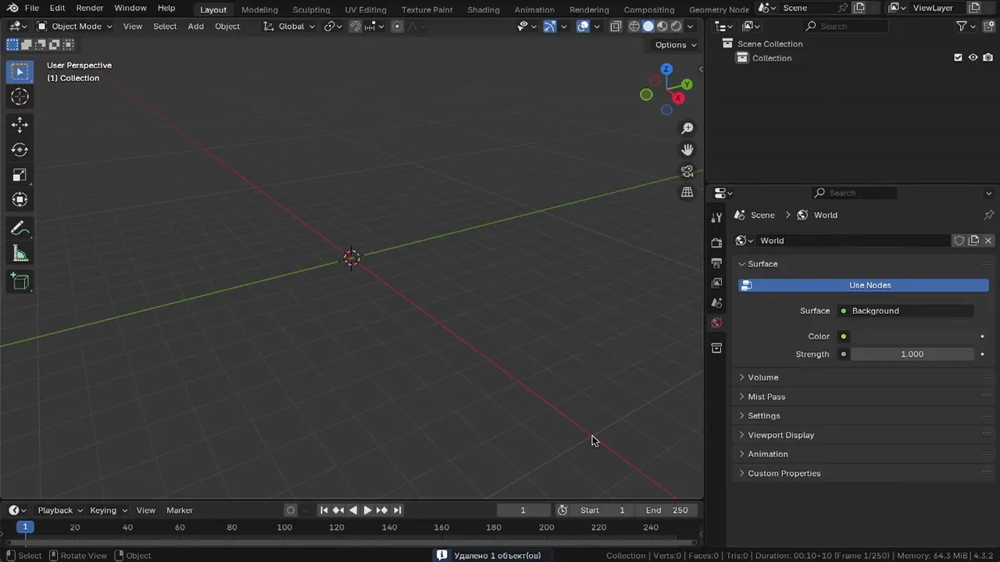

У каждого объекта может быть назначено несколько материалов. Каждый материал привязывается к определенному слоту. Слот назначается на мешь объекта (на полигоны).

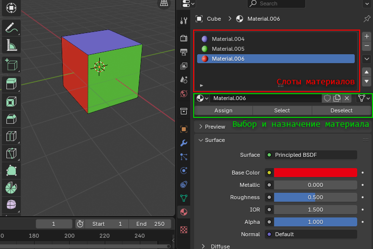

Чтобы назначить слот для определенных полигонов, нужно:

1. Создать слот
2. Выделить в Edit Mode полигоны
3. Assign
4. Выбрать в слоте материал или создать новый

Обратите внимание, что при выделении полигонов в Edit Mode будет выделятся назначенный слот. По этому перед нажатием Assign нужно проверить, какой указан слот. Создание нового слота не приводит к автоматическому назначению слота выделенным полигонам.

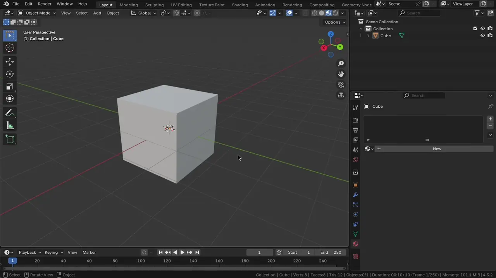

> 💡 Для быстрого переноса (копирования) материалов можно воспользоваться инструментом **Link/Transfer Data**.\
> Для этого выделите объекты (в Object Mode), которым нужно указать новый материал, последним выделите объект с которого нужно скопировать материал. Далее откройте инструмент через `Ctrl + L` и выберите опцию **Link Materials**.

## Рендеры EVEE и Cycles

Eevee - это _экранный рендер-движок_ (screen space), который обеспечивает высокую скорость за счёт использования упрощённых моделей освещения и теней. Он отлично подходит для превью, интерактивных сцен и создания контента в реальном времени, но имеет ограничения по реалистичности отражений, преломлений и освещения.

Cycles, в отличие от него, использует трассировку лучей (ray tracing), что позволяет достичь фотореалистичного качества, особенно при работе с прозрачными материалами, отражениями, тенями и каустикой. Однако за это приходится платить временем: рендер может занять минуты (или даже часы) в зависимости от сцены.

| Характеристика              | **Eevee**                                     | **Cycles**                                         |
| --------------------------- | --------------------------------------------- | -------------------------------------------------- |
| **Тип рендера**             | Реалтайм (экранный, быстрый)                  | Физически корректный (реалистичный)                |
| **Скорость**                | Очень высокая (почти мгновенный результат)    | Медленный (особенно на слабых GPU/CPU)             |
| **Качество освещения**      | Приближённое, использует фейки (Screen Space) | Реалистичное глобальное освещение                  |
| **Тени**                    | Быстрые, но не всегда точные                  | Очень точные, учитывают рассеивание и прозрачность |
| **Отражения и преломления** | Ограниченные (экранные отражения)             | Точные (трассировка лучей)                         |
| **Каустика и GI**           | Отсутствуют/имитируются                       | Полная поддержка (в т.ч. caustics)                 |
| **Поддержка Transparency**  | Ограниченная, зависит от настроек             | Полная                                             |
| **Использование GPU**       | Всегда                                        | GPU или CPU (в зависимости от настроек)            |
| **Подходит для**            | Предпросмотра, геймдев-визуализации, анимаций | Финальный рендер, реалистичные изображения         |
| **Поддержка волюметрики**   | Быстрая, но менее точная                      | Медленная, но физически точная                     |

### Screen Space (экранное пространство)

Screen Space - это метод, при котором все расчёты света и отражений делаются на основе того, что видно на экране прямо сейчас. Рендер-движок просто "смотрит" на финальную картинку и анализирует пиксели, чтобы добавить отражения, тени и другие эффекты.

Принцип работы:

* Blender рендерит текущий кадр сцены
* Затем применяются эффекты вроде отражений, затенения, AO и пр.
* Все эти эффекты рассчитываются только для объектов, которые попали в поле зрения камеры

Преимущества:

* Очень быстрый (работает в реальном времени)
* Отлично подходит для геймдева и анимации, где важна скорость
* Можно делать красивые превью без длительного рендера

Ограничения:

* Не видит то, что за пределами кадра - например, объекты, находящиеся за камерой или за другими объектами, не учитываются в отражениях
* Прозрачные материалы, сложные тени и преломления реализуются через "фейки" или не поддерживаются вовсе
* Нет настоящей глобальной иллюминации (GI), только имитация

### Ray Tracing (трассировка лучей)

Ray Tracing - это физически корректный метод расчета света, лежащий в основе работы Cycles. Он имитирует реальное поведение света: лучи исходят от камеры и "путешествуют" по сцене, отражаются, преломляются, поглощаются, взаимодействуют с материалами и источниками света.

Принцип работы:

* Из камеры выпускаются "лучи" (rays), которые пересекают объекты в сцене.
* Когда луч сталкивается с поверхностью, запускаются дополнительные лучи:
  * Отражённые (для зеркальных поверхностей)
  * Преломлённые (для прозрачных объектов)
  * Диффузные (для рассеянного света)
* Это позволяет точно рассчитывать:
  * Глобальное освещение (GI)
  * Каустику
  * Тени от непрямого свет
  * Эффекты прозрачности, рассеивающих сред и т.п

Преимущества:

* Максимально реалистичное освещение и материалы
* Корректные отражения, преломления, каустика, тени и прочее
* Используется в кино, рекламе, архитектурной и продуктовой визуализации

Ограничения:

* Значительно медленнее, чем Screen Space
* Требует мощного оборудования (желательно GPU)

### Наглядное сравнение Screen Space / Ray Tracing

В примере ниже использован рендер-движок EVEE с включеным Screen Space (для отражений). Обратите внимание на отражение красного куба в зеркальной сфере. В левом изображении есть отражение, а в правом его нет. Куб пропал из изображения, как только пропал с экрана.

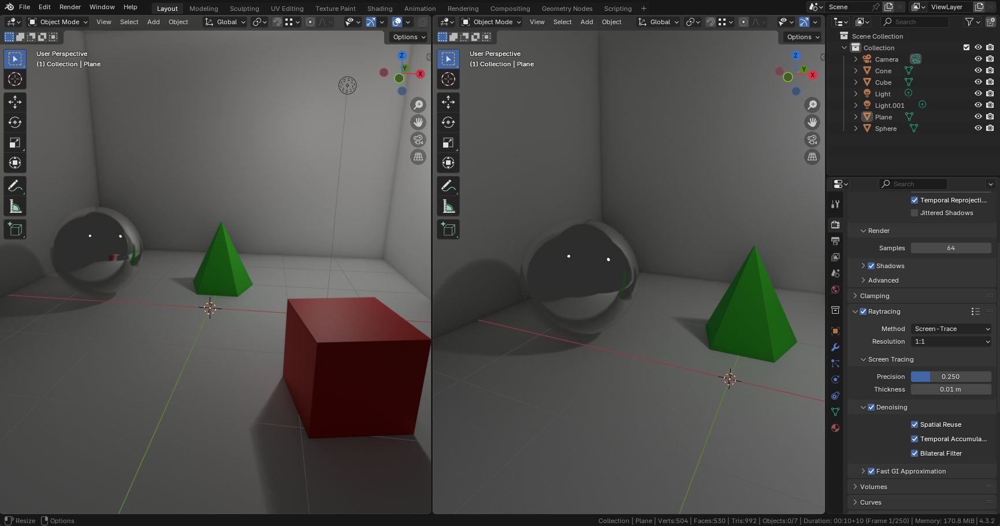

В примере с Cycles отражения присуствуют независимо от наличия объекта в экранном пространстве.

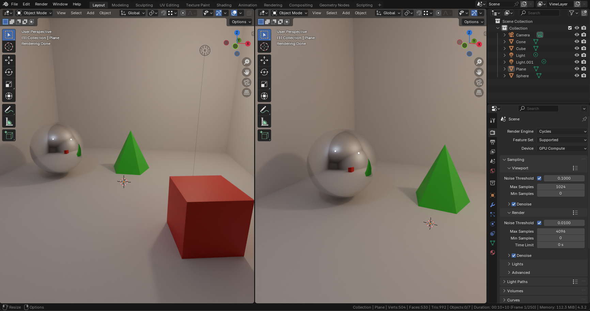

## Типы шейдеров и их параметры

BSDF (Bidirectional Scattering Distribution Function) - это двунаправленная функция распределения рассеивания света. В контексте 3D-графики BSDF описывает, как свет взаимодействует с поверхностью объекта: отражается, рассеивается, поглощается или проходит сквозь материал.

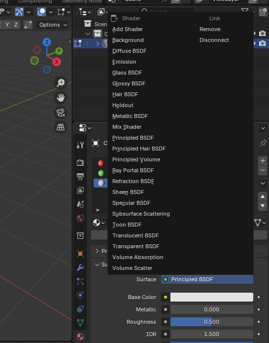

### Principled BSDF

Это основной шейдер в Blender, который используется для создания физически корректных материалов (PBR - Physically Based Rendering). Он сочетает в себе несколько моделей рассеивания света и позволяет создать почти любой тип материала: металл, пластик, стекло, ткань, кожу и многое другое.

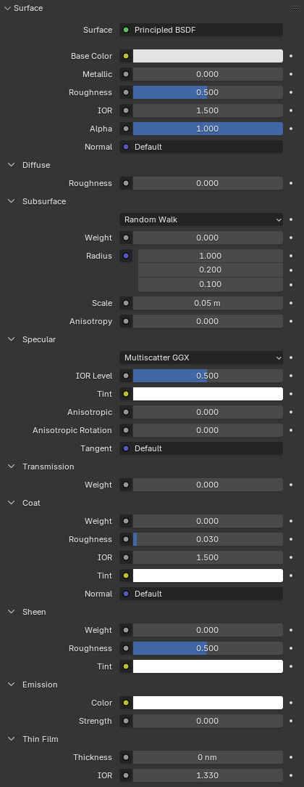

1. Базовые свойства (Surface)
   * Base Color - основной цвет материала
   * Metallic - степень металлического отражения (0 - диэлектрик, 1 - металл)
   * Roughness - степень шероховатости поверхности (0 - глянец, 1 - матовость)
   * IOR (Index of Refraction) - показатель преломления света (важно для стекла и прозрачных материалов)
   * Alpha - прозрачность материала (0 - полностью прозрачный, 1 - непрозрачный)
   * Normal - подключение карты нормалей (используется для детализации поверхности)
2. Diffuse (Диффузное рассеивание)
   * Roughness - дополнительный параметр для регулировки рассеивания света.
3. Subsurface (Подповерхностное рассеивание, SSS) - Используется для полупрозрачных материалов (кожа, воск, мрамор)
   * Weight - интенсивность рассеивания
   * Radius - глубина проникновения света
   * Scale - масштаб рассеивания
4. Specular (Зеркальные отражения)
   * IOR Level - интенсивность зеркального отражения
   * Anisotropic - анизотропные отражения (эффект расчесанной поверхности, например у металлов)
   * Anisotropic Rotation - направление анизотропных отражений
5. Transmission (Прозрачность и стекло)
   * Weight - степень прозрачности
6. Coat (Лаковый слой) - Позволяет добавить дополнительное глянцевое покрытие
   * Weight - интенсивность покрытия
   * Roughness - шероховатость покрытия
   * IOR - показатель преломления покрытия
7. Sheen (Эффект мягкого блеска) - Используется для имитации ткани
   * Weight - интенсивность эффекта
   * Roughness - степень шероховатости ткани
8. Emission (Светящиеся материалы)
   * Color - цвет свечения
   * Strength - интенсивность свечения
9. Thin Film (Тонкие пленки, переливы) - Создает эффект тонкопленочного покрытия (например, бензиновые разводы на воде)
   * Thickness - толщина пленки
   * IOR - показатель преломления для пленки

### Прочие шейдеры

Остальные BSDF шейдеры являются подмножеством Principled BSD, но у них упрощены параметры (убраны лишнии для тех или иных целей).

* Diffuse BSDF - Базовый диффузный (матовый) шейдер без отражений
* Glossy BSDF - Зеркальный отражающий шейдер
* Glass BSDF - Шейдер для прозрачных материалов с эффектом преломления
* Emission - Излучающий свет шейдер (самосвечения)
* Metallic BSDF - Отражающий металлический материал
* Transparent BSDF - Простая прозрачность без преломлений (например, для альфа-канала)
* Subsurface Scattering (SSS) - Эффект рассеивания света внутри материала (например, для кожи, воска)
* Mix Shader - Позволяет смешивать два любых шейдера
* Specular BSDF - Имитирует зеркальные отражения (альтернатива Glossy BSDF)
* Translucent BSDF - Передает свет сквозь объект, создавая эффект полупрозрачности

### Примеры применения шейдеров

#### Текстура с Principled BSDF

Для того, чтобы выбрать текстуру, нужно в Base Color выбрать Texture / Image Texture.

> Попробуйте Checker Texture, Voronoi Texture и другие

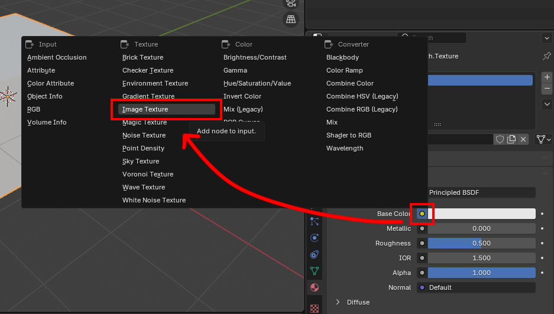

Выберите файл изображения.

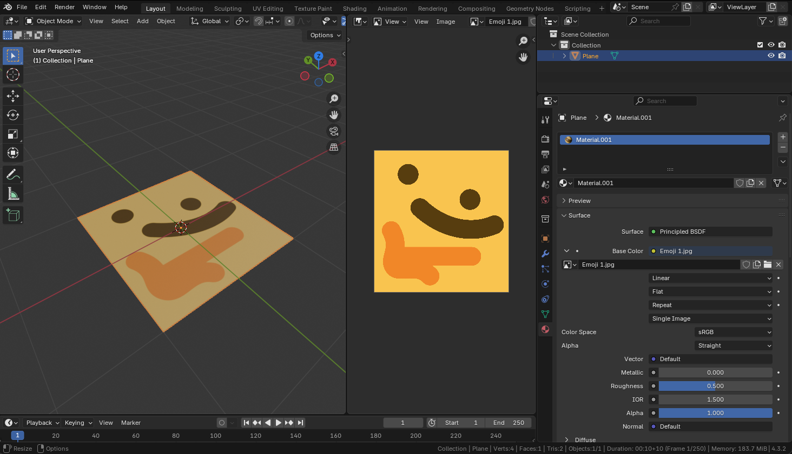

> ⚠️ Обратите внимание, что тектуры не будут отображаться в режиме Solid
>
> Перелючитесь на Rendered или Material Preview

#### Металлическая поверхность

Для металлической поверхности установите Metallic в 1. Как правило промежуточные значения не имеют смысла.

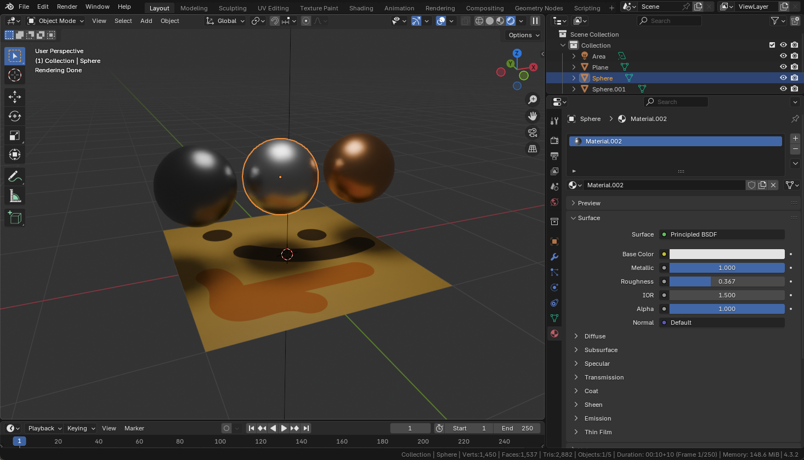

Для полностью зеркальной поверхности выключите шероховатость (Roughness установить на 0)

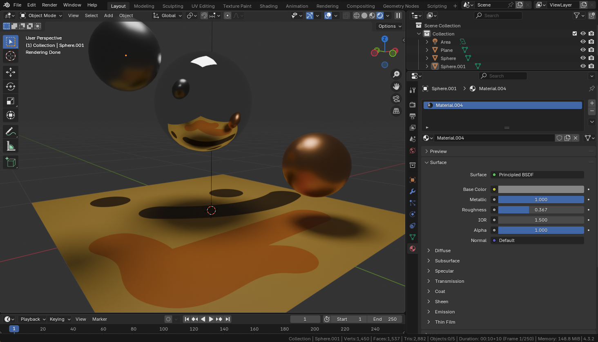

#### Прозрачный материал с водой

Для прозрачного материала необходимо выбрать Transmission (например установить значение 1). Рассеивание (мутность) будет контролироваться через шероховатость (Roughness).

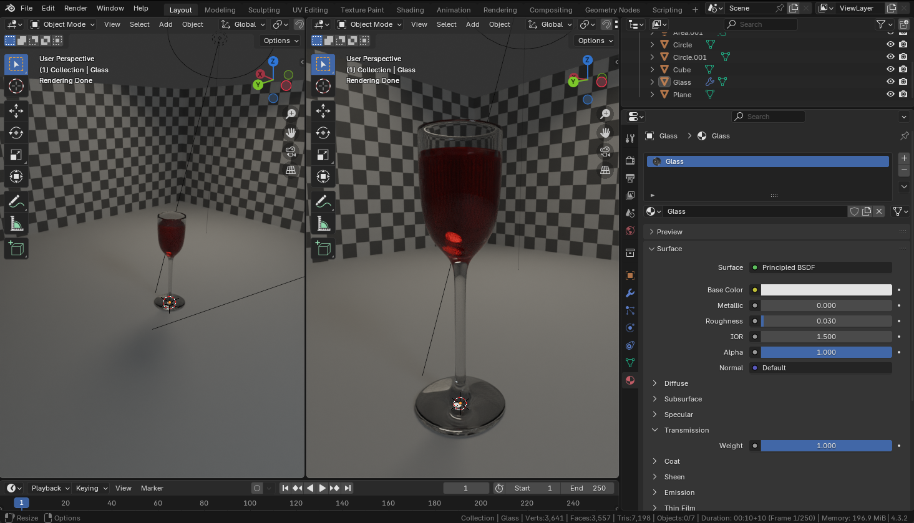

Для выбора правильного IOR (Index Of Refraction) можно воспользоваться [этим сайтом](https://pixelandpoly.com/ior.html).

## UV-развёртка и текстурирование

Когда мы создаём 3D-модель, мы описываем её форму - с помощью вершин, ребер и граней. Чтобы наложить на модель текстуру (рисунок, материал), Blender должен понять: _какая часть текстуры должна попасть на какую часть модели_.

Именно для этого и нужна UV-развёртка - процесс "разворачивания" 3D-модели в плоскую 2D-схему, чтобы на нее можно было наложить изображение.

Для редактирования UV откройте UV Editing в списке Layouts. Либо создайте отдельное окно UV Editor в разделе General.

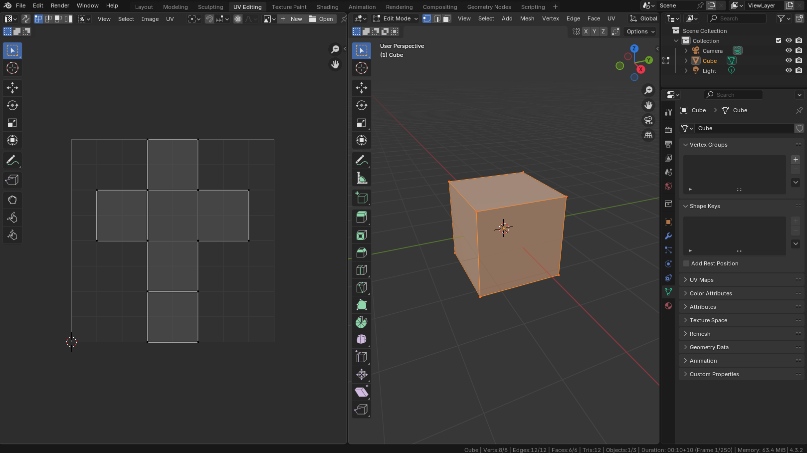

Когда мы говорим про 2D-координаты текстуры, вместо привычных X и Y, используются U и V:

* U - горизонтальная координата текстуры
* V - вертикальная координата

Почему не X и Y? Чтобы не путать с 3D-координатами модели (X, Y, Z), в текстурах используют другие обозначения: (U, V) - для 2D, (U, V, W) - для 3D текстур.

В материале при создании текстуры попробуйте указать Generated Type / UV Grid.

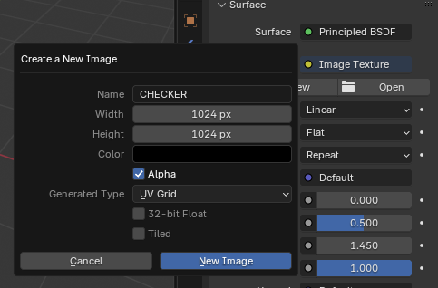

Как это работает:

* 3D-модель разбивается на плоские участки (как выкройка)
* Эти участки укладываются в прямоугольник - UV-координатное пространство
* Каждая вершина модели получает координаты (U, V), указывающие где на текстуре брать цвет

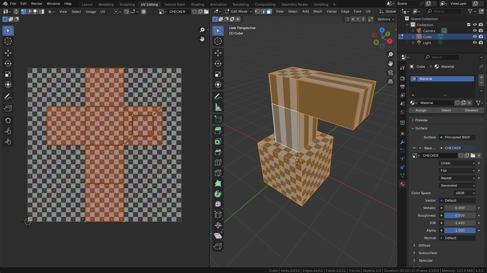

UV развертку можно делать вручную, или воспользоваться инструментами UV / Unwarp.

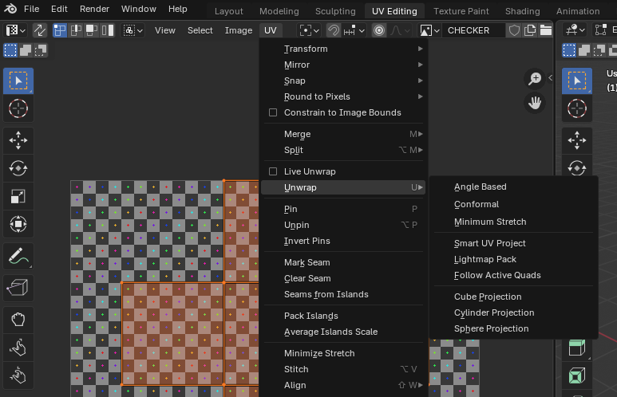

Обратите внимание, что Unwarp будет работать только на выделенную геометрию. Таким образом можно разворачивать только необходимую часть.

После применения, например, Smart UV Project, развертка будет создана автоматически.

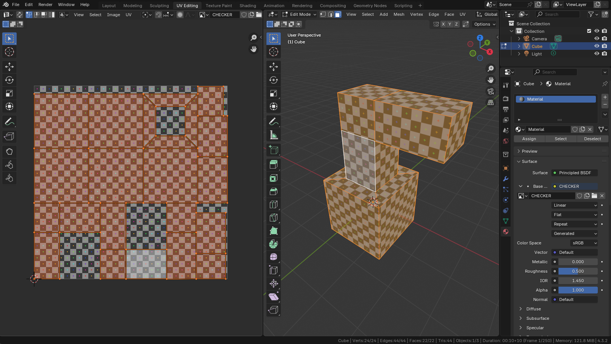

Не всегда автоматическая развертка работает корректно. Чтобы помочь автоматике, можно вручную указать швы через контекстное меню в Edit Mode - Mark Seam.

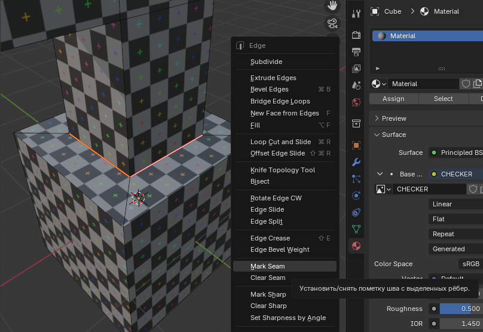

Основная суть создания UV развертки - избежать искажений текстуры. Искажения хорошо видно при использовании UV Grid сетки.

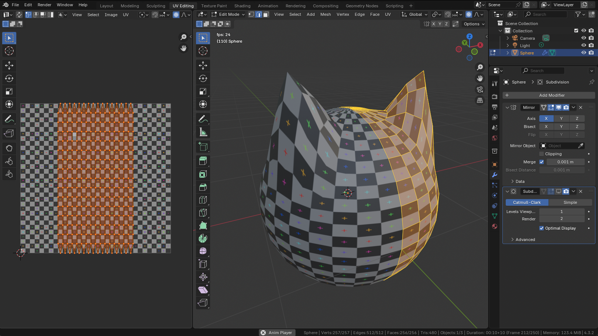

Для примера выше можно указать вручную все необходимые разрезы для создания UV развертки.

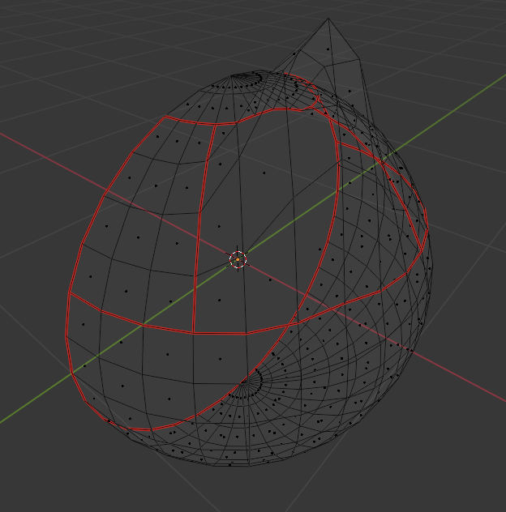

После этого применить UV / Unwarp / Cube Project, предварительно выделив всю геометрию. Можно выделять только связанный "айлэнд" (uv island, то, на что мы нарезали) через  Ctrl + L и применять отдельно иные способы развертки (вплоть до полностью ручного редактирования).

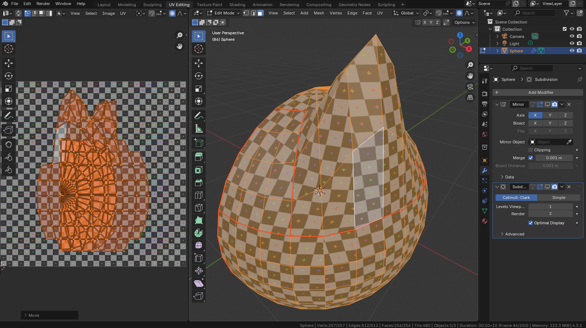

Обратите внимание, что после такой развертки все айленды пересекаются. Это плохо (если специально так не задумано для повтороного использования определенных участков текстуры). Чтобы автоматически "разбросать" айленды, воспользуйтесь UV / Pack Islands.

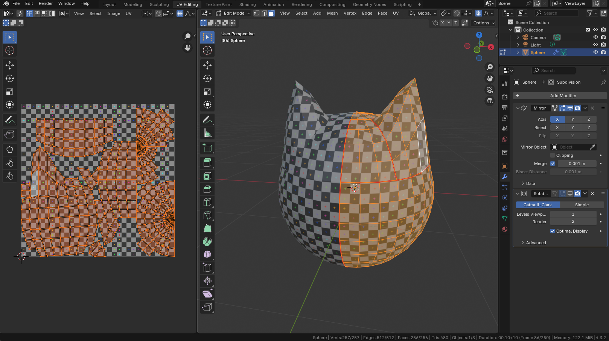

Теперь можно приступить к рисованию текстур. Для этого можно открыть Image Editor и включить режим редактирования. Так же можно переключится в режим редактирования Texture Paint и рисовать прямо на модели. В примере ниже была создана новая текстура для используемого материала.

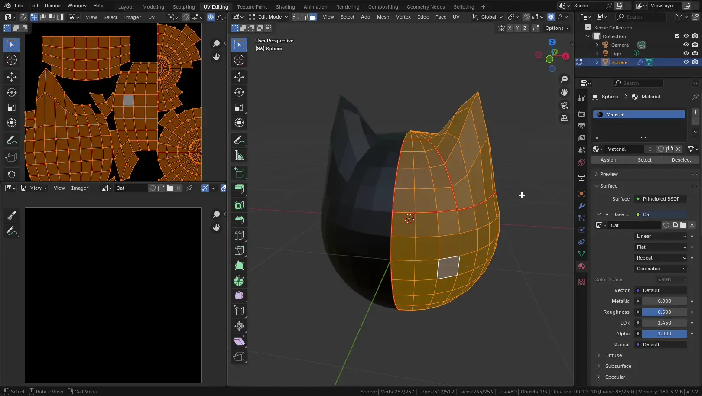
