# Топология

Топология - это структура меша, то есть способ соединения вершин, ребер и граней в 3D-модели.

Она определяет:

* Насколько удобно редактировать модель
* Как она будет сглаживаться
* Как будет вести себя при деформации
* Сколько полигонов содержит модель

Даже если форма модели выглядит правильно, плохая топология может сильно усложнить дальнейшую работу.

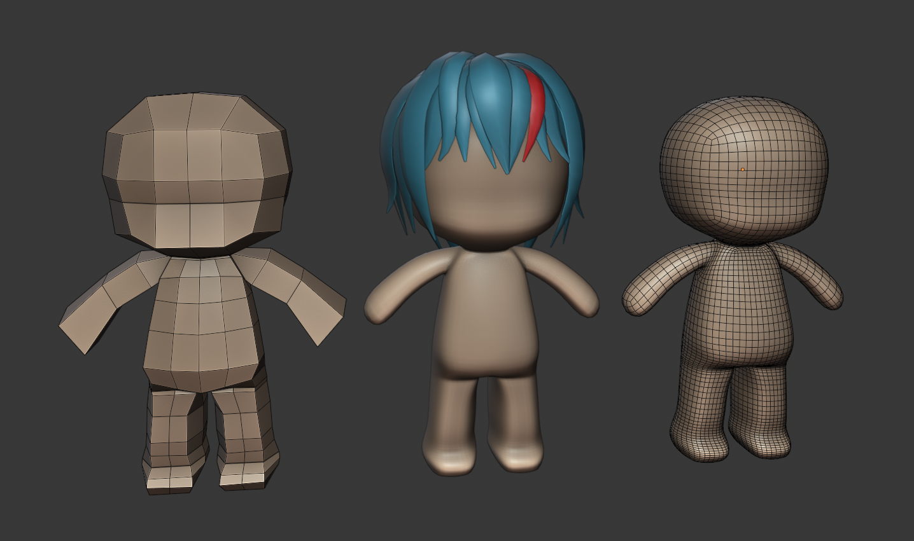

## Основы топологии и структура меша

Важно не только количество полигонов, но и то, как именно они соединены между собой.

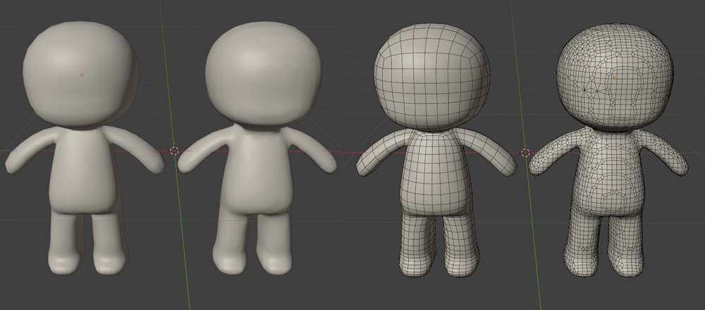

Две модели могут иметь одинаковую форму, но:

* Одна будет легко редактироваться
* Другая будет ломаться при любом изменении

Хорошая топология позволяет:

* Легко добавлять детали
* Предсказуемо изменять форму
* Корректно использовать модификаторы
* Избегать артефактов

### High Poly vs Low Poly

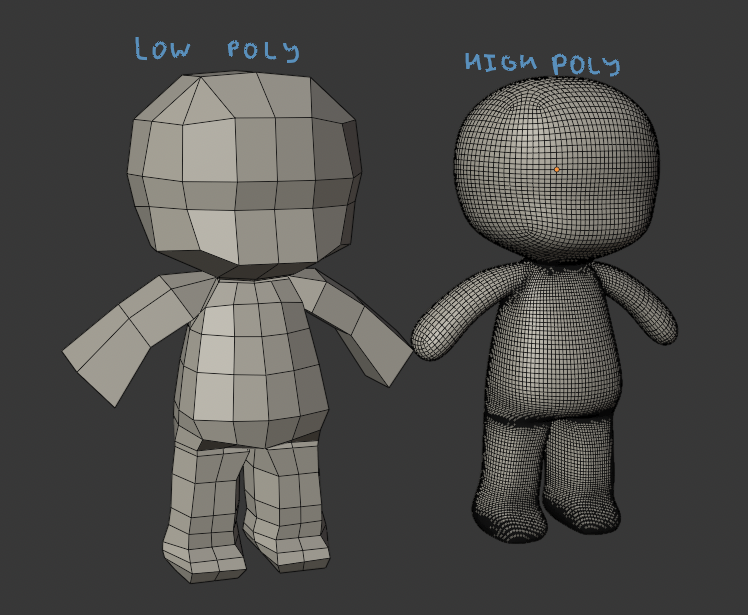

#### High Poly

High Poly - модель с большим количеством полигонов.

Используется для:

* Скульптинга
* Детализированных рендеров
* Создания normal maps

В такой модели как правило большое количество вершин и ее сложно редактировать.

#### Low Poly

Low Poly - упрощенная версия модели. Такая модель описывает форму минимальным количеством полигонов.

Используется:

* В играх
* В рендерах реального времени
* Для оптимизации сцены
* Для Subdiv модификатора

Хорошая топология позволяет сохранить форму модели даже при небольшом количестве полигонов.

### Quad сетка

В большинстве случаев предпочтительна сетка из четырехугольников (quads).

Quad - это грань с 4 вершинами.

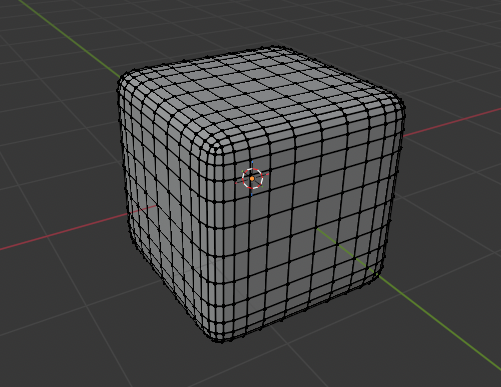

Такая сетка образует регулярную решетку.

#### Почему quad лучше tris

GPU всегда рисует треугольники. Любая модель перед рендерингом будет разбита на отдельные треугольники.

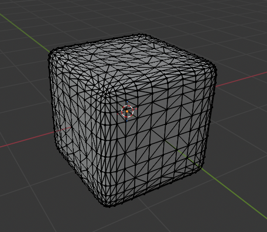

Тем не менее, на практике моделирование почти всегда выполняется в квадратах. Причина заключается в удобстве моделирования и особенностях работы инструментов (например subdivision).

Реальные формы чаще имеют параллельные линии, так как большинство объектов состоит из:

* Параллельных поверхностей
* Прямых линий

У треугольника нет параллельных линий, поэтому им неудобно описывать форму большинства объектов. Quad-сетка естественно формирует такие структуры.

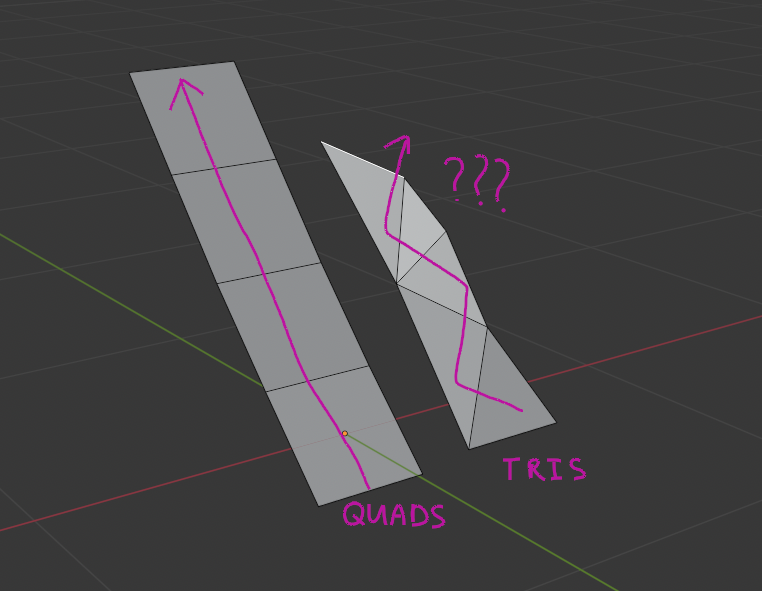

Также quad сетка формирует логические петли ребер (edge loops), с помощью которых легко деформировать и изменять форму объекта.

Subdivision Surface работает лучше всего с quad сеткой. При использовании треугольников появляются:

* Артефакты
* Неправильные складки
* Поломанный shading

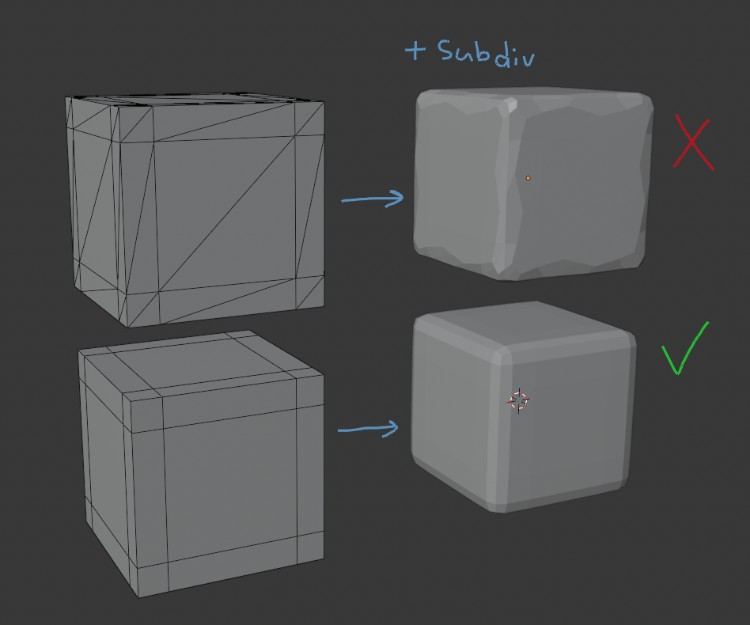

#### GPU всегда использует треугольники

Важно понимать:

> ⚠️ Любая 3D-модель в конечном итоге триангулируется.

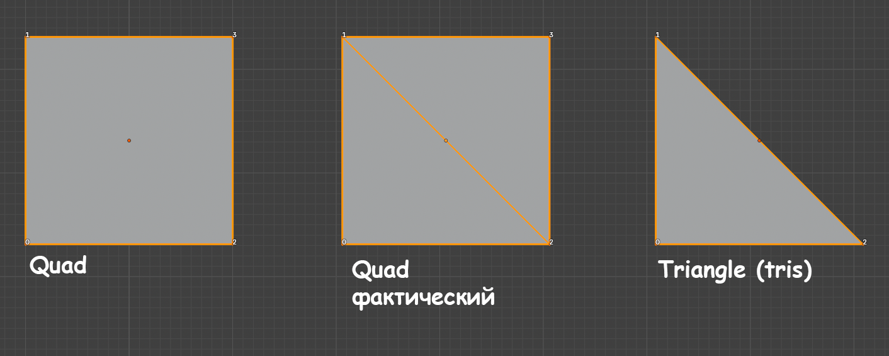

Это происходит:

* При экспорте
* При рендере
* В игровом движке

GPU работает только с треугольниками.

Но:

* Quad -> триангулируется предсказуемо
* N-gon -> триангулируется случайно

Экспортированная модель с n-gon может триангулироваться в разных программах по-разному. Поэтому если n-gon выглядит удачно в Blender - это не обязательно будет так же в Substance Painter или Unreal Engine.

### Треугольники (Triangles, tris)

Треугольник - грань из трех вершин.

При моделировании они допустимы, но их стараются избегать, чтобы не нарушать edge flow. Наличие треугольников также может создавать артефакты при использовании subdivision.

### N-gons

N-gon - грань с 5 и более сторонами. В некоторых определениях - с 4 и более (то есть quad тоже относят к n-gon).

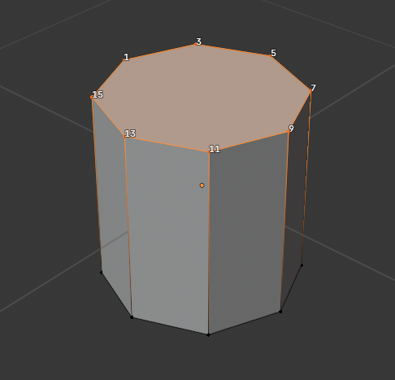

Они могут вызвать:

* Проблемы сглаживания
* Артефакты при subdivision
* Хаотичную триангуляцию

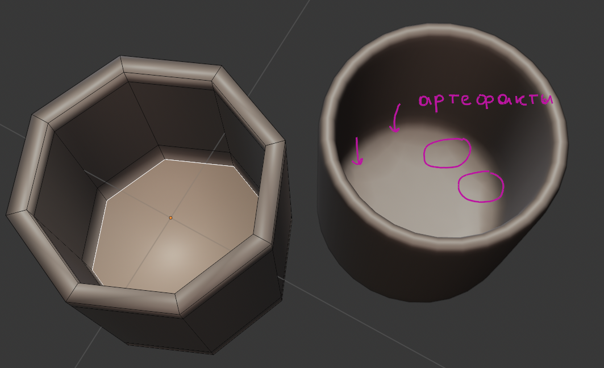

Использовать их можно:

* На плоских поверхностях
* В местах без деформации

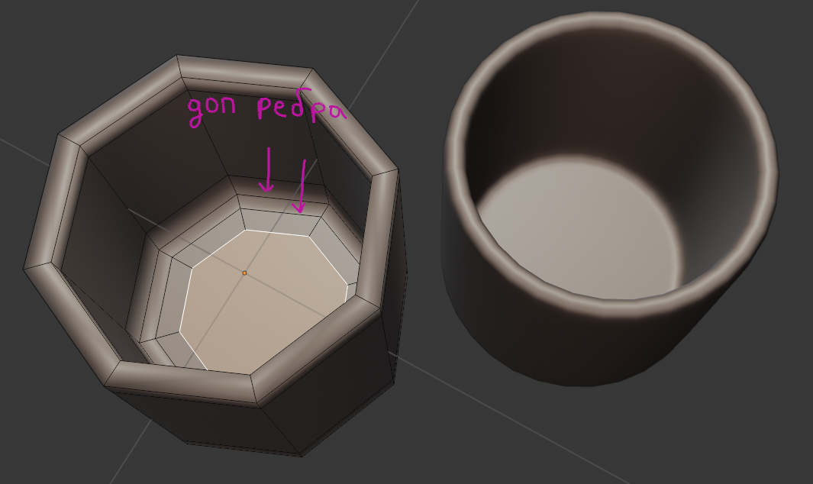

Сам по себе n-gon не является чем-то очень плохим, так как он все равно будет приведен к треугольникам. На плоских поверхностях обычно не имеет значения, как именно он будет триангулирован.

### Edge Flow и Edge Loops

Edge Flow - направление ребер в модели.

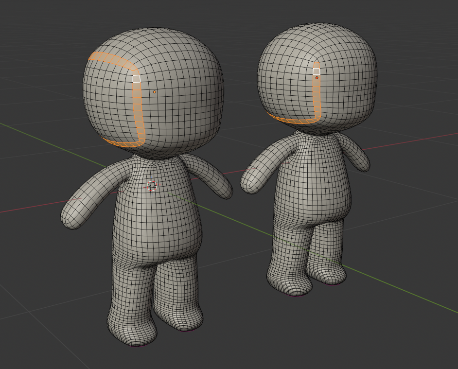

Хороший edge flow:

* Повторяет форму объекта
* Образует логические петли
* Облегчает деформацию

Примеры:

* Вокруг глаз персонажа
* Вокруг суставов
* Вокруг отверстий

Edge Loop - кольцо ребер, проходящее через quad сетку.

Выделить loop можно: `Alt + Click`

### Poles

Pole - вершина, к которой подключено не 4 ребра.

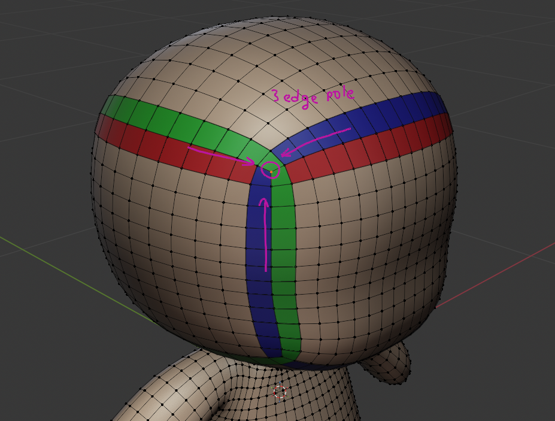

Например:

* 3-edge pole
* 5-edge pole
* 6-edge pole

Poles используются для:

* Перенаправления edge loops
* Изменения плотности сетки
* Перехода между разными участками топологии

### Равномерность плотности сетки

Хорошая сетка имеет примерно одинаковую плотность полигонов.

Плохо:

* Одна часть очень плотная
* Другая почти пустая

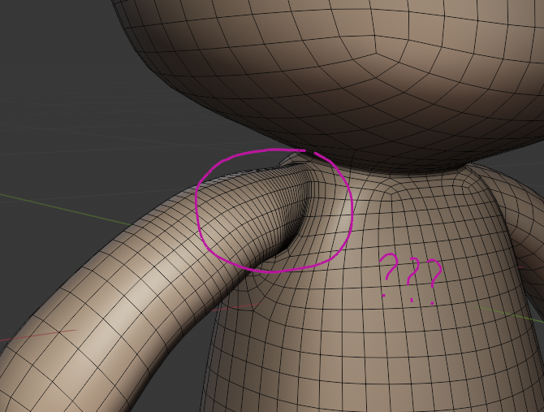

Такая структура усложняет редактирование и может приводить к артефактам.

### Единый mesh vs раздельные объекты

В один объект объединяют:

* Непрерывные поверхности
* Органические формы
* Части одной структуры

Например:

* Тело персонажа
* Мягкие формы

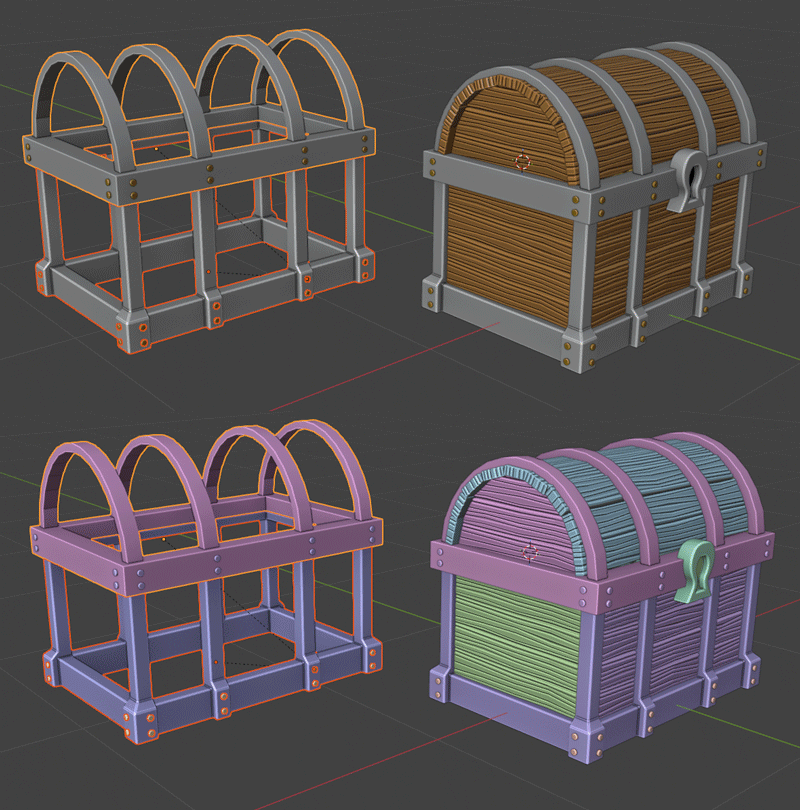

Разделять стоит:

* Механические детали
* Независимые элементы
* Разные материалы (например стеклянные)

Например:

* Болты
* Панели
* Крышки

## Проблемы плохой топологии и их исправление

### N-gons

Проблема: грань имеет слишком много сторон.

Почему плохо:

* Ломается сглаживание
* Непредсказуемая триангуляция

Исправление:

* Разделить на quads
* Добавить edge loops

### Ломаный edge flow

Проблема: ребра идут хаотично.

Почему плохо:

* Сложное редактирование
* Неправильная деформация

Исправление:

* Перестроить loops
* Удалить лишние ребра

### Лишние loops

Проблема: слишком много edge loops.

Почему плохо:

* лишние полигоны
* сложная сетка

Исправление: `Dissolve Edge Loop`.

### Дубли вершин

Проблема: несколько вершин находятся в одном месте.

Почему плохо:

* Ломается shading
* Появляются щели

Исправление: `M -> By Distance`.

### Перекрестная геометрия

Проблема: полигоны пересекаются.

Почему плохо:

* Артефакты
* Неправильный shading

Исправление:

* Удалить пересечения
* Перестроить геометрию

### Boolean мусор

После Boolean часто появляется:

* N-gons
* Хаотичные полигоны
* Плохая топология

Исправляется через:

* Ручную ретопологию
* Удаление лишних ребер

### Сломанный shading

Проблема: поверхность выглядит неровной или имеет странные затенения.

Причина: неправильные нормали.

Исправление: `Shift + N`.

## Инструменты анализа

### Wireframe Overlay

Позволяет видеть сетку поверх модели.

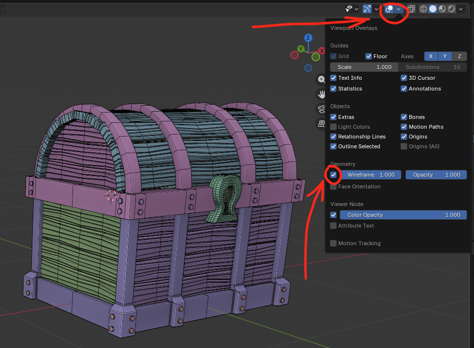

Помогает анализировать:

* Плотность сетки
* Edge flow

### Face Orientation

Показывает направление полигонов, где красный - обратная сторона.

### X-Ray режим

Позволяет видеть геометрию сквозь объект.

Комбинация: `Alt + Z`.

### Проверка сгибом

Небольшая деформация модели позволяет увидеть:

* Складки
* Искажения
* Наложение геометрии

### Subdiv проверка

Добавление Subdivision Surface позволяет увидеть:

* Проблемы топологии
* Неправильные loops

### Анализ меша (Mesh Analysis)

Blender имеет инструменты анализа геометрии.

Mesh Analysis позволяет проверить:

* толщину
* кривизну
* искажения
* нависания (актуально для 3D печати)

## Инструменты ретопологии в Blender

Хотя хорошая топология обычно создается **во время моделирования**, в некоторых случаях сетку приходится перестраивать.

Это происходит когда:

* Модель создана через скульптинг
* Модель получена после Boolean операций
* Геометрия слишком плотная
* Сетка имеет хаотичную структуру

В таких случаях используется ретопология - перестроение сетки поверх существующей формы.

Ретопология может выполняться:

* Вручную (обычно так)
* Автоматически
* Через модификаторы

### Snap to Face

Позволяет размещать вершины на поверхности другого объекта.

Настройки: `Snapping -> Face`.

### Shrinkwrap Modifier

Модификатор притягивает сетку к поверхности другого объекта.

### Poly Build

Инструмент для ручного построения quad-сетки.

### Loop Cut

Добавляет edge loop.

Комбинация: `Ctrl + R`.

### Merge

Объединяет вершины.

Комбинация: `M`.

### Dissolve

Удаляет элементы без разрушения поверхности.

Комбинация: `X -> Dissolve`.

### QuadriFlow Remesh

QuadriFlow - инструмент автоматической ретопологии.

Он создает:

* Quad сетку
* Равномерную плотность

Используется когда:

* Модель слишком сложная
* Нужна быстрая базовая топология

Для моделей, которые потом планируется анимировать, обычно требуется ручная ретопология.
