# Базовая работа с материалами

В компьютерной графике материал определяет, как объект взаимодействует со светом. Он отвечает за цвет, блеск, прозрачность, отражение и другие визуальные характеристики. Шейдер - это математическая модель, описывающая, как свет взаимодействует с поверхностью объекта.

Простейший материал может состоять из одного цвета, но реалистичные сцены требуют сложных материалов, сочетающих текстуры, отражения и даже физические параметры, такие как шероховатость или подповерхностное рассеивание (SSS).

## Создание и назначение простых материалов

Материал можно создать и настроить в разделе Properties в объекта.

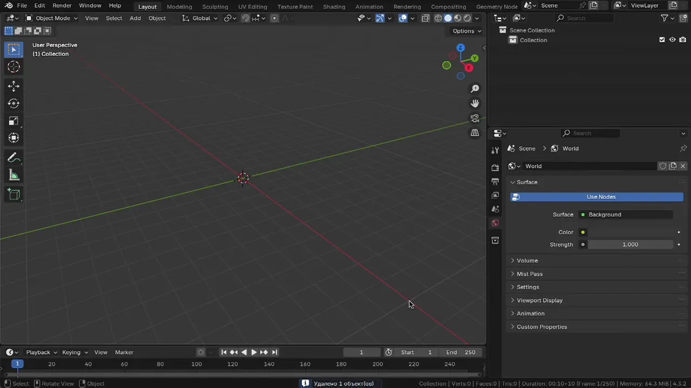

У каждого объекта может быть назначено несколько материалов. Каждый материал привязывается к определенному слоту. Слот назначается на меш объекта (на полигоны).

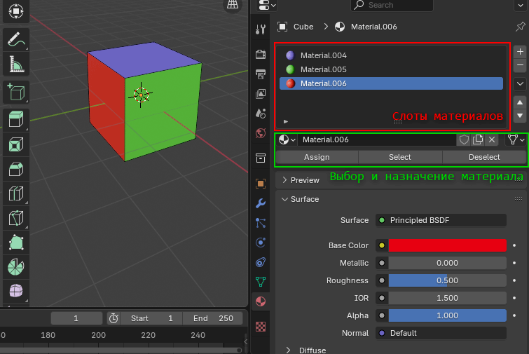

Чтобы назначить слот для определенных полигонов, нужно:

1. Создать слот
2. Выделить в Edit Mode полигоны
3. Assign
4. Выбрать в слоте материал или создать новый

Обратите внимание, что при выделении полигонов в Edit Mode будет выделятся назначенный слот. По этому перед нажатием Assign нужно проверить, какой указан слот. Создание нового слота не приводит к автоматическому назначению слота выделенным полигонам.

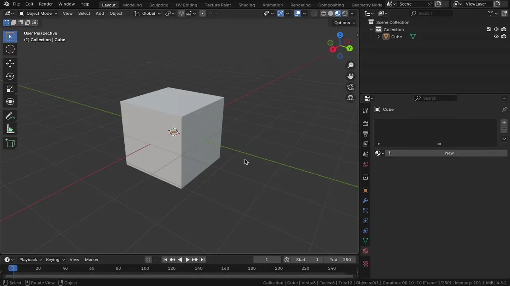

> 💡 Для быстрого переноса (копирования) материалов можно воспользоваться инструментом **Link/Transfer Data**.\
> Для этого выделите объекты (в Object Mode), которым нужно указать новый материал, последним выделите объект с которого нужно скопировать материал. Далее откройте инструмент через `Ctrl + L` и выберите опцию **Link Materials**.

## Рендеры EVEE и Cycles

Eevee - это _экранный рендер-движок_ (screen space), который обеспечивает высокую скорость за счет использования упрощенных моделей освещения и теней. Он отлично подходит для превью, интерактивных сцен и создания контента в реальном времени, но имеет ограничения по реалистичности отражений, преломлений и освещения.

Cycles, в отличие от него, использует трассировку лучей (path tracing), что позволяет достичь фотореалистичного качества, особенно при работе с прозрачными материалами, отражениями, тенями и каустикой. Однако за это приходится платить временем: рендер может занять минуты (или даже часы) в зависимости от сцены.

| Характеристика              | **Eevee**                                     | **Cycles**                                         |
| --------------------------- | --------------------------------------------- | -------------------------------------------------- |
| **Тип рендера**             | Реалтайм (экранный, быстрый)                  | Физически корректный (реалистичный)                |
| **Скорость**                | Очень высокая (почти мгновенный результат)    | Медленный (особенно на слабых GPU/CPU)             |
| **Качество освещения**      | Приближенное, использует фейки (Screen Space) | Реалистичное глобальное освещение                  |
| **Тени**                    | Быстрые, но не всегда точные                  | Очень точные, учитывают рассеивание и прозрачность |
| **Отражения и преломления** | Ограниченные (экранные отражения)             | Точные (трассировка лучей)                         |
| **Каустика и GI**           | Отсутствуют/имитируются                       | Полная поддержка (в т.ч. caustics)                 |
| **Поддержка Transparency**  | Ограниченная, зависит от настроек             | Полная                                             |
| **Использование GPU**       | Всегда                                        | GPU или CPU (в зависимости от настроек)            |
| **Подходит для**            | Предпросмотра, геймдев-визуализации, анимаций | Финальный рендер, реалистичные изображения         |
| **Поддержка волюметрики**   | Быстрая, но менее точная                      | Медленная, но физически точная                     |

### Screen Space (экранное пространство)

Screen Space - это метод, при котором все расчеты света и отражений делаются на основе того, что видно на экране прямо сейчас. Рендер-движок просто "смотрит" на финальную картинку и анализирует пиксели, чтобы добавить отражения, тени и другие эффекты.

Принцип работы:

* Blender рендерит текущий кадр сцены
* Затем применяются эффекты вроде отражений, затенения, AO и пр.
* Все эти эффекты рассчитываются только для объектов, которые попали в поле зрения камеры

Преимущества:

* Очень быстрый (работает в реальном времени)
* Отлично подходит для геймдева и анимации, где важна скорость
* Можно делать красивые превью без длительного рендера

Ограничения:

* Не видит то, что за пределами кадра - например, объекты, находящиеся за камерой или за другими объектами, не учитываются в отражениях
* Прозрачные материалы, сложные тени и преломления реализуются через фейки или не поддерживаются вовсе
* Нет настоящей глобальной иллюминации (GI), только имитация

> **Как это устроено под капотом (упрощенно)**
>
> Screen Space эффекты реализуются через постобработку изображения с использованием шейдеров (обычно fragment shader на GPU)
>
> После рендеринга геометрии сцены формируется набор буферов (G-buffer):
>
> * Depth buffer - расстояние до объектов (глубина)
> * Normal buffer - нормали поверхностей
> * Albedo - базовый цвет
> * Specular / Roughness - параметры материала
>
> Часть G-buffers вы можете посмотреть в render pass в настройках viewport:
> 
> 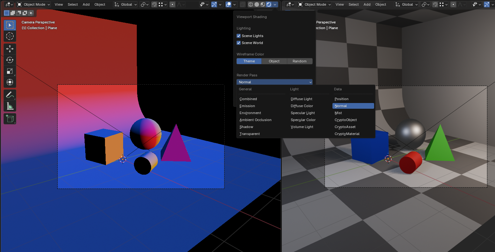
>
> Далее шейдеры используют эти данные как текстуры и вычисляют эффекты:
>
> **Пример: Screen Space Reflections (SSR)**
>
> * Для каждого пикселя вычисляется отраженный луч:
>
>   ```txt
>   R = reflect(V, N)
>   ```
>
>   где:
>   * `V` - вектор взгляда
>   * `N` - нормаль поверхности
>
> * Луч шагает по экрану (ray marching) в пространстве глубины:
>   * проецируется в screen space
>   * сравнивается с depth buffer
>   * если найдено пересечение - берется цвет из framebuffer
>
> При этом реально лучи не выпускаются (физический луч) и мы не считаем пересечение с геометрией, только в буфере глубины
>
> **Пример: SSAO (ambient occlusion)**
>
> * Вокруг пикселя берутся случайные выборки (samples)
> * Проверяется, закрыты ли они геометрией (по depth buffer)
> * Итог - коэффициент затемнения:
>
>   ```txt
>   AO = 1 - (occluded_samples / total_samples)
>   ```
>
> **Важно:**
>
> * Все вычисления происходят в экранных координатах (screen space)
> * Используются только уже отрендеренные данные (без знания полной сцены)
> * Часто применяются:
>   * ray marching
>   * stochastic sampling (случайные выборки)
>   * temporal accumulation (накопление между кадрами)
>
> Из-за этого:
>
> * Лучи обрываются за пределами экрана
> * Возможны артефакты (шумы, исчезающие отражения)
> * Нет полной физической корректности (лишь имитация, которая выглядит неплохо, если не проводить сравнение с физически корректными отражениями)

### Path Tracing (трассировка лучей)

Path Tracing - это физически корректный метод расчета света, лежащий в основе работы Cycles. Он имитирует реальное поведение света: лучи испускаются из камеры и путешествуют по сцене, отражаются, преломляются, поглощаются, взаимодействуют с материалами и источниками света.

Принцип работы:

* Из камеры выпускаются лучи (rays), которые пересекают объекты в сцене
* Когда луч сталкивается с поверхностью, запускаются дополнительные лучи:
  * Отраженные (для зеркальных поверхностей)
  * Преломленные (для прозрачных объектов)
  * Диффузные (для рассеянного света)
* Это позволяет точно рассчитывать:
  * Глобальное освещение (GI)
  * Каустику
  * Тени от непрямого свет
  * Эффекты прозрачности, рассеивающих сред и т.п

Преимущества:

* Максимально реалистичное освещение и материалы
* Корректные отражения, преломления, каустика, тени и прочее
* Используется в кино, рекламе, архитектурной и продуктовой визуализации

Ограничения:

* Значительно медленнее, чем Screen Space
* Требует мощного оборудования (желательно GPU)

> **Как это устроено "под капотом" (упрощенно)**
>
> Path Tracing основан на методе Монте-Карло и решении уравнения рендеринга:
>
> $$
> L_o(\omega_o) = L_e(\omega_o) + \int_{\Omega} f_r(\omega_i, \omega_o)\, L_i(\omega_i)\, \cos\theta_i \, d\omega_i
> $$
>
> где:
>
> * $L_o(\omega_o)$ - исходящий свет в направлении наблюдения $\omega_o$ (например, в сторону камеры)
> * $L_e(\omega_o)$ - собственное излучение поверхности в направлении $\omega_o$ (если объект сам светится)
> * $L_i(\omega_i)$ - входящий свет, приходящий в точку с направления $\omega_i$
> * $f_r(\omega_i, \omega_o)$ - BRDF, функция отражения материала, описывающая, как входящий свет переходит в отраженный
> * $\omega_i$ - направление, **из которого** приходит свет
> * $\omega_o$ - направление, **в которое** свет уходит
> * $\Omega$ - полусфера всех входящих направлений над поверхностью
> * $\theta_i$ - угол между входящим направлением $\omega_i$ и нормалью поверхности
> * $\cos\theta_i$ - поправка на угол падения света: чем свет падает более косо, тем меньше его вклад
> * $d\omega_i$ - бесконечно малый элемент телесного угла, по которому выполняется интегрирование
>
> Идея формулы такая: итоговый цвет точки складывается из двух частей:
>
> * света, который поверхность излучает сама
> * света, который приходит на нее со всех направлений, отражается материалом и уходит в сторону камеры
>
> **Пересечение луча с геометрией:**
>
> Луч задается параметрически:
>
> $$
> P(t) = O + tD
> $$
>
> где:
>
> * $O$ - начало луча (камера или точка на поверхности)
> * $D$ - направление
>
> Для каждого объекта решается задача пересечения:
>
> * с треугольниками (основа всей геометрии)
> * с использованием аналитической геометрии
>
> В реальности используются ускоряющие структуры (BVH):
>
> * сцена разбивается на иерархию bounding box'ов
> * это снижает сложность с O(n) до ~O(log n)
>
> **После попадания:**
>
> * выбирается случайное направление (sampling)
> * запускается новый луч (bounce)
> * вклад света накапливается:
>
>   $$
>   L \approx \frac{1}{N} \sum_{i=1}^{N} L_i
>   $$
>
> Итог:
>
> * физически корректный результат
> * но появляется шум - требуется много сэмплов

### Наглядное сравнение Screen Space / Path Tracing

В примере ниже использован рендер-движок EVEE с включенным Screen Space (для отражений). Обратите внимание на отражение красного куба в зеркальной сфере. В левом изображении есть отражение, а в правом его нет. Куб пропал из изображения, как только пропал с экрана

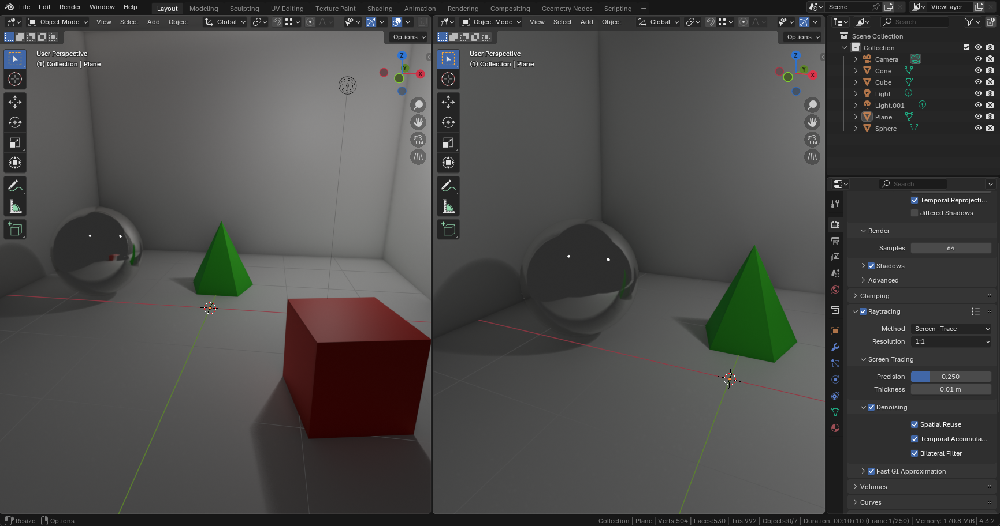

В примере с Cycles отражения присутствуют независимо от наличия объекта в экранном пространстве

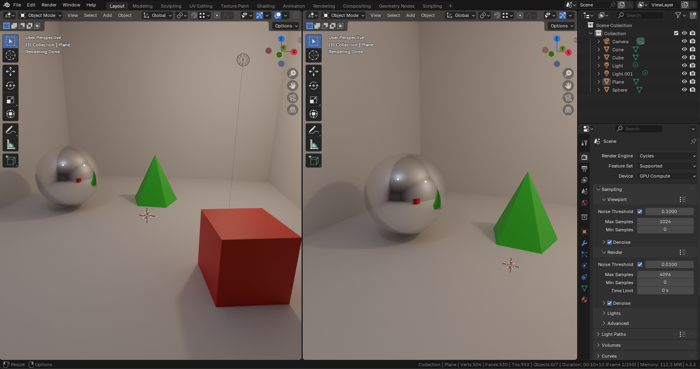

## Principled BSDF

BSDF (Bidirectional Scattering Distribution Function) - это двунаправленная функция распределения рассеивания света. В контексте 3D-графики BSDF описывает, как свет взаимодействует с поверхностью объекта: отражается, рассеивается, поглощается или проходит сквозь материал.

Principled BSDF - основной шейдер в Blender, который используется для создания физически корректных материалов (PBR - Physically Based Rendering). Сочетает в себе несколько моделей рассеивания света и позволяет создать почти любой тип материала: металл, пластик, стекло, ткань, кожу и многое другое.

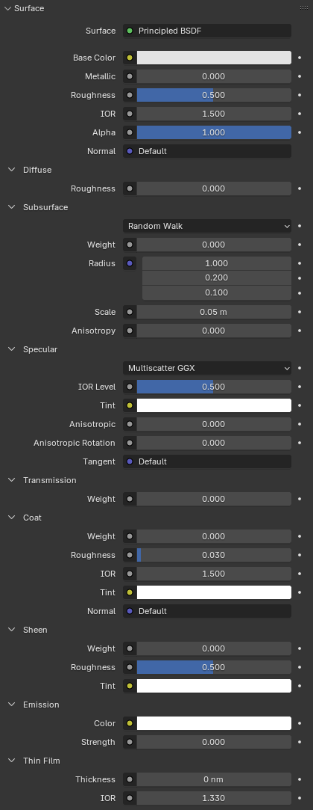

1. Базовые свойства (Surface)
   * Base Color - основной цвет материала
   * Metallic - степень металлического отражения (0 - диэлектрик, 1 - металл)
   * Roughness - степень шероховатости поверхности (0 - глянец, 1 - матовость)
   * IOR (Index of Refraction) - показатель преломления света (важно для стекла и прозрачных материалов)
   * Alpha - прозрачность материала (0 - полностью прозрачный, 1 - непрозрачный)
   * Normal - подключение карты нормалей (используется для детализации поверхности)
2. Diffuse (Диффузное рассеивание)
   * Roughness - дополнительный параметр для регулировки рассеивания света.
3. Subsurface (Подповерхностное рассеивание, SSS) - Используется для полупрозрачных материалов (кожа, воск, мрамор)
   * Weight - интенсивность рассеивания
   * Radius - глубина проникновения света
   * Scale - масштаб рассеивания
4. Specular (Зеркальные отражения)
   * IOR Level - интенсивность зеркального отражения
   * Anisotropic - анизотропные отражения (эффект расчесанной поверхности, например у металлов)
   * Anisotropic Rotation - направление анизотропных отражений
5. Transmission (Прозрачность и стекло)
   * Weight - степень прозрачности
6. Coat (Лаковый слой) - Позволяет добавить дополнительное глянцевое покрытие
   * Weight - интенсивность покрытия
   * Roughness - шероховатость покрытия
   * IOR - показатель преломления покрытия
7. Sheen (Эффект мягкого блеска) - Используется для имитации ткани
   * Weight - интенсивность эффекта
   * Roughness - степень шероховатости ткани
8. Emission (Светящиеся материалы)
   * Color - цвет свечения
   * Strength - интенсивность свечения
9. Thin Film (Тонкие пленки, переливы) - Создает эффект тонкопленочного покрытия (например, бензиновые разводы на воде)
   * Thickness - толщина пленки
   * IOR - показатель преломления для пленки

### Примеры применения шейдеров

#### Текстура с Principled BSDF

Для того, чтобы выбрать текстуру, нужно в Base Color выбрать Texture / Image Texture.

> Попробуйте Checker Texture, Voronoi Texture и другие

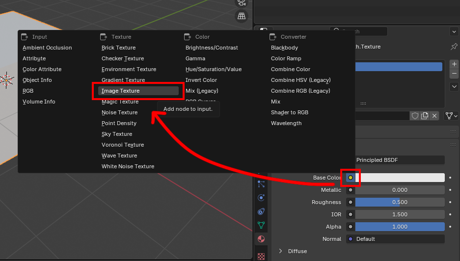

Выберите файл изображения.

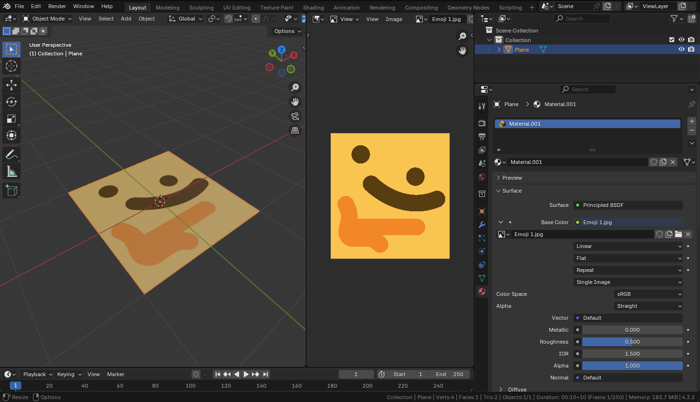

> ⚠️ Обратите внимание, что текстуры не будут отображаться в режиме Solid
>
> Перелечитесь на Rendered или Material Preview

#### Металлическая поверхность

Для металлической поверхности установите Metallic в 1. Как правило промежуточные значения не имеют смысла.

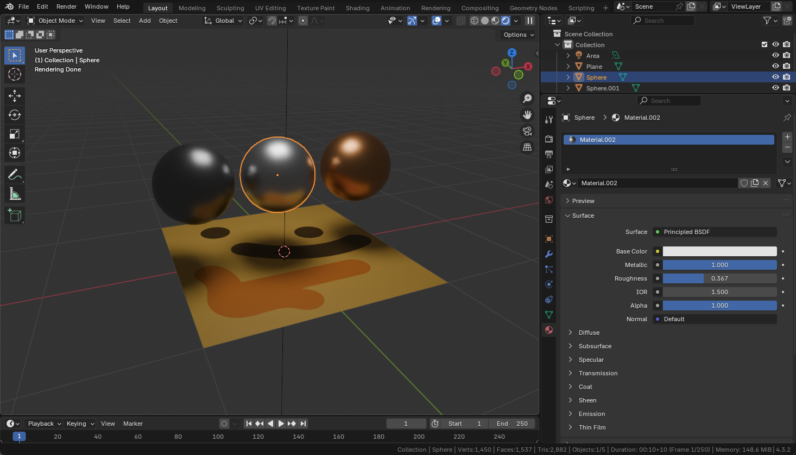

Для полностью зеркальной поверхности выключите шероховатость (Roughness установить на 0)

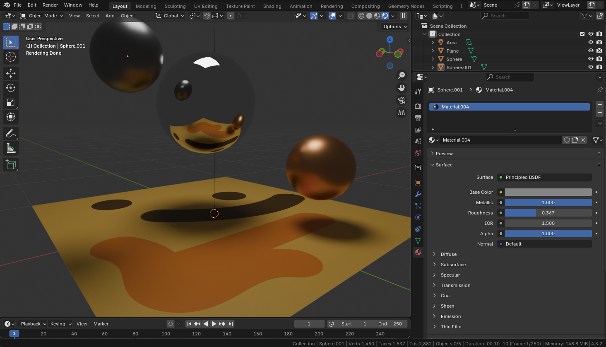

#### Прозрачный материал с водой

Для прозрачного материала необходимо выбрать Transmission (например установить значение 1). Рассеивание (мутность) будет контролироваться через шероховатость (Roughness).

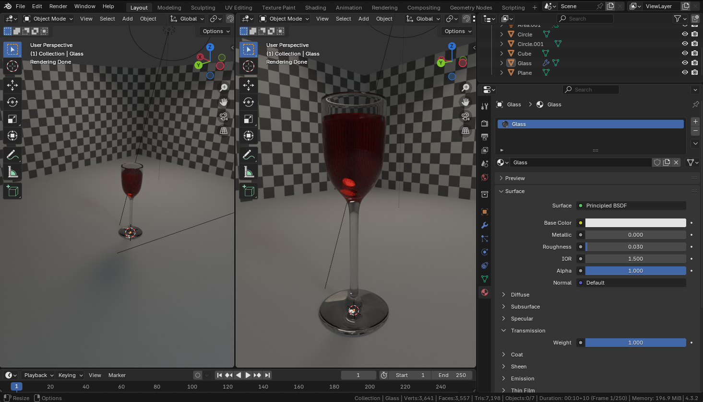

Для выбора правильного IOR (Index Of Refraction) можно воспользоваться [этим сайтом](https://pixelandpoly.com/ior.html).

### Прочие шейдеры

Остальные BSDF шейдеры являются подмножеством Principled BSD, но у них упрощены параметры (убраны лишнии для тех или иных целей).

* Diffuse BSDF - Базовый диффузный (матовый) шейдер без отражений
* Glossy BSDF - Зеркальный отражающий шейдер
* Glass BSDF - Шейдер для прозрачных материалов с эффектом преломления
* Emission - Излучающий свет шейдер (самосвечения)
* Metallic BSDF - Отражающий металлический материал
* Transparent BSDF - Простая прозрачность без преломлений (например, для альфа-канала)
* Subsurface Scattering (SSS) - Эффект рассеивания света внутри материала (например, для кожи, воска)
* Mix Shader - Позволяет смешивать два любых шейдера
* Specular BSDF - Имитирует зеркальные отражения (альтернатива Glossy BSDF)
* Translucent BSDF - Передает свет сквозь объект, создавая эффект полупрозрачности
