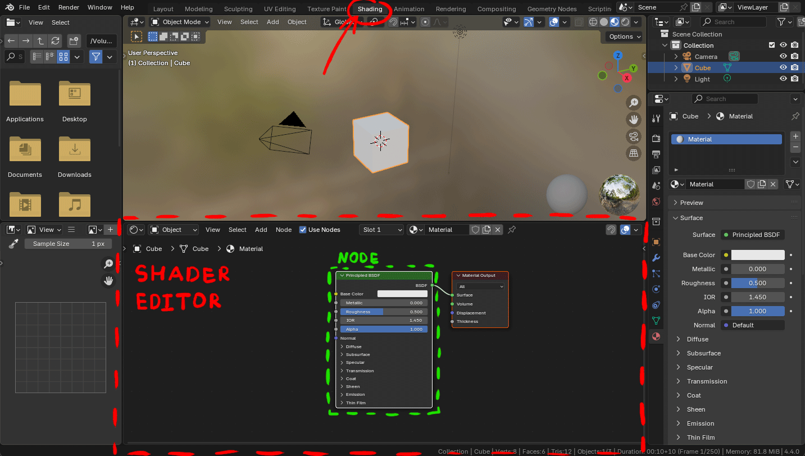
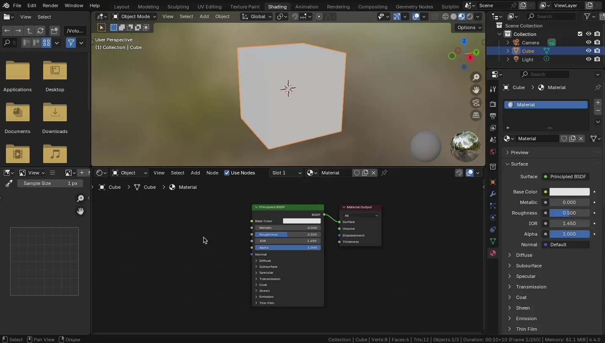
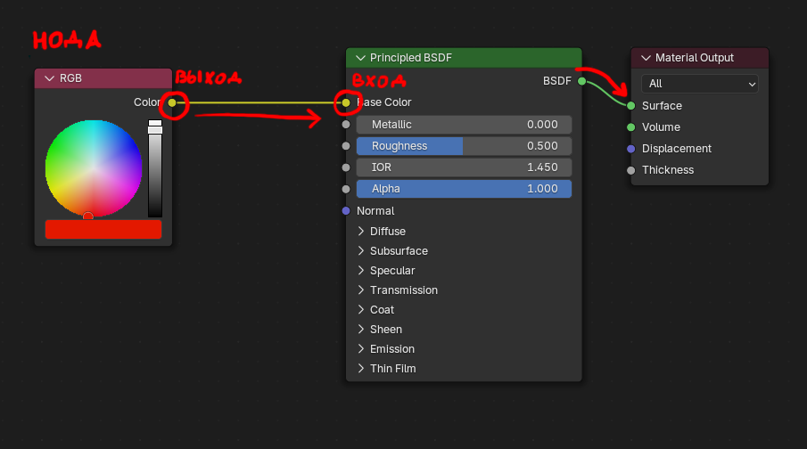
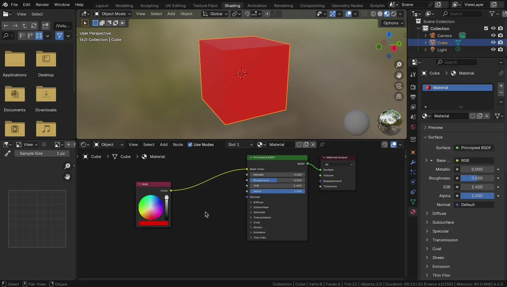
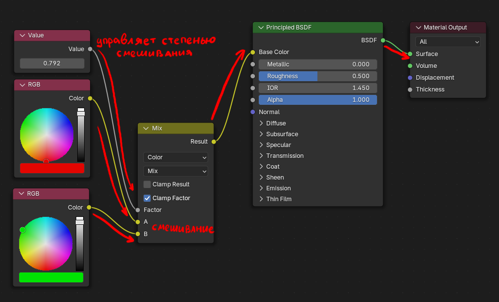
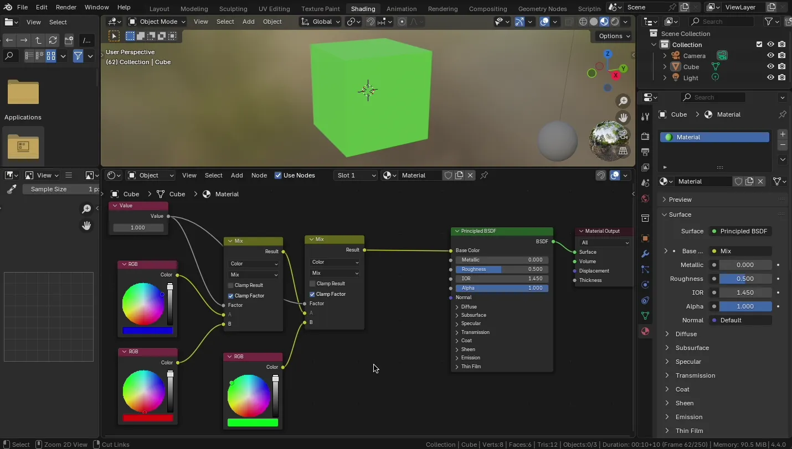

# Основы работы с Shader Editor: сложные материалы и

Blender использует систему Shader Editor, где можно собирать сложные материалы из маленьких блоков (нод), соединяя их друг с другом, тем самым программируя шейдер.

С помощью нод можно:

* Точно контролировать цвет, прозрачность, отражение, и другие параметры
* Комбинировать текстуры и цвета;
* Программировать поведение материалов (например, градиенты, маски, шумы)
* Создавать параметрические материалы - то есть такие, где изменение одного параметра (например, цвета, размера, степени шероховатости) сразу влияет на весь материал

> 💡 Параметрические материалы особенно полезны, если вы хотите применять один и тот же материал на разных объектах с разными настройками (например, плитка с разным цветом швов или мокрый асфальт с настраиваемым блеском).

> ⚠️ **ВАЖНО:** При экспорте моделей в .fbx формат большинство сложных материалов, особенно нодовые, не сохраняются корректно. В играх или движках (Unity, Unreal) материалы нужно настраивать заново, или использовать экспорт текстур (через bake). Shader Editor работает только в рамках Blender.

## Программирование шейдеров - Shader Editor

Для того, чтобы начать редактировать материал, нужно открыть Shader Editor. Его можно выбрать в списке Layout, либо самостоятельно добавить необходимое окно.

В стандартном Layout верхняя часть будет выделена под отображения сцены объекта (по умолчанию в режиме Material Preview с отображением окружения). Ниженяя часть - Shader Editor.

Для того, чтобы начать редактировать материал - выберите нужный объект, далее выберите нужный слот материала (если необходимо).

Обратите внимание, что в старых версиях блендера для включения нодовой системы редактирования материала, необходимо было указать галочку Use Nodes. В современных версиях Blender эта галочка стоит по умолчанию и является устаревшей (legacy) функцией.

### Создание и подключение нод

Создать новую ноду можно следующими способами:

* `Shift + A` - открывает окно с созданием нод
* Схватить за пин любого входа (или выхода ноды)
* Использользовать меню Add

У нод есть входы и выходы (пины). Схватив пин его можно соединить с пином другой ноды.

### Как работает нодовая система

Создадим ноду RGB и соединим ее с Base Color. Укажем у RGB ноды цвет.

Каждая нода - это маленький блок, обрабатывающий информацию (цвет, число, вектор и т.д.).

Вы соединяете выход одной ноды со входом другой.
Ноды работают потоково - результат одной ноды переходит в следующую.

Создадим еще одну ноду RGB и объединим результаты двух RGB нод в один с помощью ноды Mix.

В ноде Mix параметр Frac - коэффициет смещивания входов. В примере значение коэффициента было вынесено в отдельную ноду.

### Дополнительные инструменты для работы с нодами

* `Ctrl + ПКМ` - рисование линии, которая будет удалять связи
* `Ctrl + Alt + ПКМ` - рисование линии, которая будет заглушать (отлючать) связь, повторное использование включает связь обратно
* `Shift + D` - позволяет дублировать ноды
* Размещение ноды поверх уже существующей связи встраивает ноду

### Виды пинов у нод

У каждой точки входа/выхода есть цвет - это тип данных:

| Цвет пина (кружочка) | Тип данных      | Пример              |
| -------------------- | --------------- | ------------------- |
| 🟡 Жёлтый             | Цвет (Color)    | RGB, Texture        |
| 🔵 Синий              | Вектор (Vector) | Normal, Mapping     |
| ⚪️ Серый              | Число (Value)   | Roughness, Metallic |
| 🟢 Зелёный            | Shader          | Вход/выход шейдера  |

Если вы попытаетесь соединить несовместимые типы - Blender сам преобразует данные, если это возможно.

### Полезные ноды

Ниже перечислены основные полезные ноды (далеко не все)

Полный список нод можно посмотреть в [официальной документации Blender](https://docs.blender.org/manual/en/latest/render/shader_nodes/index.html).

#### Из категории Color

* RGB - просто цвет
* Mix - смешивает два цвета
* Color Ramp - градиент, позволяет точно настроить смешивание
* Invert - инвертирует цвет

#### Из категории Input

* Texture Coordinate - координаты текстуры (включая UV)
* Fresnel - создает эффект блика по краям (зависит от угла обзора)
* Geometry - параметры объекта, включая нормали, позицию и т.д

#### Из категории Converter

* Math - арифметические операции
* Separate XYZ / Combine XYZ - разделение / сборка векторов
* Clamp - ограничение значений

### Ноды текстур

| Нода                    | Описание                                                |
| ----------------------- | ------------------------------------------------------- |
| **Brick Texture**       | Кирпичный узор, настраиваются размеры и швы.            |
| **Checker Texture**     | Шахматный узор, часто для тестов UV.                    |
| **Environment Texture** | HDRI-окружение для фона сцены.                          |
| **Gabor Texture**       | Волнообразный узор, подходит для генеративных эффектов. |
| **Gradient Texture**    | Градиенты: линейный, сферический и др.                  |
| **IES Texture**         | Реалистичное освещение на основе фотометрии.            |
| **Image Texture**       | Подключение внешней текстуры (PNG, JPG и т.д.).         |
| **Magic Texture**       | Хаотичный эффект, используется редко.                   |
| **Noise Texture**       | Классический procedural noise.                          |
| **Point Density**       | Визуализация плотности точек (для Volume).              |
| **Sky Texture**         | Реалистичное небо в зависимости от солнца.              |
| **Voronoi Texture**     | Клеточная структура (трещины, пятна).                   |
| **Wave Texture**        | Волнообразный узор, часто для воды и ткани.             |
| **White Noise Texture** | Резкий случайный шум.                                   |

## PBR-материалы

TODO

## Управление .blend файлами и текстурами

TODO
