# Основы работы с Shader Editor: сложные материалы и PBR

Blender использует систему Shader Editor, где можно собирать сложные материалы из маленьких блоков (нод), соединяя их друг с другом, тем самым программируя шейдер.

С помощью нод можно:

* Точно контролировать цвет, прозрачность, отражение, и другие параметры
* Комбинировать текстуры и цвета;
* Программировать поведение материалов (например, градиенты, маски, шумы)
* Создавать параметрические материалы - то есть такие, где изменение одного параметра (например, цвета, размера, степени шероховатости) сразу влияет на весь материал

> 💡 Параметрические материалы особенно полезны, если вы хотите применять один и тот же материал на разных объектах с разными настройками (например, плитка с разным цветом швов или мокрый асфальт с настраиваемым блеском).

> ⚠️ **ВАЖНО:** При экспорте моделей в .fbx формат большинство сложных материалов, особенно нодовые, не сохраняются корректно. В играх или движках (Unity, Unreal) материалы нужно настраивать заново, или использовать экспорт текстур (через bake). Shader Editor работает только в рамках Blender.

## Программирование шейдеров - Shader Editor

Для того, чтобы начать редактировать материал, нужно открыть Shader Editor. Его можно выбрать в списке Layout, либо самостоятельно добавить необходимое окно.

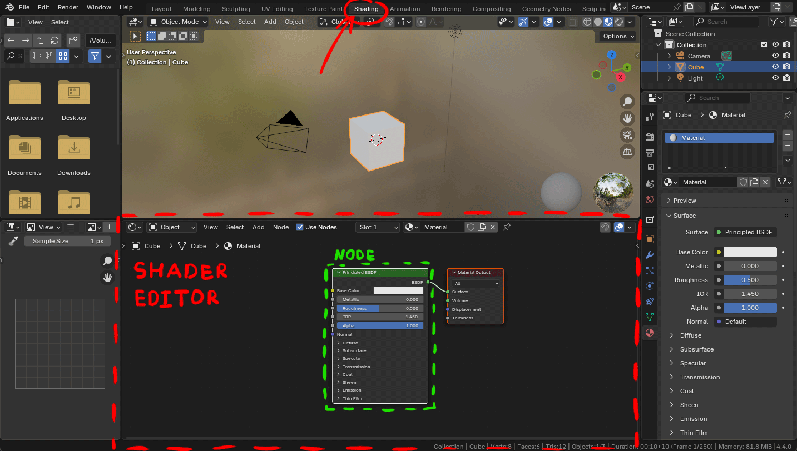

В стандартном Layout верхняя часть будет выделена под отображения сцены объекта (по умолчанию в режиме Material Preview с отображением окружения). Ниженяя часть - Shader Editor.

Для того, чтобы начать редактировать материал - выберите нужный объект, далее выберите нужный слот материала (если необходимо).

Обратите внимание, что в старых версиях блендера для включения нодовой системы редактирования материала, необходимо было указать галочку Use Nodes. В современных версиях Blender эта галочка стоит по умолчанию и является устаревшей (legacy) функцией.

### Создание и подключение нод

Создать новую ноду можно следующими способами:

* `Shift + A` - открывает окно с созданием нод
* Схватить за пин любого входа (или выхода ноды)
* Использользовать меню Add

У нод есть входы и выходы (пины). Схватив пин его можно соединить с пином другой ноды.

### Как работает нодовая система

Создадим ноду RGB и соединим ее с Base Color. Укажем у RGB ноды цвет.

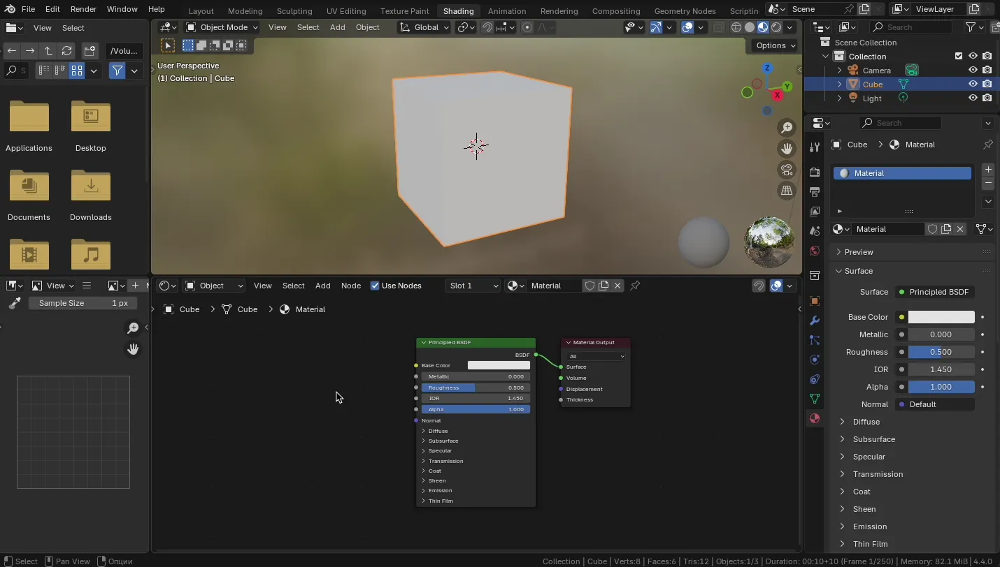

Каждая нода - это маленький блок, обрабатывающий информацию (цвет, число, вектор и т.д.).

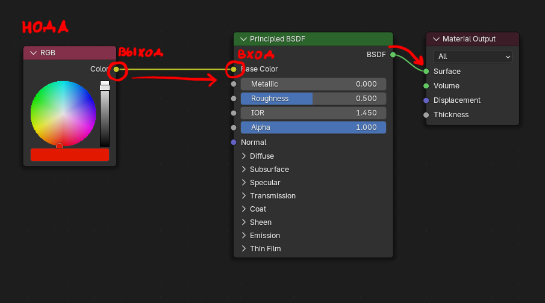

Вы соединяете выход одной ноды со входом другой.
Ноды работают потоково - результат одной ноды переходит в следующую.

Создадим еще одну ноду RGB и объединим результаты двух RGB нод в один с помощью ноды Mix.

В ноде Mix параметр Frac - коэффициет смещивания входов. В примере значение коэффициента было вынесено в отдельную ноду.

### Дополнительные инструменты для работы с нодами

* `Ctrl + ПКМ` - рисование линии, которая будет удалять связи
* `Ctrl + Alt + ПКМ` - рисование линии, которая будет заглушать (отлючать) связь, повторное использование включает связь обратно
* `Shift + D` - позволяет дублировать ноды
* Размещение ноды поверх уже существующей связи встраивает ноду

### Виды пинов у нод

У каждой точки входа/выхода есть цвет - это тип данных:

| Цвет пина (кружочка) | Тип данных      | Пример              |
| -------------------- | --------------- | ------------------- |
| 🟡 Жёлтый             | Цвет (Color)    | RGB, Texture        |
| 🔵 Синий              | Вектор (Vector) | Normal, Mapping     |
| ⚪️ Серый              | Число (Value)   | Roughness, Metallic |
| 🟢 Зелёный            | Shader          | Вход/выход шейдера  |

Если вы попытаетесь соединить несовместимые типы - Blender сам преобразует данные, если это возможно.

### Полезные ноды

Ниже перечислены основные полезные ноды (далеко не все)

Полный список нод можно посмотреть в [официальной документации Blender](https://docs.blender.org/manual/en/latest/render/shader_nodes/index.html).

#### Из категории Color

* RGB - просто цвет
* Mix - смешивает два цвета
* Color Ramp - градиент, позволяет точно настроить смешивание
* Invert - инвертирует цвет

#### Из категории Input

* Texture Coordinate - координаты текстуры (включая UV)
* Fresnel - создает эффект блика по краям (зависит от угла обзора)
* Geometry - параметры объекта, включая нормали, позицию и т.д

#### Из категории Converter

* Math - арифметические операции
* Separate XYZ / Combine XYZ - разделение / сборка векторов
* Clamp - ограничение значений

### Ноды текстур

| Нода                    | Описание                                                |
| ----------------------- | ------------------------------------------------------- |
| **Brick Texture**       | Кирпичный узор, настраиваются размеры и швы.            |
| **Checker Texture**     | Шахматный узор, часто для тестов UV.                    |
| **Environment Texture** | HDRI-окружение для фона сцены.                          |
| **Gabor Texture**       | Волнообразный узор, подходит для генеративных эффектов. |
| **Gradient Texture**    | Градиенты: линейный, сферический и др.                  |
| **IES Texture**         | Реалистичное освещение на основе фотометрии.            |
| **Image Texture**       | Подключение внешней текстуры (PNG, JPG и т.д.).         |
| **Magic Texture**       | Хаотичный эффект, используется редко.                   |
| **Noise Texture**       | Классический procedural noise.                          |
| **Point Density**       | Визуализация плотности точек (для Volume).              |
| **Sky Texture**         | Реалистичное небо в зависимости от солнца.              |
| **Voronoi Texture**     | Клеточная структура (трещины, пятна).                   |
| **Wave Texture**        | Волнообразный узор, часто для воды и ткани.             |
| **White Noise Texture** | Резкий случайный шум.                                   |

## PBR-материалы

PBR (Physically Based Rendering) - это метод визуализации материалов, который имитирует физические свойства поверхности при взаимодействии со светом. Он стремится к фотореалистичности и используется во всех современных игровых движках, рендерах и 3D-программах.

Главные преимущества:

* Реалистичное освещение при любом источнике света
* Стандартизация: материалы можно переносить между программами
* Упрощение работы с текстурами: один набор подходит для всех случаев

### Основные текстуры PBR

| Название текстуры     | Назначение                                                       | Цветовой формат | Пример                                                  |
| --------------------- | ---------------------------------------------------------------- | --------------- | ------------------------------------------------------- |
| Base Color (Albedo)   | Основной цвет поверхности, без теней и бликов                    | RGB             | 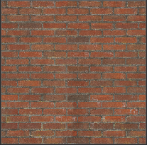    |
| Roughness             | Определяет шероховатость поверхности (0 - глянец, 1 - матовость) | Grayscale       | 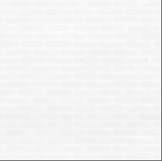      |
| Metallic              | Определяет, является ли материал металлом                        | Grayscale       | 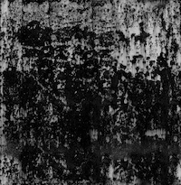    |
| Normal Map            | Позволяет добавить мелкий рельеф без изменения геометрии         | RGB (Tangent)   | 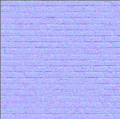    |
| Height / Displacement | Используется для сильного рельефа (обычно через модификатор)     | Grayscale       | 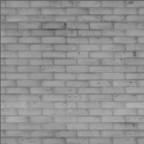      |
| Ambient Occlusion     | Отображает затемнение в углублениях                              | Grayscale       | 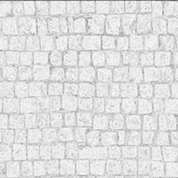 |

> ⚠️ Некоторые наборы текстур объединяют карты в один файл (например, R - AO, G - Roughness, B - Metallic)

### Где брать PBR-текстуры?

| Сайт                                      | Комментарий                               |
| ----------------------------------------- | ----------------------------------------- |
| [ambientCG.com](https://ambientcg.com/)   | Бесплатные, CC0, регулярно обновляются    |
| [polyhaven.com](https://polyhaven.com/)   | Бесплатные, в высоком качестве            |
| [cgbookcase.com](https://cgbookcase.com/) | Хорошо структурированы, CC0               |
| [textures.com](https://www.textures.com/) | Ограничение на скачивание без регистрации |

### Подключение PBR-текстур в Blender

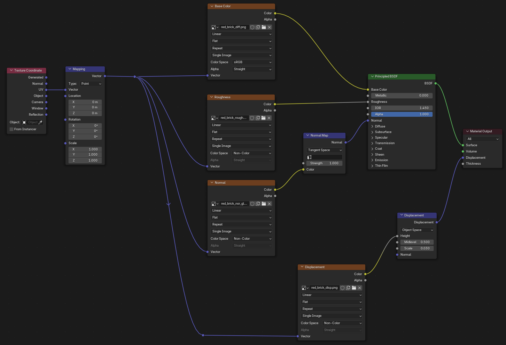

Чтобы использовать PBR-материал:

1. Создайте новый материал на объекте
2. Перейдите в Shader Editor
3. Добавьте Image Texture (Shift + A -> Texture -> Image Texture) для каждой карты:
   * Base Color -> подключить к Base Color
   * Roughness -> к Roughness
   * Metallic -> к Metallic
   * Normal Map -> через Normal Map ноду -> к Normal
4. Для Normal Map:
   * Тип Color Space у Image Texture нужно поставить на Non-Color
   * Добавить Normal Map ноду и соединить её с Image Texture и шейдером

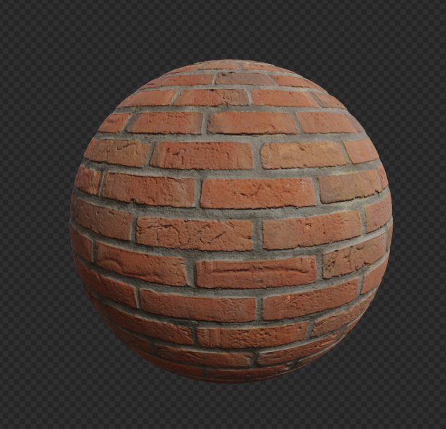

### Работа Normal Map: теория

Normal Map - это специальная текстура, кодирующая направление нормалей поверхности через цвет. Она позволяет «подделать» мелкий рельеф, не добавляя лишнюю геометрию.

* Цвета RGB в normal map представляют векторы отклонения нормали
* Используется в Tangent Space, то есть отклонения задаются относительно самой поверхности
* Blender требует подключать Normal Map через специальную Normal Map ноду, иначе результат будет некорректным

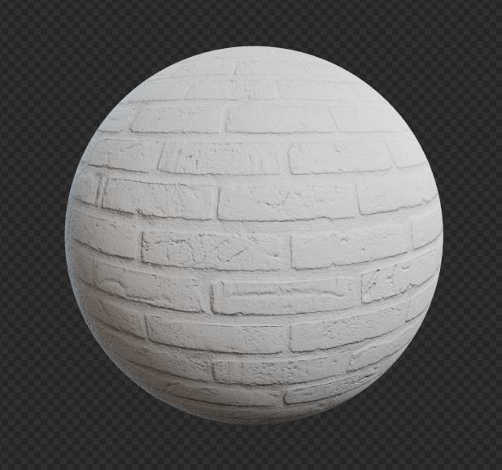

Для реалистичного эффекта также можно добавить Bump карту в дополнение к Normal Map, особенно для мелкого рельефа вроде пыли или потертостей.

## Управление .blend файлами и текстурами

Blender хранит всю информацию в датаблоках - это внутренние структуры данных:

* Mesh, Material, Texture, Image, World, Object, Collection и т.д.
* Датаблоки можно переиспользовать: например, один материал на нескольких объектах
* Переиспользуемые блоки имеют "двойную ссылку" в Outliner (иконка двойной цепочки)

### Переиспользование материалов

* Один материал можно назначить на несколько объектов
* Изменение одного экземпляра автоматически влияет на все остальные, если не делать "Single User"

Для создания уникальной копии материала: `Properties -> Material -> Number Icon (двойной блок) -> Сделать Single User`

### Упаковка текстур внутрь .blend

Чтобы не потерять текстуры при переносе .blend файла:

1. Перейти в File -> External Data -> Pack Resources
2. Либо использовать Automatically Pack Resources

### Где смотреть и управлять ресурсами?

* В Outliner переключить вид на Blender File
* Здесь видны все ресурсы: материалы, текстуры, изображения
* Можно удалить неиспользуемые датаблоки, чтобы облегчить сцену

### Сохранение текстур отдельно

Если нужно сохранить или экспортировать текстуры, можно:

* `Image Editor -> Image -> Save As / Save a Copy`
* Использовать `File -> External Data -> Unpack Resources` - извлечет текстуры в папку рядом с .blend файлом
