# Продвинутая работа с материалами и текстурирование

## UV-развертка

Когда мы создаем 3D-модель, мы описываем ее форму - с помощью вершин, ребер и граней. Чтобы наложить на модель текстуру (рисунок, материал), Blender должен понять: какая часть текстуры должна попасть на какую часть модели.

Именно для этого и нужна UV-развертка - информация о том, как развернуть 3D-модель в плоскую 2D-схему, чтобы на нее можно было наложить изображение.

Для редактирования UV откройте UV Editing в списке Layouts. Либо создайте отдельное окно UV Editor в разделе General.

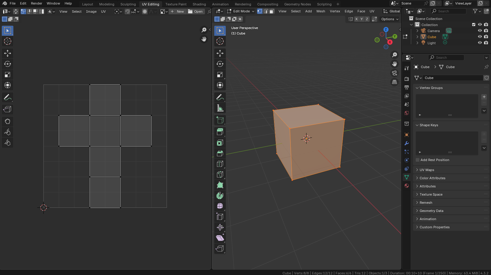

Когда мы говорим про 2D-координаты текстуры, вместо привычных X и Y, используются U и V:

* U - горизонтальная координата текстуры
* V - вертикальная координата

Почему не X и Y? Чтобы не путать с 3D-координатами модели (X, Y, Z), в текстурах используют другие обозначения: (U, V) - для 2D, (U, V, W) - для 3D текстур.

В материале при создании текстуры попробуйте указать Generated Type / UV Grid.

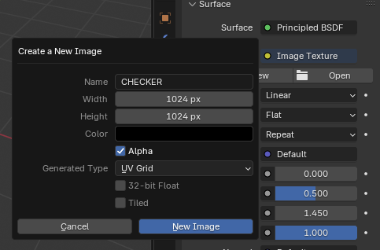

Как это работает:

* 3D-модель разбивается на плоские участки (как выкройка)
* Эти участки укладываются в прямоугольник - UV-координатное пространство
* Каждая вершина модели получает координаты (U, V), указывающие где на текстуре брать цвет

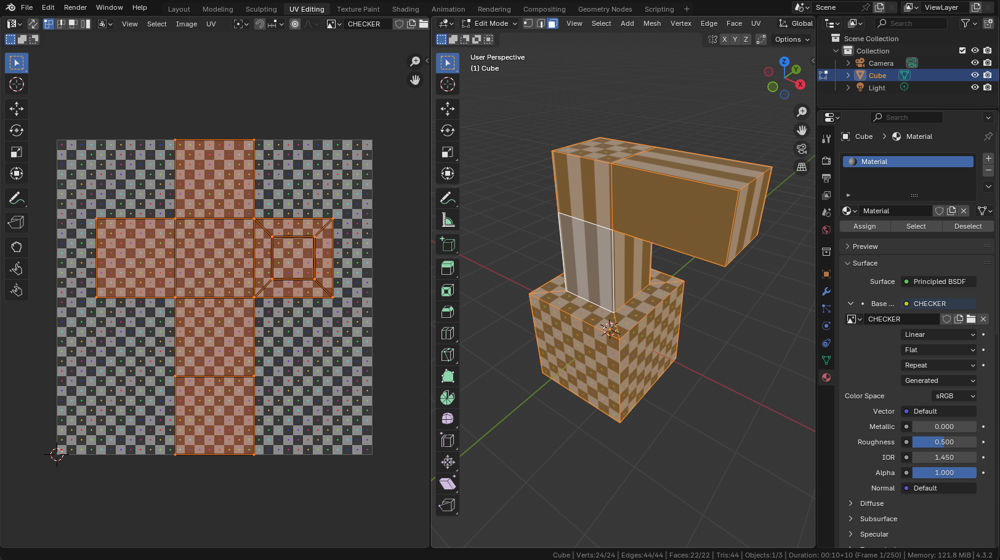

UV развертку можно делать вручную, или воспользоваться инструментами UV / Unwarp.

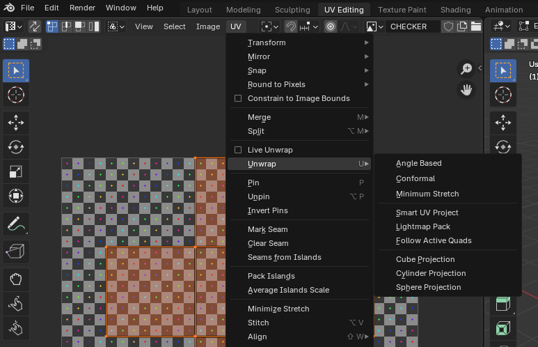

Обратите внимание, что Unwarp будет работать только на выделенную геометрию. Таким образом можно разворачивать только необходимую часть.

После применения, например, Smart UV Project, развертка будет создана автоматически.

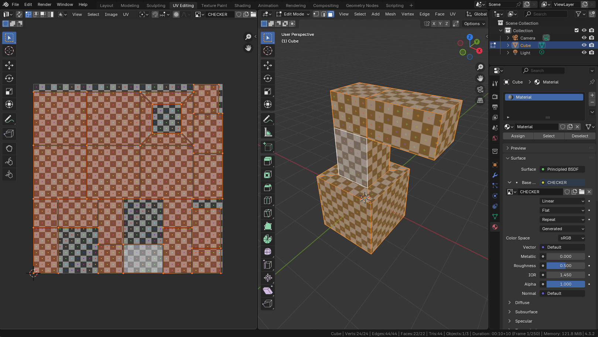

Не всегда автоматическая развертка работает корректно. Чтобы помочь автоматике, можно вручную указать швы через контекстное меню в Edit Mode - Mark Seam.

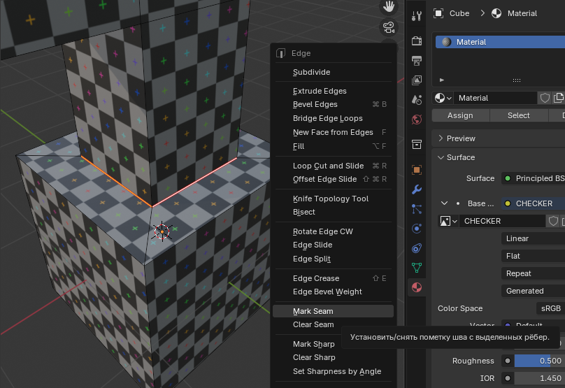

Основная суть создания UV развертки - избежать искажений текстуры. Искажения хорошо видно при использовании UV Grid сетки.

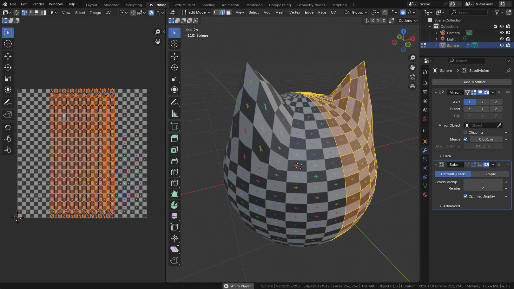

Для примера выше можно указать вручную все необходимые разрезы для создания UV развертки.

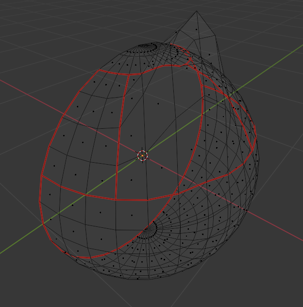

После этого применить UV / Unwarp / Cube Project, предварительно выделив всю геометрию. Можно выделять только связанный айлэнд (uv island, то, на что мы нарезали) через  Ctrl + L и применять отдельно иные способы развертки (вплоть до полностью ручного редактирования).

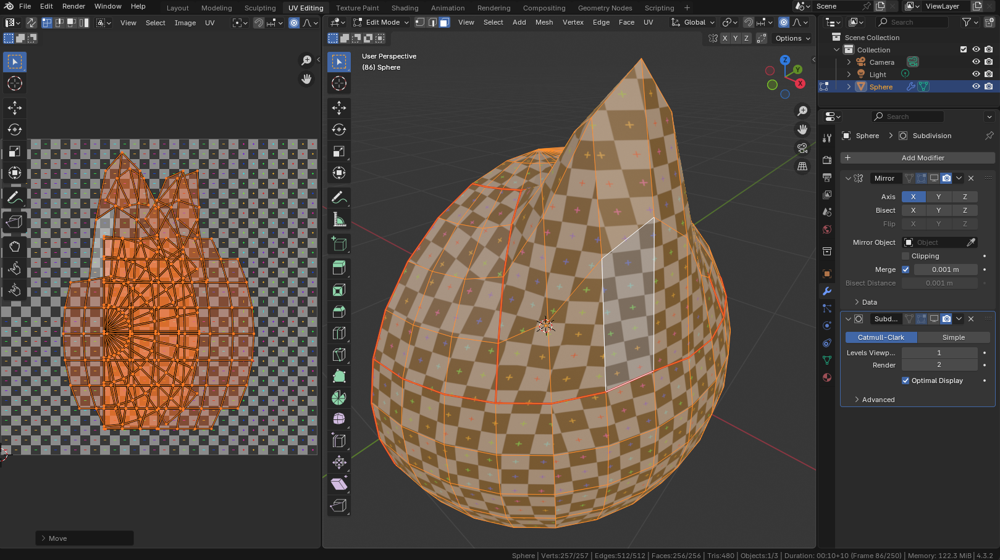

Обратите внимание, что после такой развертки все айленды пересекаются. Это плохо (если специально так не задумано для повторного использования определенных участков текстуры). Чтобы автоматически разбросать айленды, воспользуйтесь UV / Pack Islands.

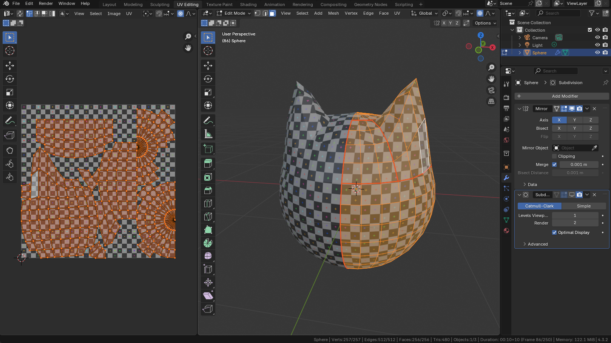

Для просмотра искажений на UV развертке можно использовать режим наложения "UV Stretch" в настройках Overlays в UV Editor.

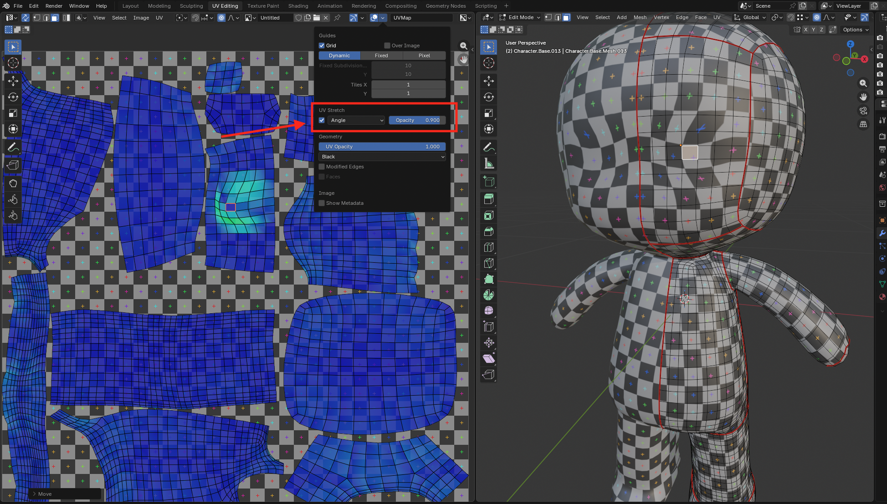

## Наложение и рисование текстур

Blender позволяет встроенным инструментарием редактировать изображения и текстуры (как созданные в нем, так и импортированные).

Перед началом рисования - добавьте пустую текстуру (Blank, например с черной заливкой размером 1024 x 1024)

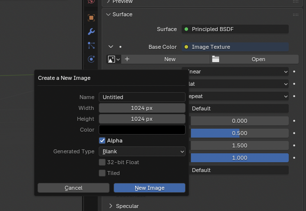

Для рисования достаточно перейти в режим Texture Paint.

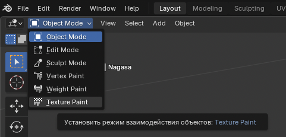

Для удобства следует так же открыть отдельное окно Image Editor для удобного просмотра текстуры и UV развертки.

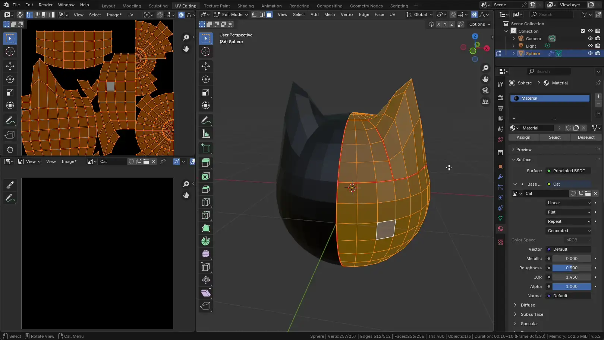

Прежде чем рисовать, следует настроить UV развертку. При достаточно высоком разрешении, может показаться, что даже без настройки развертки - получается рисовать. Однако нарисованная текстура будет очень сильно искажена и будет иметь заметные артефакты (при более низком разрешении).

## Программирование материалов

TODO

## PBR текстуры

TODO

## Управление .blend файлами и текстурами

TODO
