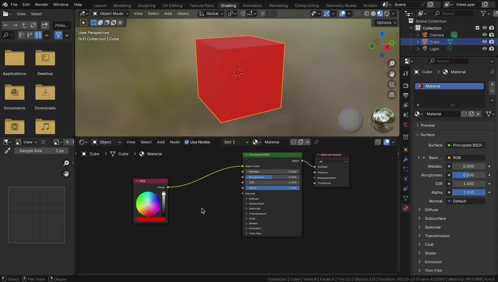
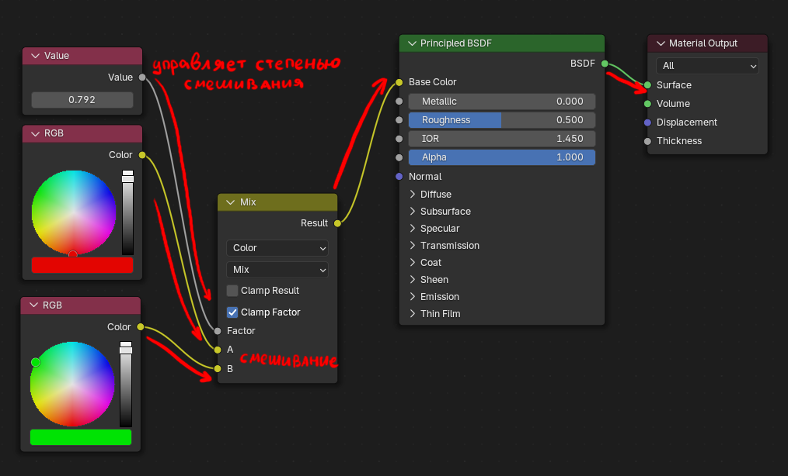
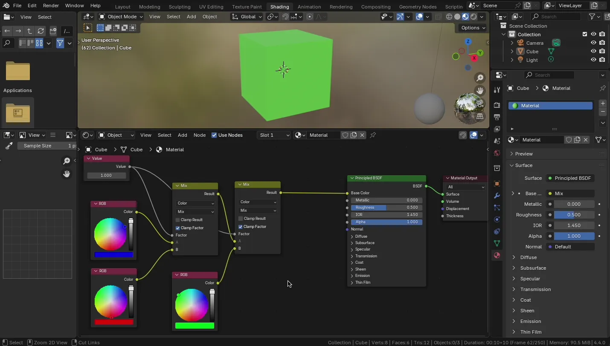

# Продвинутая работа с материалами и текстурирование

## UV-развертка

Когда мы создаем 3D-модель, мы описываем ее форму - с помощью вершин, ребер и граней. Чтобы наложить на модель текстуру (рисунок, материал), Blender должен понять: какая часть текстуры должна попасть на какую часть модели.

Именно для этого и нужна UV-развертка - информация о том, как развернуть 3D-модель в плоскую 2D-схему, чтобы на нее можно было наложить изображение.

Для редактирования UV откройте UV Editing в списке Layouts. Либо создайте отдельное окно UV Editor в разделе General.

Когда мы говорим про 2D-координаты текстуры, вместо привычных X и Y, используются U и V:

* U - горизонтальная координата текстуры
* V - вертикальная координата

Почему не X и Y? Чтобы не путать с 3D-координатами модели (X, Y, Z), в текстурах используют другие обозначения: (U, V) - для 2D, (U, V, W) - для 3D текстур.

В материале при создании текстуры попробуйте указать Generated Type / UV Grid.

Как это работает:

* 3D-модель разбивается на плоские участки (как выкройка)
* Эти участки укладываются в прямоугольник - UV-координатное пространство
* Каждая вершина модели получает координаты (U, V), указывающие где на текстуре брать цвет

UV развертку можно делать вручную, или воспользоваться инструментами UV / Unwarp.

Обратите внимание, что Unwarp будет работать только на выделенную геометрию. Таким образом можно разворачивать только необходимую часть.

После применения, например, Smart UV Project, развертка будет создана автоматически.

Не всегда автоматическая развертка работает корректно. Чтобы помочь автоматике, можно вручную указать швы через контекстное меню в Edit Mode - Mark Seam.

Основная суть создания UV развертки - избежать искажений текстуры. Искажения хорошо видно при использовании UV Grid сетки.

Для примера выше можно указать вручную все необходимые разрезы для создания UV развертки.

После этого применить UV / Unwarp / Cube Project, предварительно выделив всю геометрию. Можно выделять только связанный айлэнд (uv island, то, на что мы нарезали) через  Ctrl + L и применять отдельно иные способы развертки (вплоть до полностью ручного редактирования).

Обратите внимание, что после такой развертки все айленды пересекаются. Это плохо (если специально так не задумано для повторного использования определенных участков текстуры). Чтобы автоматически разбросать айленды, воспользуйтесь UV / Pack Islands.

Для просмотра искажений на UV развертке можно использовать режим наложения "UV Stretch" в настройках Overlays в UV Editor.

## Наложение и рисование текстур

Blender позволяет встроенным инструментарием редактировать изображения и текстуры (как созданные в нем, так и импортированные).

Перед началом рисования - добавьте пустую текстуру (Blank, например с черной заливкой размером 1024 x 1024)

Для рисования достаточно перейти в режим Texture Paint.

Для удобства следует так же открыть отдельное окно Image Editor для удобного просмотра текстуры и UV развертки.

Прежде чем рисовать, следует настроить UV развертку. При достаточно высоком разрешении, может показаться, что даже без настройки развертки - получается рисовать. Однако нарисованная текстура будет очень сильно искажена и будет иметь заметные артефакты (при более низком разрешении).

## Программирование материалов (Shader Editor)

Прежде чем создавать и редактировать сложной материал, необходимо открыть Shader Editor. По-умолчанию он уже есть в Workspace с названием Shading, либо можно самостоятельно добавить необходимое окно Shader Editor.

В стандартном Workspace верхняя часть будет выделена под отображения сцены объекта (по умолчанию в режиме Material Preview с отображением окружения). Нижняя часть - Shader Editor.

Для того, чтобы начать редактировать материал - выберите нужный объект, далее выберите нужный слот материала (если необходимо).

Обратите внимание, что в старых версиях блендера для включения нодовой системы редактирования материала, необходимо было указать галочку Use Nodes. <s>В современных версиях Blender эта галочка стоит по умолчанию и является устаревшей (legacy) функцией.</s> В современных версиях Blender галочка удалена.

### Создание и подключение нод

Создать новую ноду можно следующими способами:

* `Shift + A` - открывает окно с созданием нод
* Схватить за пин любого входа (или выхода ноды)
* Использользовать меню Add

У нод есть входы и выходы (пины). Схватив пин его можно соединить с пином другой ноды.

### Как работает нодовая система

Создадим ноду RGB и соединим ее с Base Color. Укажем у RGB ноды цвет.

Каждая нода - это маленький блок, обрабатывающий информацию (цвет, число, вектор и т.д.).

Вы соединяете выход одной ноды со входом другой.
Ноды работают потоково - результат одной ноды переходит в следующую.

Создадим еще одну ноду RGB и объединим результаты двух RGB нод в один с помощью ноды Mix.

В ноде Mix параметр Frac - коэффициет смещивания входов. В примере значение коэффициента было вынесено в отдельную ноду.

### Дополнительные инструменты для работы с нодами

* `Ctrl + ПКМ` - рисование линии, которая будет удалять связи
* `Ctrl + Alt + ПКМ` - рисование линии, которая будет заглушать (отключать) связь, повторное использование включает связь обратно
* `Shift + D` - позволяет дублировать ноды
* Размещение ноды поверх уже существующей связи встраивает ноду

### Виды пинов у нод

У каждой точки входа/выхода есть цвет - это тип данных:

| Цвет пина (кружочка) | Тип данных      | Пример              |
| -------------------- | --------------- | ------------------- |
| 🟡 Жёлтый             | Цвет (Color)    | RGB, Texture        |
| 🔵 Синий              | Вектор (Vector) | Normal, Mapping     |
| ⚪️ Серый              | Число (Value)   | Roughness, Metallic |
| 🟢 Зелёный            | Shader          | Вход/выход шейдера  |

Если вы попытаетесь соединить несовместимые типы - Blender сам преобразует данные, если это возможно.

### Полезные ноды

Ниже перечислены основные полезные ноды (далеко не все)

Полный список нод можно посмотреть в [официальной документации Blender](https://docs.blender.org/manual/en/latest/render/shader_nodes/index.html).

#### Из категории Color

* RGB - просто цвет
* Mix - смешивает два цвета
* Color Ramp - градиент, позволяет точно настроить смешивание
* Invert - инвертирует цвет

#### Из категории Input

* Texture Coordinate - координаты текстуры (включая UV)
* Fresnel - создает эффект блика по краям (зависит от угла обзора)
* Geometry - параметры объекта, включая нормали, позицию и т.д

#### Из категории Converter

* Math - арифметические операции
* Separate XYZ / Combine XYZ - разделение / сборка векторов
* Clamp - ограничение значений

### Ноды текстур

| Нода                    | Описание                                                |
| ----------------------- | ------------------------------------------------------- |
| **Brick Texture**       | Кирпичный узор, настраиваются размеры и швы.            |
| **Checker Texture**     | Шахматный узор, часто для тестов UV.                    |
| **Environment Texture** | HDRI-окружение для фона сцены.                          |
| **Gabor Texture**       | Волнообразный узор, подходит для генеративных эффектов. |
| **Gradient Texture**    | Градиенты: линейный, сферический и др.                  |
| **IES Texture**         | Реалистичное освещение на основе фотометрии.            |
| **Image Texture**       | Подключение внешней текстуры (PNG, JPG и т.д.).         |
| **Magic Texture**       | Хаотичный эффект, используется редко.                   |
| **Noise Texture**       | Классический procedural noise.                          |
| **Point Density**       | Визуализация плотности точек (для Volume).              |
| **Sky Texture**         | Реалистичное небо в зависимости от солнца.              |
| **Voronoi Texture**     | Клеточная структура (трещины, пятна).                   |
| **Wave Texture**        | Волнообразный узор, часто для воды и ткани.             |
| **White Noise Texture** | Резкий случайный шум.                                   |

## PBR текстуры

TODO

## Управление .blend файлами и текстурами

TODO
