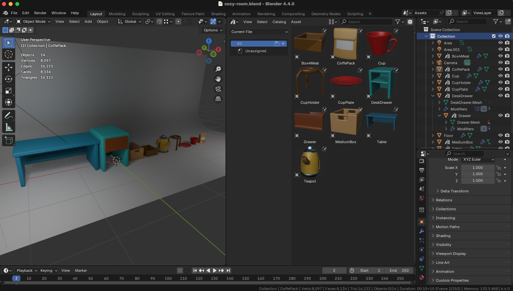
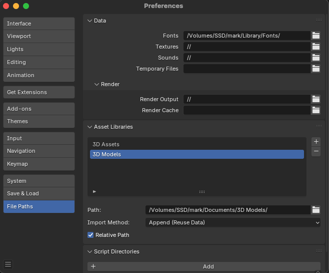
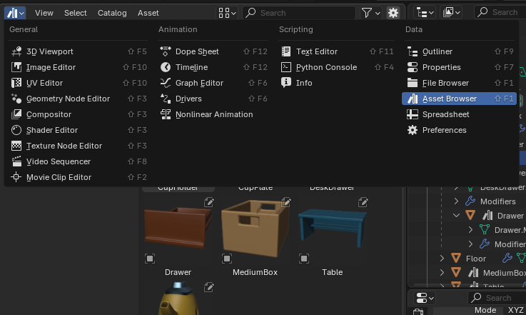
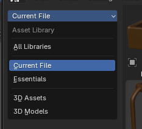
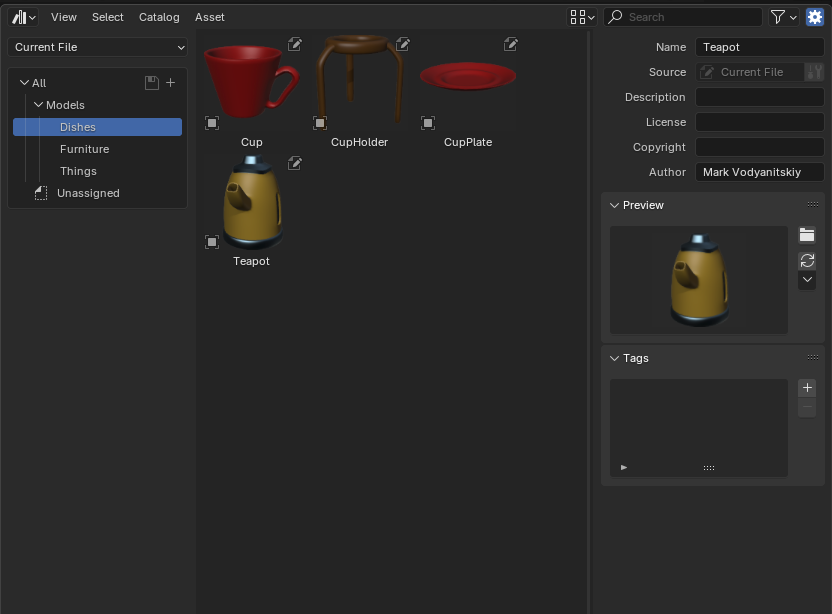
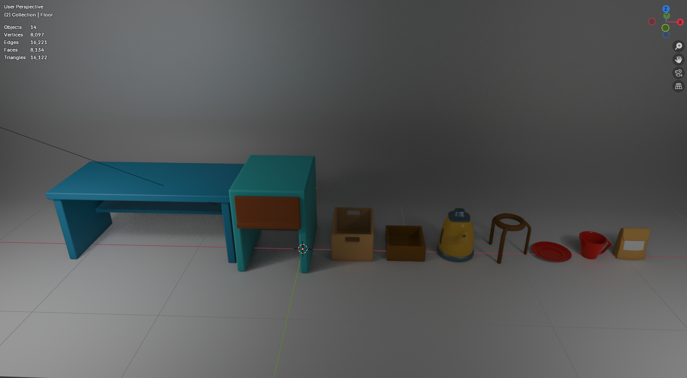
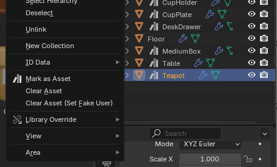
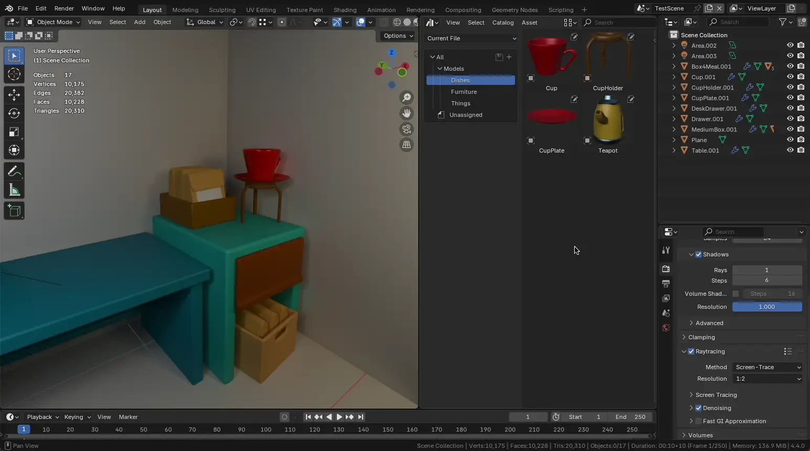
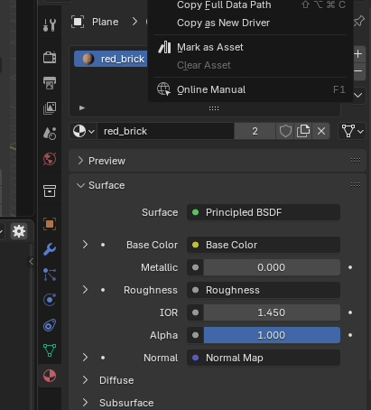
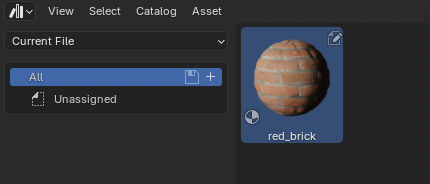

# Создание библиотек ассетов

При создании сложной сцены (комнаты с множеством объектов, игрового уровня и т.д.) часто применяется подход, которой предусматривает использование ассетов. Ассеты - это "упаковнные" готовые к повторному использованию объекты, материалы, нод группы и т.п. (любой datablock в Blender может быть ассетом).

Задача ассетов - упросить размещение уже готовых объектов, при этом не ограничиваясь количеством копий этих объектов. Копии могут быть как линкованные (т.к. с ссылкой на оригинал и могут быть все разом обновлены), либо быть дубликатами без связи (с возможностью их редактировать).

Blender умеет искать ассеты:

- В текущем файле
- В множетсве файлов-библиотек (путь указывается в настройках)

Для того, чтобы указать местоположение ассетов (где Blender должен их искать), необходимо в настройках в разделе File Paths указать пути до библиотек в Assets Libraries.

Blender будет просматривать все `.blend` файлы в директории рекурсивно и искать внутри файлов ассеты (указанные через Mark as Asset).

Чтобы открыть Asset Browser (просмотр и выбор ассетов), нужно создать новое окно и выбать в нем соотвествующий пункт.

Обратите внимание что браузер ассетов можно настроить на поиск везде, либо на поиск ассетов в текущем файле. Так же можно выбрать определенную библиотеку, прописанную в настройках.

В Asset Browser можно задавать иерархию групп ассетов (папок), а так же можно открыть Sidebar (на `N`) для дополнительных настроек ассетов.

## Библиотеки моделей

Прежде чем использовать ассеты - нужно сделать набор объектов. Жедательно прижерживаться реальных размеров, чтобы у пользователя ассетов не возниклом проблем при их внедрении в сцену и ему не пришлось их маштабировать.

Для того, чтобы пометить объект как ассет, необходимо его выбрать в Outliner и в контекстном меню ПКМ выбрать Mark as Asset.

После этого модель станет доступна как ассет в браузере ассетов и ее можно разместить на сцене. После размещения можно включить опцию Linked Copy (в настройках иснтрумента) чтобы объект ссылался на оригинал и не был дубликатом.

> 💡 Для того, чтобы в Asset Browser отображались цвета у материалов, необходимо указать в настройках материала в разделе Viewport Display цвет.

## Библиотеки материалов

Ассеты материалов работают схоже с моделями. Для создания ассета необходимо нажать ПКМ по материалу (в списке слотов) и выбрать Mark as Asset.

После этого материал может быть доступен как ассет и быть легко перенесен на модель в сцене.

