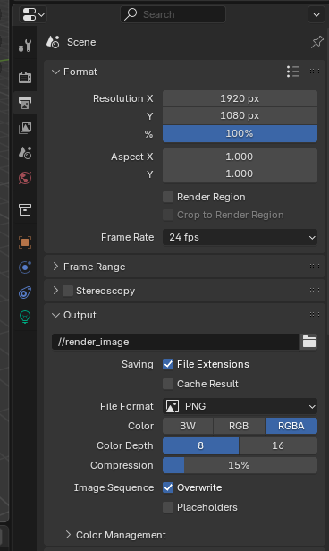
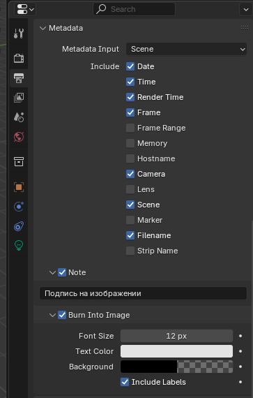
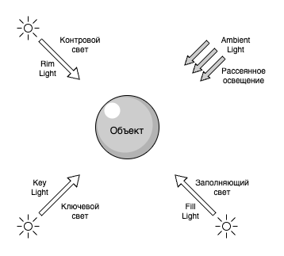
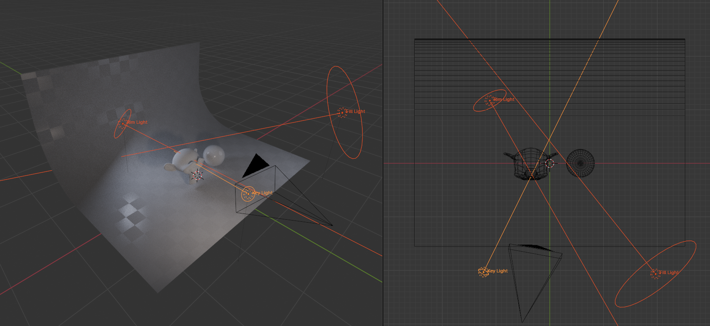
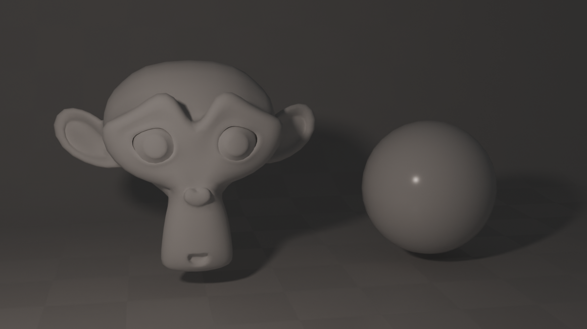
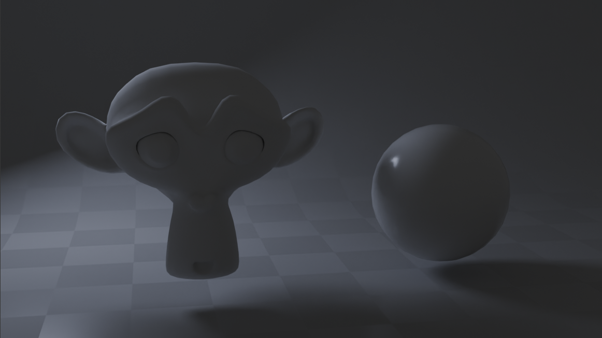
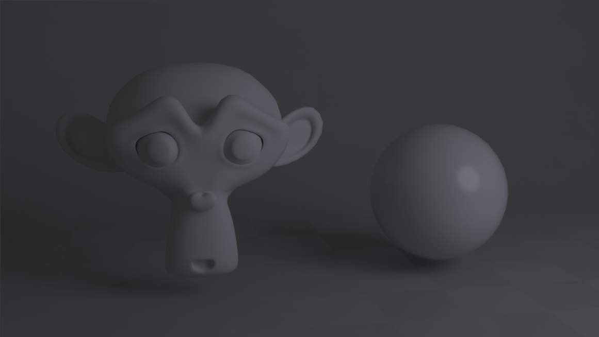
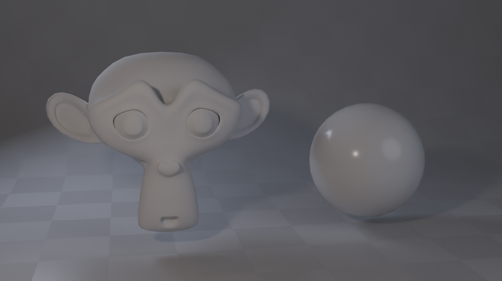
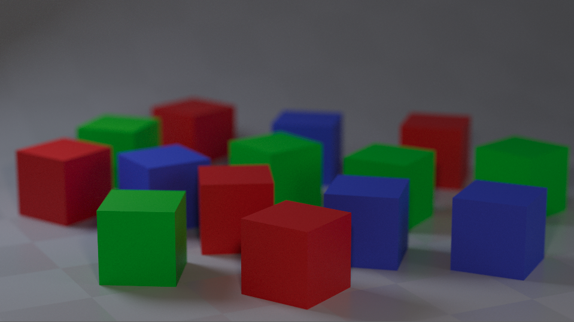

# Рендер изображения

## Настройка рендера

### Формат и разрешение изображения

Вкладка **Render Properties** / **Output Properties**:

- `Resolution` - задает итоговое разрешение изображения (например, 1920×1080)
- `Percentage Scale` - масштабирует разрешение. Если указано 50%, то итоговое разрешение будет 960×540
  - 💡 Полезно при тестовом рендере: можно временно уменьшить масштаб, чтобы ускорить процесс
- `Frame Range` - используется для анимации, но для одиночного кадра всегда рендерится текущий кадр
- `Output` - директория сохранения. Можно указать **относительный путь**, например: `//renders/`

### Формат файла

Во вкладке **Output Properties**:

- `File Format` - PNG, JPEG, OpenEXR и т.д.
  - PNG предпочтителен для изображений с прозрачностью
- `Color` - RGB или RGBA (для включения альфа-канала)
- `Compression` - степень сжатия (для PNG и JPEG)
- `File Name` - имя изображения (при сохранении серии кадров)

### Регион рендера

Blender позволяет рендерить **только часть изображения**:

- Активировать в `Render Region`:
  - Включить в `View` -> `Render Region`
  - В 3D Viewport выделить область с помощью `Ctrl + B`
  - Убрать область - `Ctrl + Alt + B`

### Метаданные

Во вкладке **Output Properties** -> `Metadata`:

- Добавляют информацию в изображение: имя сцены, имя файла, текущий кадр, камера и т.д.
- Опция `Burn Into Image` - позволяет записать метаданные прямо в картинку (используется, например, для черновиков и технических рендеров)

### Прозрачный фон

Чтобы фон изображения был **прозрачным**, а не цветом окружения:

- Перейдите во вкладку `Render Properties` -> `Film`
- Активируйте чекбокс `Transparent`

## Настройка освещения и камеры

### Освещение

#### Общая теория: свет в 3D и реальности

Освещение - ключ к выразительному и читаемому изображению. Основные принципы освещения из классической фотографии и кинематографа также применимы в 3D:

- **Ключевой свет (Key Light)** - основной источник света в сцене
- **Заполняющий свет (Fill Light)** - смягчает тени, добавляется с противоположной стороны
- **Контровой свет (Rim Light)** - размещается позади объекта, подчеркивает силуэт
- **Ambient Light** - общее рассеянное освещение (в реальности - от неба и отражений)

Дополнительно:

- Чем больше источник света (его радиус или площадь его поверхности) — тем мягче тени
- Чем дальше от объекта — тем слабее освещение (интенсивность - квадрат расстояния)
- Цвет и температура источников света могут задавать настроение сцены

Ниже приведен пример использования 3-х источников света.

| Key Light                 | Rim Light                 | Fill Light                 |
| ------------------------- | ------------------------- | -------------------------- |
|  |  |  |

Все источники вместе:

#### Источники света в Blender

- **Point** - точечный источник света, излучает во все стороны
- **Sun** - имитирует солнечный свет, параллельные лучи
- **Spot** - направленный пучок, можно регулировать угол
- **Area** - прямоугольный (или иной задаваемой формы) источник, подходит для мягкого освещения

##### Point (Точечный источник)

Имитирует лампочку — излучает свет во все стороны

- **Color** - цвет света
- **Power** - мощность источника (в ваттах), влияет на яркость
- **Soft Falloff** - более мягкий переход освещённости
- **Radius** - радиус светящегося объекта, влияет на мягкость теней
- **Shadow** - включение / отключение теней
- **Custom Distance** - можно ограничить дальность действия света

##### Sun (Солнце)

Источник с параллельными лучами. Не имеет расстояния, направление света задаётся поворотом объекта

- **Color** - цвет света
- **Strength** - сила света, задаётся в условных единицах
- **Angle** - угол рассеивания, влияет на мягкость теней
- **Shadow / Jitter / Filter / Resolution Limit** - настройки тени:
  - `Jitter` и `Filter` — влияют на размытие и шум теней
  - `Resolution Limit` — минимальная точность теней (меньше — лучше, но медленнее)

##### Spot (Прожектор)

Направленный свет с регулируемым углом. Полезен для театральных сцен, подсветки деталей и т.п.

- **Color**, **Power**, **Radius**, **Soft Falloff** - аналогичны Point
- **Beam Shape** - форма и свойства луча:
  - `Size` - угол рассеивания.
  - `Blend` - мягкость границы.
  - `Show Cone` - визуализация области освещения в Viewport
- **Shadow / Jitter / Filter / Resolution Limit** - параметры теней

##### Area (Площадной источник света)

Прямоугольная (или дисковая) панель света. Хорошо подходит для студийного освещения

- **Color**, **Power** - цвет и мощность
- **Shape** - форма источника (`Rectangle`, `Square`, `Disk`, `Ellipse`)
- **Size X / Y** - размеры источника (ширина и высота)
- **Shadow / Jitter / Filter / Resolution Limit** - как у Spot и Sun

> ⚠️ При использовании EEVEE обратите внимание, что не все типы света поддерживаются одинаково. Например, Area Light работает ограниченно — основное применение с Cycles.

---

### Камера

#### Общая теория: композиция и планы

Визуальный стиль сцены во многом зависит от **ракурса и плана камеры**. В 3D, как и в кино или фотографии, можно применять классические принципы композиции.

Сама тема композиции кадра - очень обширная и подробно не разбирается в данном курсе. Подробно изучить основы композиции можно в литературе:

* [«Композиция кадра в кино и на телевидении», Питер Уорд](https://archive.org/details/PeterWard-2003-PictureCompositionForFilmAndTv_113/mode/2up) - классический учебник, охватывающий принципы композиции, цветового решения и особенности многокамерной съемки
* [«Формат, энергия кадра и композиция для визуального сторителлинга», Матеу-Местре](magnet:?xt=urn:btih:68A6691B9095A8070B3F21745B6D6C0A6E182A44&tr=http%3A%2F%2Fbt3.t-ru.org%2Fann%3Fmagnet&dn=Marcos%20Mateu-Mestre%20-%20Framed%20Perspective%20vol.1%2Cvol.2%2C%20Framed%20ink%20%5B2010-2016%2C%20PDF%2C%20RUS%5D) - практическое руководство по созданию выразительных композиций в кино, анимации и комиксах

##### Виды планов

| Вид        | Описание                                                      |
| ---------- | ------------------------------------------------------------- |
| Общий план | Показывает объект полностью вместе с окружением               |
| Средний    | Показывает объект по пояс или по грудь                        |
| Крупный    | Подчеркивает детали: лицо, руки, конкретный объект            |
| Макро      | Очень крупный план (например, только глаз или предмет вблизи) |

##### Углы съемки

- **Фронтальный** - камера расположена на уровне объекта
- **Верхний (High Angle)** - зритель смотрит сверху вниз. Часто уменьшает важность объекта
- **Нижний (Low Angle)** - камера смотрит снизу вверх. Усиливает драму и масштаб
- **Dutch Angle** - наклоненная камера. Используется для создания напряжения или нестабильности

##### Правила композиции

- **Правило третей** - делим изображение на 3×3 и размещаем объект по линиям или на пересечениях
- **Ведущие линии** - линии, ведущие взгляд зрителя к важным частям кадра
- **Отрицательное пространство** - пустое место вокруг объекта, подчёркивающее его форму

---

#### Настройки камеры в Blender

Все параметры камеры доступны во вкладке `Properties -> Camera`, если выбрана сама камера в сцене

---

##### Focal Length (Фокусное расстояние)

- Измеряется в миллиметрах
- Чем **меньше значение**, тем **шире угол обзора** (эффект "широкоугольника" / "рыбий глаз", как у GoPro).
- Чем **больше значение**, тем **сильнее приближение** и "сплющивание" перспективы (как у телевика).

| Тип объектива  | Focal Length | Характеристика                      |
| -------------- | ------------ | ----------------------------------- |
| Широкоугольный | 18-35 mm     | Для больших пространств, интерьеров |
| Нормальный     | 35-50 mm     | Приближен к восприятию глаза        |
| Телеобъектив   | 85+ mm       | Приближает, сжимает пространство    |

> ⚠️ Изменение Focal Length сильно влияет на восприятие масштаба сцены.

---

##### Sensor Size (Размер сенсора)

- Физический размер сенсора (в миллиметрах), влияет на то, **как Focal Length отображается визуально**
- Чем больше сенсор - тем **шире поле зрения** при одинаковом фокусе
- Можно указать тип сенсора (например, 35mm, 70mm и т.п.)

> ‼️ Обычно не нужно менять, если нет задачи эмулировать реальные камеры

---

##### Clip Start / End (Область видимости)

- **Clip Start** - минимальная дистанция до объекта, который камера может рендерить
- **Clip End** - максимальная дистанция
  
Если объект ближе Clip Start или дальше Clip End — он **не отображается**

> ⚠️ Clip Start слишком маленький -> могут появиться артефакты (z-fighting).\
> ⚠️ Clip End слишком большой -> может ухудшиться точность отображения.

---

##### Depth of Field (Глубина резкости, DoF)

Используется для создания размытого фона или переднего плана

- **Use Depth of Field** - включение эффекта
- **Focus Object / Distance** - можно указать объект, на который будет сфокусирована камера, или вручную задать расстояние
- **Aperture (диафрагма)**:
  - **F-Stop** - контролирует степень размытия:
    - Меньше значение -> больше размытие (меньше глубина резкости)
    - Больше значение -> меньше размытие (всё в фокусе)
  - **Blades / Rotation / Ratio** - параметры формы боке (формы размытия)

| Без DoF                  | С DoF                    |
| ------------------------ | ------------------------ |
|  |  |

> ⚠️ DoF визуализируется только в режиме рендера (Material Preview или Rendered View)

---

##### Safe Areas (Безопасные зоны)

- Отображаются только в камере
- Используются в видеопроизводстве, чтобы убедиться, что важные элементы **не обрезаются** на разных устройствах
- **Action Safe** - зона для важного действия
- **Title Safe** - зона для текста и интерфейса

Можно включить во вкладке **Camera -> Viewport Display -> Safe Areas**

---

##### Другие полезные параметры

- **Shift X / Y** - позволяет сдвинуть проекцию (например, исправить искажения или добиться эффекта архитектурной съёмки).
- **Passepartout** - затемнение областей вне кадра, помогает фокусироваться на композиции.

---

> 💡 Камеру можно перемещать как обычный объект. Но для удобства компоновки рекомендуется использовать привязку текущего вида к камере\
> Используйте `Shift + ~` (режим полета) и просмотр вида от камеры - это позволит быстро и удобно разместить камеру используя WASD управление

---

## Основы композитинга

TODO
