# Анимация

Анимация позволяет двигать объекты или менять их форму с течением времени (на таймлайне).

Способы создания анимации объектов:

* Перемещение всего объекта - изменение трансформации (позиции, поворота, масштаба)
* Деформация объекта - анимация вертексов или точек/объектов для управления деформацией
* Наследование анимации - движение на основе родителя, хука, арматуры и т.д.

## Анимация по ключевым кадрам и драйверы анимации

Базовая основа любой цифровой анимации (в том числе вне Blender) - это ключевые кадры. Ключевой кадр - маркер времени, который хранит значения анимируемых свойств. Между ключевыми кадрами Blender рассчитывает промежуточные значения автоматически. Например если задать в кадре 10 высоту куба 2 м, а в кадре 20 высоту 4 м, Blender определит высоту куба для кадров с 11 по 19 в зависимости от выбранного метода интерполяции.

### Создание простой анимации объекта

1. Выберите объект в 3D Viewport
2. Перейдите на нужный кадр в Timeline
3. Установите начальные значения трансформации (позиция, вращение, масштаб)
4. Добавьте ключевой кадр:
   * Нажмите `K` и выберите нужный параметр (например, Location, Rotation, Scale)
   * Или щелкните правой кнопкой мыши по нужному параметру в панели Properties и выберите Insert Keyframe
5. Перейдите на другой кадр, измените параметры и снова добавьте ключевой кадр

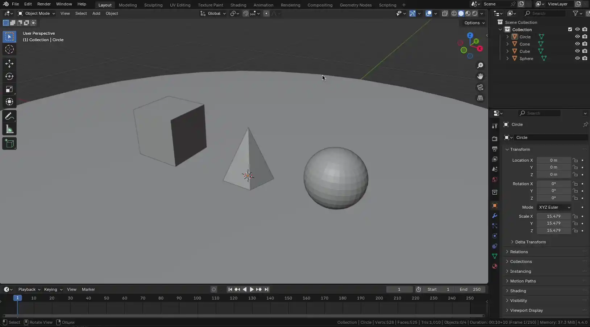

`I` - быстрый способ вставить ключевой кадр:

* в `3D Viewport` обычно используется для трансформации объекта
* если курсор наведен на конкретное свойство в `Properties`, ключ будет создан для этого свойства

`K` (Insert Keyframe Menu) - открывает расширенное меню вставки ключей, где можно явно выбрать набор каналов

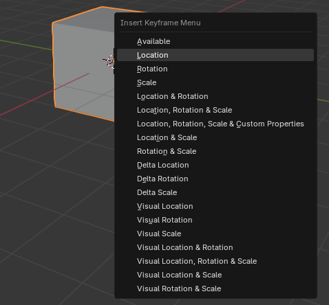

Если у объекта уже есть ключевые кадры и анимированные свойства - в меню Insert Keyframe будет доступна опция Available, которая добавляет ключевые кадры для уже анимированных ранее свойств.

> 💡 Автоматическая запись ключевых кадров\
> Включите кнопку с иконкой записи (красный кружок 🔴) в Timeline, чтобы Blender автоматически добавлял ключевые кадры при изменении параметров. Какие именно каналы будут записываться, зависит от настроек Auto Keying и выбранного набора ключей\
> 

### Цвета анимированных свойств

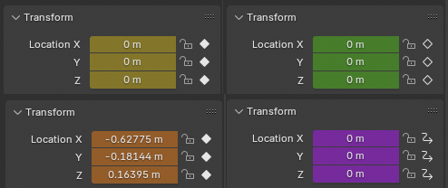

| Цвет         | Описание                              |
| ------------ | ------------------------------------- |
| ⚪️ Серый      | Свойство не анимировано                           |
| 🟡 Желтый     | На текущем кадре есть ключевой кадр               |
| 🟢 Зеленый    | Свойство анимировано, но на другом кадре          |
| 🟠 Оранжевый  | Значение изменено относительно ключевого кадра    |
| 🟣 Фиолетовый | Свойство управляется драйвером                    |

> 💡 Точные цвета могут немного отличаться в зависимости от версии Blender и выбранной темы интерфейса.

### Timeline и Dope Sheet

Timeline - основное окно для управления анимацией по времени. Здесь отображаются ключевые кадры и можно управлять воспроизведением.

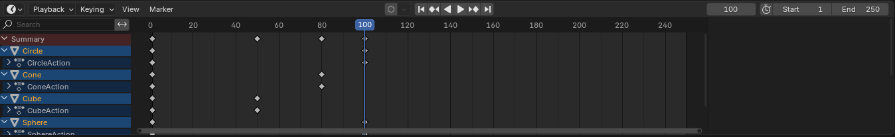

Dope Sheet - более продвинутый редактор анимации, позволяющий управлять ключевыми кадрами нескольких объектов и параметров одновременно. Здесь можно легко перемещать, копировать и удалять ключевые кадры.

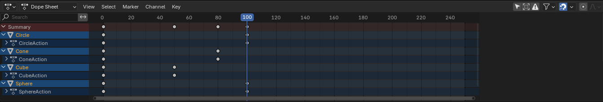

Timeline и Dope Sheet очень похожи, но последний - продвинутее, а так же включает в себя разделы Action Editor, Shape Key Editor и т.п.

### Интерполяция

Graph Editor - редактор, в котором анимация отображается в виде кривых. По горизонтали в нем идет время, а по вертикали - значение свойства.

В отличие от Dope Sheet, где удобно работать со временем появления ключей, Graph Editor удобен для точной настройки движения:

* плавности разгона и торможения
* амплитуды изменения значения
* поведения анимации до и после ключевых кадров
* цикличности и повторяющихся колебаний

### F-Curves

Каждое анимируемое свойство в Blender представлено своей кривой - `F-Curve`.

Например:

* у `Location` будет три кривые: `X`, `Y`, `Z`
* у `Rotation Euler` тоже три кривые
* у `Scale` - еще три

Ключевые кадры являются опорными точками этих кривых. Форма кривой между точками определяет, как именно меняется значение во времени.

Именно поэтому анимацию можно редактировать двумя способами:

* в `Dope Sheet` - когда важнее время и порядок ключей
* в `Graph Editor` - когда важна точная форма движения

У безье-кривых есть `handles` - управляющие точки, которые позволяют менять характер перехода между ключами.

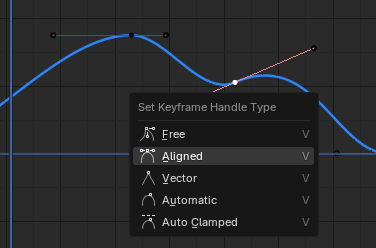

#### Виды интерполяции

Blender автоматически интерполирует значения между ключевыми кадрами. Тип интерполяции определяет характер перехода.

* Bezier (по умолчанию) - плавное начало и конец движения
* Linear - равномерное движение между ключевыми кадрами
* Constant - без интерполяции; значение изменяется мгновенно на следующем ключевом кадре

| Linear                                 | Bezier                                 | Constant                                |
| -------------------------------------- | -------------------------------------- | --------------------------------------- |
| 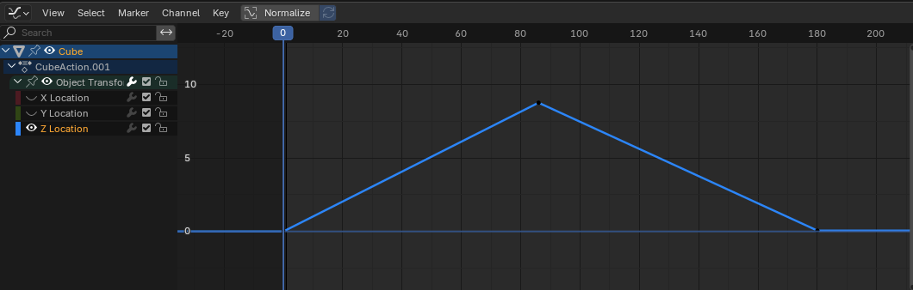 |  | 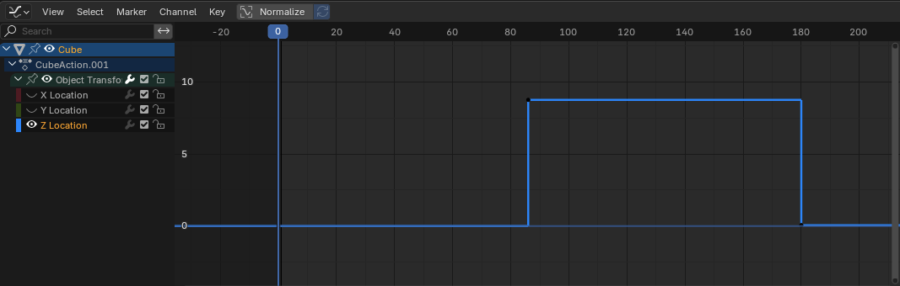 |

Помимо основных типов интерполяции, в Blender есть дополнительные режимы перехода и easing-настройки. Например, можно получить поведение с имитацией отскока:

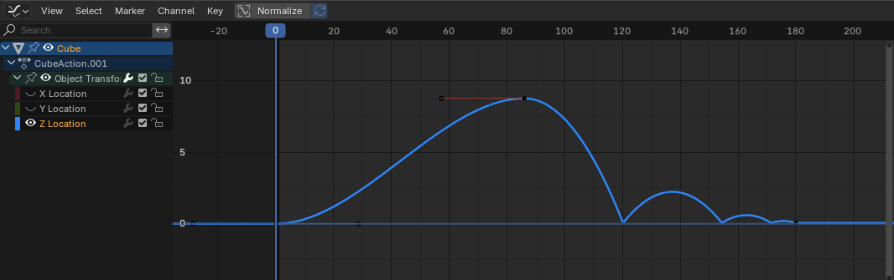

> 💡 Изменение интерполяции\
> Выделите ключевые кадры в Dope Sheet или Graph Editor, нажмите `T` и выберите нужный тип интерполяции

В режиме безье можно настроить тип `handle` горячей клавишей `V`.

### Экстраполяция

Экстраполяция определяет поведение анимации за пределами установленных ключевых кадров:

* Constant - значение остается постоянным
* Linear - значение продолжает изменяться линейно
* Make Cyclic - анимация зацикливается

| Константная экстраполяция | Линейная экстраполяция |
|---|---|
|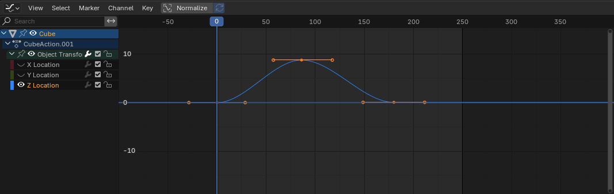||

> 💡 Настройка экстраполяции\
> В Graph Editor выберите кривую, нажмите `Shift + E` и выберите нужный тип экстраполяции

### Типы ключевых кадров (визуальные обозначения)

Для удобства можно визуально размечать различные кадры. Это не влияет на саму анимацию.

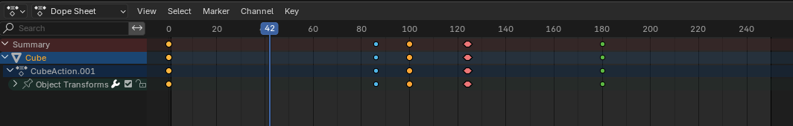

* Keyframe - стандартный ключевой кадр
* Breakdown - вспомогательный ключевой кадр, обычно используется для обозначения промежуточных поз
* Extreme - обозначает крайние положения движения
* Jitter - служит для пометки дрожания или мелких вариаций

> 💡 Изменение типа ключевого кадра\
> Выделите ключевой кадр в Dope Sheet, нажмите `R` и выберите нужный тип.

### Редактирование ключевых кадров

* Перемещение: выделите ключевой кадр и переместите его с помощью `G`
* Копирование: `Ctrl + C` для копирования, `Ctrl + V` для вставки; вставка произойдет в месте установки текущего кадра
* Удаление: выделите ключевой кадр и нажмите `X` или `Delete`
* Для безье также доступны `R` и `S` для поворота и масштабирования `handle`

> 💡 Используйте Dope Sheet для массового редактирования ключевых кадров и Graph Editor для точной настройки кривых анимации.

### Драйверы анимации

Драйверы - это способ управлять значениями свойств с помощью других свойств, переменных и математических выражений. Драйверы позволяют создавать зависимости между объектами и автоматизировать повторяющееся поведение.

Для добавления драйвера:

1. Выберите свойство, которое хотите анимировать с помощью драйвера.
2. Щелкните правой кнопкой мыши по свойству и выберите Add Driver.
3. Откройте `Drivers Editor` или `Graph Editor` в режиме драйверов.
4. Настройте драйвер:
    * Type: Averaged Value, Sum Values, Scripted Expression и т.д.
    * Variables: добавьте переменные, которые будут влиять на драйвер.
    * Expression: введите математическое выражение, определяющее поведение драйвера.

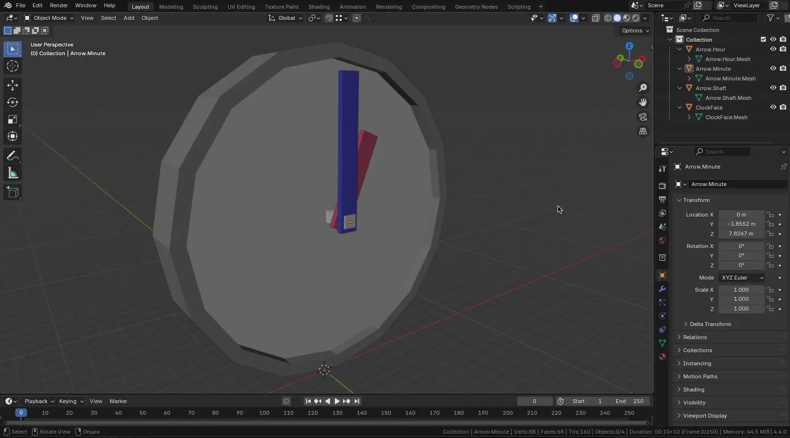

Пример: чтобы вращение объекта зависело от позиции другого объекта по оси `X`, добавьте переменную, ссылающуюся на позицию по `X`, и используйте выражение `var`.

#### Панель драйверов

Панель можно открыть через `ПКМ -> Edit Driver` по свойству, либо через редактор драйверов.

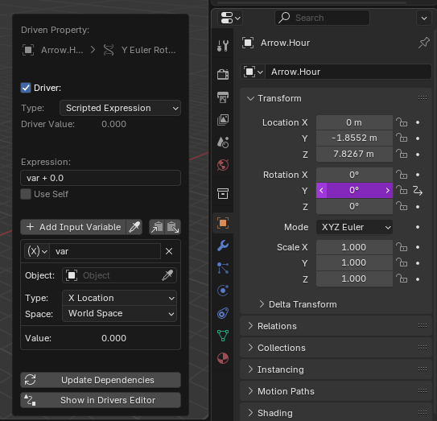

В панели драйверов можно:

* Добавлять и удалять переменные
* Настраивать тип переменных: Transform Channel, Single Property, Distance и т.д.
* Вводить выражения для определения поведения драйвера

Драйверы поддерживают использование Python-выражений. Это позволяет создавать как простые математические выражения, так и сложные зависимости и анимации.

* Имена переменных: используйте только символы ASCII
* Глобальные переменные: frame
* Константы: pi, True, False
* Операторы: +, -, *, /, ==, !=, <, <=, >, >=, and, or, not
* Стандартные функции: min, max, radians, degrees, abs, fabs, floor, ceil, trunc, round, int, sin, cos, tan, asin, acos, atan, atan2, exp, log, sqrt, pow, fmod
* Функции, предоставляемые Blender: lerp, clamp, smoothstep

Если использовать какие-то иные выражения (из Python) - Blender будет выводить предупреждение "Slow Python expression". Это не является ошибкой и допустимо.

### NLA (Nonlinear Animation)

NLA - это редактор нелинейной анимации. Если `Dope Sheet` и `Graph Editor` работают с отдельными ключами и кривыми, то `NLA` работает на уровне готовых анимационных клипов.

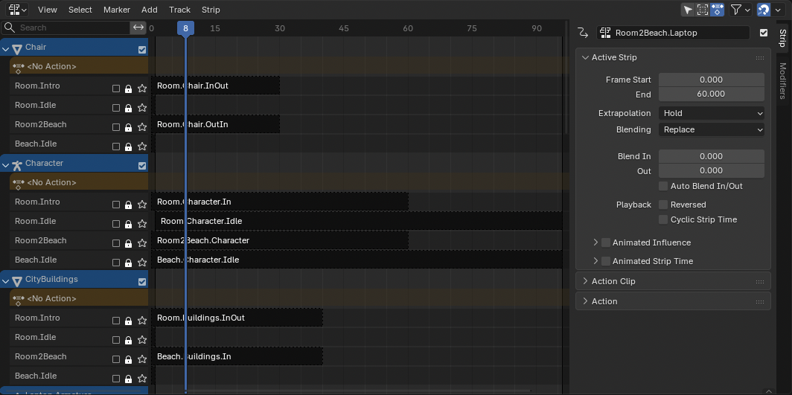

Основная идея NLA:

* сначала создается `Action` - отдельная анимация объекта
* затем эта анимация помещается в `NLA` как `Strip`
* после этого клипы можно комбинировать, повторять, растягивать по времени и смешивать между собой

Это удобно, когда анимация состоит из нескольких повторяемых или независимых действий: шаг, прыжок, поворот головы, покачивание и т.д.

#### Основные элементы NLA

* `Action` - отдельный набор ключевых кадров, например "прыжок" или "поворот"
* `Track` - дорожка, на которой располагаются анимационные клипы
* `Strip` - экземпляр `Action` на дорожке NLA
* `Tweak Mode` - режим редактирования содержимого выбранного `Strip`

Важно: активная анимация объекта обычно находится в `Action Editor`. Когда `Action` отправляется в `NLA`, он становится клипом, который можно использовать повторно.

#### Что можно делать в NLA

* собирать длинную анимацию из нескольких `Action`
* повторно использовать один и тот же `Action`
* обрезать клипы по времени
* растягивать или сжимать их, меняя скорость воспроизведения
* настраивать силу влияния (`Influence`)
* смешивать несколько дорожек между собой

NLA особенно полезен для цикличной анимации: например, один и тот же цикл шага можно повторить несколько раз, не дублируя вручную все ключевые кадры.

> 💡 Если нужно изменить саму анимацию внутри клипа NLA, удобнее перейти в `Tweak Mode`, а не редактировать `Strip` только как временной блок

### Ограничители

Ограничители (Constraints) в Blender позволяют управлять объектом используя простые статические значения. Например с помощью ограничителя можно определить допустимый диапазон поворота объекта или оси его перемещения.

Для доступа к ограничителям откройте вкладку Constraints в свойствах объекта.

В Blender есть очень много разных ограничителей:

#### Motion Tracking

Используются для работы с трекингом камеры или объектов при композитинге с видео:

* Camera Solver - используется для настройки камеры на основе трекинга
* Follow Track - позволяет объекту следовать за треком
* Object Solver - делает объект частью системы трекинга (аналогично камере)

#### Transform

Ограничители трансформации - позволяют дублировать или ограничивать трансформации объекта:

* Copy Location - копирует позицию другого объекта
* Copy Rotation - копирует поворот
* Copy Scale - копирует масштаб
* Copy Transforms - копирует все три трансформации (позицию, поворот и масштаб)
* Limit Location / Rotation / Scale - ограничивает перемещение/вращение/масштабирование в заданных пределах
* Limit Distance - ограничивает максимальное расстояние до другого объекта
* Maintain Volume - позволяет сохранить объем объекта при масштабировании (например, при squash/stretch)
* Transformation - продвинутая версия Copy, позволяет делать пересчет координат и применять влияние по осям
* Transform Cache - воспроизводит трансформации на основе кэшированных данных (обычно из Alembic)

#### Tracking

Ограничители, которые нацеливают объект на другой:

* Clamp To - ограничивает движение объекта вдоль кривой
* Damped Track - объект поворачивается к цели, плавно (без резких поворотов)
* Locked Track - фиксирует одну ось и поворачивает другую в сторону цели
* Stretch To - вытягивает объект к цели (анимация как у рук или костей)
* Track To - один из старейших трекеров, указывает на объект выбранной осью

#### Relationship

Устанавливают логические или иерархические связи:

* Action - проигрывает экшен (анимацию) на основе параметров, например кадров
* Armature - используется для связывания с арматурами (например, для скелетной анимации)
* Child Of - делает объект "ребенком" другого объекта, но с возможностью отключения/переключения влияния
* Floor - не позволяет объекту опускаться ниже "пола" (влияет на позицию по оси)
* Follow Path - объект будет следовать вдоль кривой
* Pivot - позволяет использовать другой объект как точку вращения/поворота
* Shrinkwrap - прилипает объект к поверхности другого (например, для приклеивания к геометрии)

### Пример использования Constrain

В примере ниже стрелке часов нужно двигаться только по одной оси. Поэтому было добавлено ограничение Limit Rotation для осей X и Z.

## Костная анимация и риг

Костная анимация используется, когда нужно управлять деформацией модели не напрямую через вершины, а через набор управляющих костей

Основная идея:

* Модель персонажа остается обычным мешем
* Внутри или рядом с моделью создается скелет (`Armature`)
* Скелет состоит из костей (`Bones`)
* Кости двигаются и поворачиваются
* Меш деформируется в зависимости от того, какие вершины к каким костям привязаны

Костная анимация используется не только для персонажей. Через кости можно анимировать:

* руки, ноги, позвоночник, голову персонажа
* хвосты, щупальца, крылья
* шланги, провода, веревки
* механические конструкции
* деревья
* любые модели, где нужна управляемая деформация

### Armature

`Armature` - объект скелета. Внутри него находятся кости.

У арматуры есть несколько режимов:

* `Object Mode` - работа с арматурой как с обычным объектом
* `Edit Mode` - создание и редактирование костей
* `Pose Mode` - постановка поз и анимация костей

В `Edit Mode` задается структура скелета: количество костей, их положение, длина, связи и иерархия

В `Pose Mode` кости уже не редактируют скелет как конструкцию, а используются как контроллеры для позы и анимации

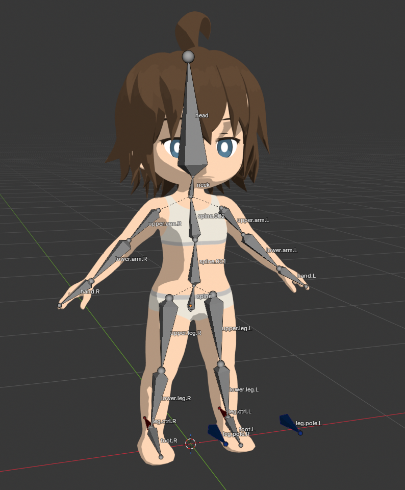

### Bone

`Bone` - отдельная кость внутри арматуры.

У кости есть:

* `Head` - начало кости
* `Tail` - конец кости
* локальные оси
* имя
* родительская связь с другой костью

Кости обычно соединяются в цепочки. Например, рука персонажа:

* плечо
* предплечье
* кисть
* пальцы

Если кость является дочерней, она наследует движение родителя. Поэтому при повороте плеча двигается вся рука, а при повороте предплечья двигается только часть ниже локтя.

### Rest Position и Pose Position

`Rest Position` - исходное положение скелета. Это нейтральная поза, в которой модель привязывается к костям

`Pose Position` - текущая поза, полученная после поворота или перемещения костей

### A-pose и T-pose

Персонажа обычно моделируют и привязывают к скелету в нейтральной позе.

Две частые позы:

* `T-pose` - руки разведены горизонтально в стороны
* `A-pose` - руки опущены под углом, примерно как буква A

`T-pose` проще читать и симметрично настраивать

`A-pose` часто удобнее для плеч, потому что руки ближе к естественному положению (=> меньше деформаций при анимации)

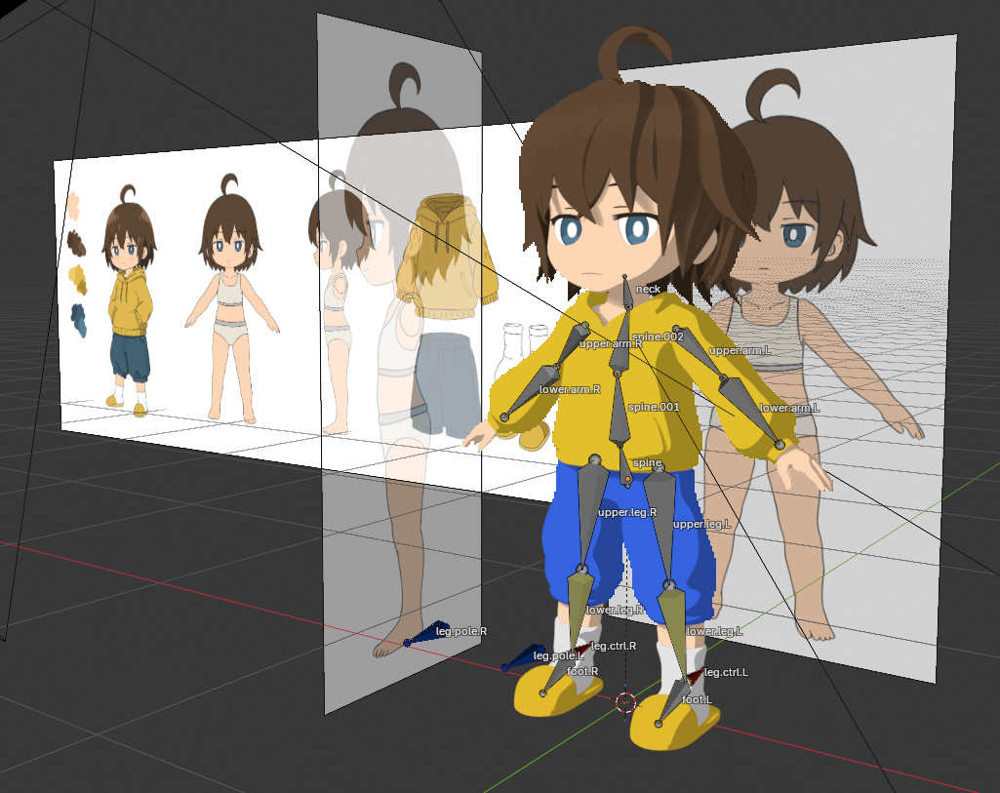

### Привязка модели к скелету

Чтобы скелет начал деформировать модель, меш нужно связать с арматурой.

Базовый способ:

1. Выбрать меш персонажа
2. Выбрать арматуру
3. Нажать `Ctrl + P`
4. Выбрать `Armature Deform / With Automatic Weights`

После этого Blender:

* добавляет мешу `Armature Modifier`
* создает `Vertex Groups` по именам костей
* автоматически распределяет веса вершин

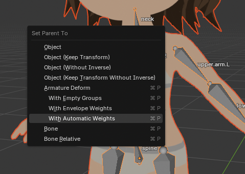

### Armature Modifier

`Armature Modifier` применяет деформацию скелета к мешу

Если модификатор выключить, меш перестанет следовать за костями

Обычно этот модификатор появляется автоматически после привязки меша к арматуре

### Скининг

`Skinning` - процесс настройки влияния костей на вершины модели

Каждая вершина может зависеть от одной или нескольких костей

Пример:

* вершины плеча сильно зависят от кости плеча
* часть вершин около локтя зависит и от плеча, и от предплечья
* вершины кисти почти полностью зависят от кости кисти

Если веса настроены плохо, при движении появляются проблемы:

* части модели тянутся не туда
* суставы ломаются
* меш сминается
* появляются резкие заломы
* одна кость случайно двигает лишнюю часть модели

### Weight Paint

`Weight Paint` - режим ручной настройки весов

Цвет показывает силу влияния выбранной кости на вершины:

* синий - влияние `0`
* зеленый / желтый - частичное влияние
* красный - влияние `1`

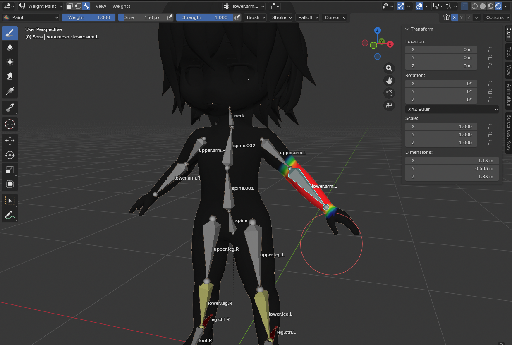

Для быстрого переключения костей в режиме Weight Paint:

1. Выделить Armature
2. Выделить меш
3. Включить режим weight paint
4. Переключаться между костями - `Alt + ЛКМ` по кости

### Риг

`Rig` - это система управления моделью. Риг может состоять из:

* управляющих костей
* ограничения (`Constraints`)
* IK-контроллеры
* дополнительные кости для глаз, пальцев, одежды, хвоста
* драйвера

После рига кости скрываются и для анимации и управления моделью используется только риг

### Rigify

`Rigify` - встроенный аддон Blender для быстрого создания готовых ригов

Он позволяет:

* добавить шаблонный humanoid-скелет
* подогнать его под модель
* сгенерировать управляющий риг
* использовать готовые IK/FK-контроллеры

## Физическая симуляция

Фактически физика не относится к анимациям в Blender, т.к. это больше модификаторы. Тем не менее после запекания физики ее можно отнести к анимации типа деформации. Физика так же управляется через таймплайн.

Система физики в Blender позволяет создавать различные эффекты, такие как:

* Волосы, траву и пучки
* Ткань
* Дым и жидкость
* Объекты с массой и инерцией
* Желе
* и т.д.

### Меню работы с физикой

Настройки физики для выбранного объекта доступны в Properies в разделе Physics.

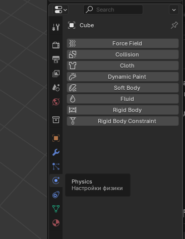

Доступные типы физи в Blender:

* Force Fields (Силовые поля) - Невидимые физические силы (вихрь, ветер, магнит, притяжение), влияющие на другие симулируемые объекты (например, частицы, ткань, мягкие тела, твердые тела)
* Collision (Столкновения) - Позволяет объектам быть "препятствием" для частиц и мягких тел. **Не работает для твердых тел!**
* Cloth (Ткань) - Симуляция ткани, реагирующей на ветер, гравитацию и столкновения. Используется для одеял, флагов, одежды и т.д.
* Dynamic Paint - Позволяет объектам "рисовать" на других. Можно симулировать мокрые следы, краску, смещения и др.
* Soft Body (Мягкие тела) - Позволяет моделировать объекты, которые деформируются, но сохраняют форму (например, желе, подушки)
* Fluid (Жидкость и газы) - Реалистичная симуляция воды, дыма, огня
* Rigid Body (Твердые тела) - Симулирует физику твердых объектов (не деформируемых), включая столкновения и гравитацию
* Rigid Body Constraints - Ограничения для твердых тел, позволяющие контролировать их поведение (например, шарниры, рычаги)

### Твердое тело (Rigid Body)

Твердое тело - это физический объект, который не деформируется под воздействием сил. Хотя и в реальном мире большинство объектов деформируются, для большинства целей в симуляциях мы можем приближено считать их твердыми телами (стулья, стены, машины и т.д.).

Есть два типа Rigid Body:

* Пассивные (Passive) - не подвергаются воздействию внешних сил и остаются неподвижными
* Активные (Active) - могут быть затянуты или оттолкнуто внешними силами (включая гравитацию)

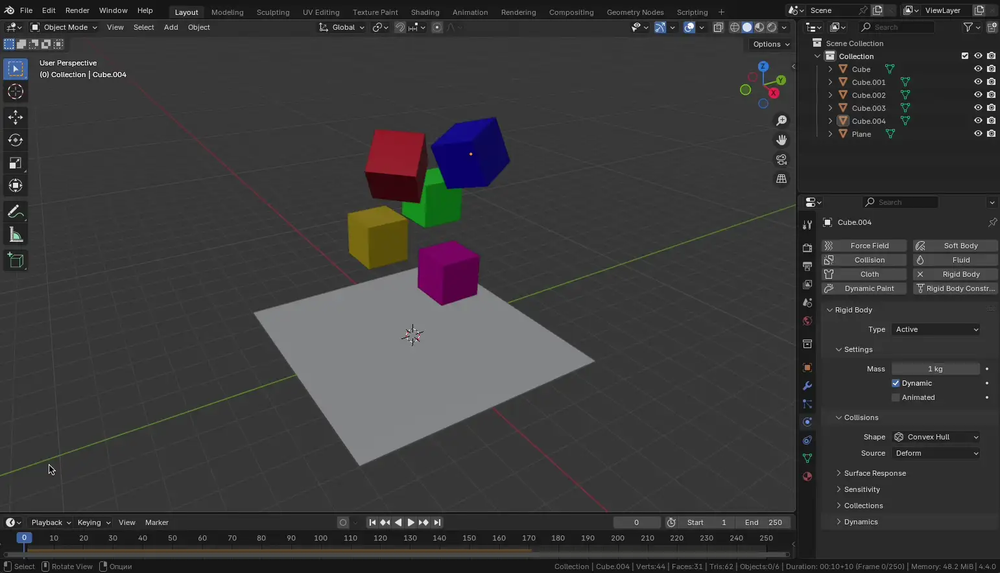

Для подвижных объектов необходимо использовать Active, для пола или стен - Passive. Не используйте Collision - это не то же самое что Rigid Body и он с ним не работает. Тем не менее на объекты можно накладывать и то и другое (чтобы объект мог взаимодействовать, например, с частицами).

> ⚠️ Обратите внимание что для физики очень важны правильные размеры объектов - всегда учитывайте их. Иначе получите эффект "слишком медленной" или наоборот "слишком быстрой" физической симуляции.

У Rigid Body объектов есть еще один невидимый меш, описывающий колизию.

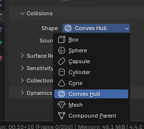

Это может быть Box, Sphere, Capsule, Cylinder, Convex Hull или Mesh. Convex Hull - выпуклый меш. Mesh - использует оригинальный меш (т.е. коллизия не будет отличаться от меша объекта). Тем не менее не советуем выбирать Mesh Collider для всего без разбора - это самая "дорогая" для расчета физика. Чем проще форма (т.е. проще описывается математикой), тем быстрее будет работать физический движок. Для большого количества мелких объектов лучше использовать Box или Sphere (т.к. в этом случае даже Convex Hull будет сильно дорожее по производительности)

Параметры Rigid Body:

* Mass - масса объекта в килограммах. Влияет на инерцию и поведение при столкновениях
* Dynamic - если включено, объект будет участвовать в симуляции (двигаться под действием сил). Если выключено - будет считаться статичным
* Animated - если включено, объект подчиняется анимации (например, движениям из ключей) во время симуляции
* Shape - форма коллизии
* Source - определяет, откуда брать форму (deform - учитывать деформирующие модификаторы)
* Friction - коэффициент трения. Чем выше значение, тем медленнее скользит объект по поверхности
* Bounciness - упругость. При 0 - объект не отскакивает, при 1 - полностью упруго отскакивает
* Collision Margin - зазор между объектами, используемый для повышения стабильности симуляции. Включается  чекбоксом, значение задает толщину "воздушной прослойки"
* Damping Translation - затухание линейного движения (движение замедляется со временем)
* Damping Rotation - затухание вращения (вращение объекта замедляется)

### Кеш симуляции Rigid Body

Располагается в Scene / Rigid Body World / Cache

Позволяет сохранить результаты физической симуляции для последующего использования, что ускоряет процесс анимации (не нужно заново перерасчитывать физику каждый раз при воспроизведении сцены).

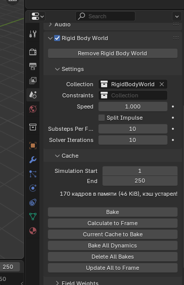

Тут можно удалить кеш (если он поламался, устарел или нужно пересчитать физику), а так же настроить точность симуляции (количество итераций и доп шагов).

### Rigid Body Constraints

Rigid Body Constraints позволяют ограничивать движение объекта с Rigid Body. Это может быть полезно, например, для создания связей между частями механизма или модели.

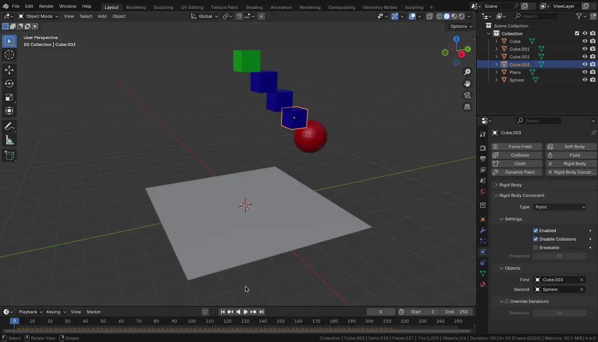

Типы Constraints:

* Fixed - Жесткое соединение - полностью "приклеивает" один объект к другому. Нет возможности вращения или перемещения
* Point - Шарнирное соединение - объекты могут свободно вращаться вокруг общей точки (как шар в гнезде). Не ограничивает углы поворота
* Hinge - Петля - разрешено вращение только вокруг одной оси, как дверная петля
* Slider - Ползунок - разрешено только поступательное движение вдоль одной оси (например, как ящик комода)
* Piston - Поршень - как Slider, но с возможностью вращения вокруг оси
* Generic - Общее соединение - можно вручную задать разрешенные степени свободы (перемещения и вращения по осям)
* Generic Spring - Как Generic, но дополнительно можно включить пружинное поведение (отскок, колебания)
* Motor - Позволяет задать постоянное движение (вращение или скольжение), используется, например, для вращающихся механизмов

### Cloth

Cloth позволяет создавать симуляцию тканей (в том числе симуляцию подушек и мягких иделий)

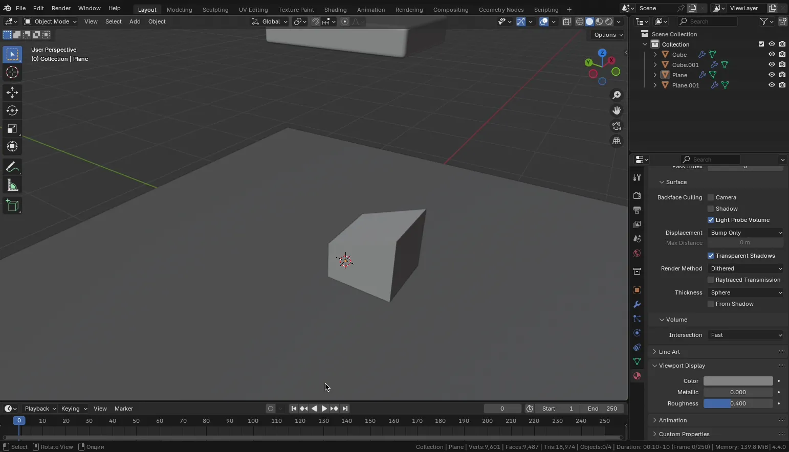

Параметры Cloth:

* ***Settings**
  * **Quality Steps** - количество итераций симуляции на кадр. Больше - точнее, но медленнее
  * **Speed Multiplier** - масштаб времени для ткани (1 = нормально, <1 = медленнее, >1 = быстрее)
* **Physical Properties**
  * **Vertex Mass** - масса одной вершины ткани
  * **Air Viscosity** - сопротивление воздуха. Увеличивает торможение в движении
  * **Bending Model** - модель изгиба:
    * *Angular* - более реалистичная, подходит для мягкой ткани
    * *Linear* - проще и быстрее, но менее точная
* **Stiffness (Жесткость)**
  * **Tension** - сопротивление растяжению
  * **Compression** - сопротивление сжатию
  * **Shear** - сопротивление сдвигу (косому сжатию)
  * **Bending** - сопротивление изгибу
* **Damping (Затухание)**
  * **Tension / Compression / Shear / Bending** - параметры, которые отвечают за уменьшение колебаний с течением времени (демпфирование)
* **Internal Springs**
  * **Max Spring Creation Length** - максимальная длина между вершинами для создания внутренних пружин
  * **Max Creation Angle** - максимальный угол между нормалями, при котором создаются пружины
  * **Check Surface Normals** - учитывать направление нормалей при создании пружин
  * **Tension / Compression** - жесткость внутренних пружин на растяжение и сжатие
  * **Vertex Group** - группа вершин, к которой применяются настройки
  * **Max Tension / Max Compression** - предельные значения напряжения и сжатия
* **Pressure**
  * **Pressure** - величина внутреннего давления ткани (как у надувного шара)
  * **Custom Volume** - ручная настройка объема (если не стоит галочка - объем рассчитывается автоматически)
  * **Target Volume** - желаемый объем объекта
  * **Pressure Scale** - масштаб давления
  * **Fluid Density** - плотность виртуальной среды вокруг (напр., воздуха или воды)
  * **Vertex Group** - ограничение давления на определенные вершины
* **Shape**
  * **Pin Group** - группа вершин, которые будут "прикреплены" (неподвижны или ограничены)
  * **Stiffness** - степень жесткости прикрепления
  * **Sewing** - включает "шитье": соединение вершин для симуляции сшивания
  * **Max Sewing Force** - максимальная сила сшивания
  * **Shrinking Factor** - процент усадки ткани (0 - без усадки, > 0 - ткань "стягивается")
  * **Dynamic Mesh** - позволяет использовать модификаторы, изменяющие топологию (например, Subdiv)
* **Collisions**
  * **Quality** - точность просчета столкновений
  * **Object Collisions** - включает столкновения с другими объектами
  * **Distance** - минимальное расстояние между объектами при столкновении
  * **Impulse Clamping** - ограничение силы столкновения
  * **Vertex Group** - область применения коллизий
  * **Collision Collection** - коллекция объектов, участвующих в коллизиях
* **Self Collisions**
  * **Friction** - трение при столкновении ткани с самой собой
  * **Distance** - минимальное расстояние между вершинами одной ткани
  * **Impulse Clamping** - ограничение силы внутреннего столкновения
  * **Vertex Group** - область, где применяются самостолкновения

### Force Fields

Force Fields - это виртуальные поля, которые воздействуют на объекты в симуляции. Они могут использоваться для создания различных эффектов, таких как ветер, гравитация или магнитное поле.

> ⚠️ Не все их них относятся к физике (например Boids)

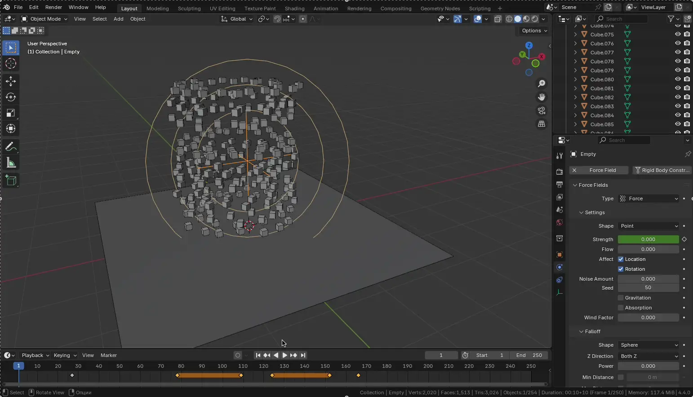

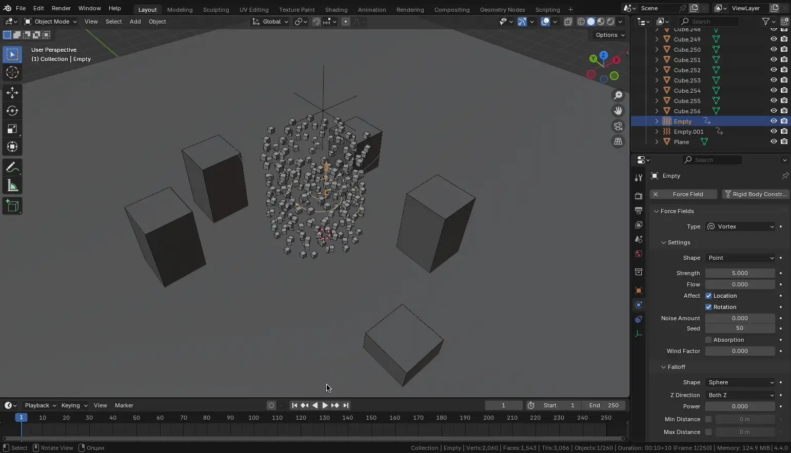

Все типы Force Fields:

* **None** - Нет силового поля (отключено)
* **Boid** - Используется в симуляции частиц с типом "Boids". Задает поведение, как у стай птиц или косяков рыб
* **Charge** - Электростатическое поле. Частицы с одинаковыми знаками отталкиваются, с противоположными - притягиваются
* **Curve Guide** - Направляет частицы вдоль кривой. Удобно для анимации потока вдоль пути
* **Drag** - Сопротивление движению. Замедляет частицы и объекты (эффект воздуха, воды)
* **Fluid Flow** - Источники и препятствия для симуляции жидкости (в сочетании с Fluid Domain)
* **Force** - Простая направленная сила (векторная). Работает как ветер, тянущий или отталкивающий частицы/объекты
* **Harmonic** - Сила колебаний (как пружина). Возвращает частицы к исходной позиции - создает эффект вибрации
* **Lennard-Jones** - Физическая модель взаимодействия молекул: сильное отталкивание на близком расстоянии и слабое притяжение на дальнем
* **Magnetic** - Магнитное поле. Влияет на частицы с настройкой "магнитная масса"
* **Texture** - Использует текстуру (например, шум или градиент) для влияния на поведение частиц - создает турбулентные или направленные движения
* **Turbulence** - Добавляет случайные вихревые движения (хаос) - для дыма, пыли, жидкости и т.п.
* **Vortex** - Закручивает частицы и объекты вокруг оси - имитация вихря
* **Wind** - Поток ветра в заданном направлении - используется чаще всего. Влияет на ткань, частицы, мягкие тела и т.п.

