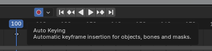
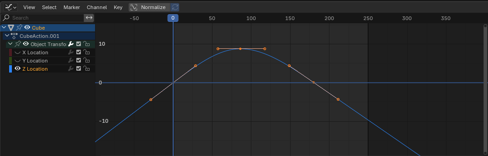
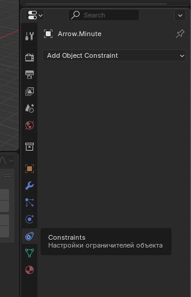
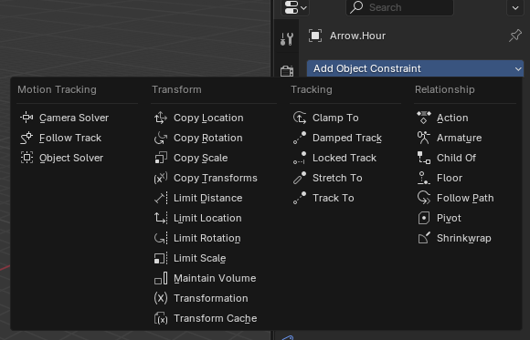
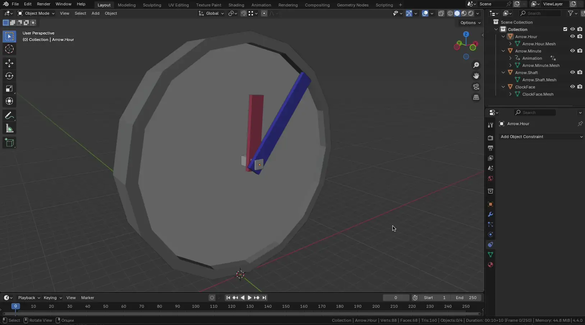

# Анимация

Анимация позволяет двигать объекты или менять их форму с течением времени (на таймлайне).

Способы создания анимации объектов:

* Перемещение всего объекта - изменение трансформации (позиции, поворота, масштаба)
* Деформация объекта - анимация вертексов или точек/объектов для управления деформацией
* Наследование анимации - движение на основе родителя, хука, арматуры и т.д.

## Анимация по ключевым кадрам и драйверы анимации

Базовая основа любой цифровой анимации (в том числе вне Blender) - это ключевые кадры. Ключевой кадр - маркер времени, который хранит значения заданных (анимируемых) свойств. Задача ключевого кадра - создать интерполированную анимацию между ключевыми кадрами. Например если задать в кадре 10 высоту куба 2м и в кадре 20 высоту 4м, Blender автоматически определит высоту куба для кадров с 11 по 19 в зависимости от выбранного метода интерполяции (линейная, безье, квадратичная и т.д.).

### Создание простой анимации объекта

1. Выберите объект в 3D Viewport
2. Перейдите на нужный кадр в Timeline
3. Установите начальные значения трансформации (позиция, вращение, масштаб)
4. Добавьте ключевой кадр:
   * Нажмите `K` и выберите нужный параметр (например, Location, Rotation, Scale)
   * Или щелкните правой кнопкой мыши по нужному параметру в панели Properties и выберите Insert Keyframe
5. Перейдите на другой кадр, измените параметры и снова добавьте ключевой кадр

`I` - позволяет создать ключевые кадры для всех свойств объекта; либо для определенного свойства, если навести мышку над этим свойством

`K` (Insert Keyframe Menu) - позволяет выбрать для чего создать ключевые кадры

Если у объекта уже есть ключевые кадры и анимированные свойства - в меню Insert Keyframe будет доступна опция Available, которая добавляет ключевые кадры для уже анимированных ранее свойств.

> 💡 Автоматическая запись ключевых кадров\
> Включите кнопку с иконкой записи (красный кружок 🔴) в Timeline, чтобы Blender автоматически добавлял ключевые кадры при изменении параметров\
> 

### Цвета анимированных свойств

| Цвет         | Описание                              |
| ------------ | ------------------------------------- |
| ⚪️ Серый      | Не анимированный                      |
| 🟡 Желтый     | Ключевой кадр в текущем фрейме        |
| 🟢 Зеленый    | Ключевой кадр на другом фрейме        |
| 🟠 Оранжевый  | Изменено относительно ключевого кадра |
| 🟣 Фиолетовый | Управляется драйвером                 |

### Timeline и Dope Sheet

Timeline - основное окно для управления анимацией по времени. Здесь отображаются ключевые кадры и можно управлять воспроизведением.

Dope Sheet - более продвинутый редактор анимации, позволяющий управлять ключевыми кадрами нескольких объектов и параметров одновременно. Здесь можно легко перемещать, копировать и удалять ключевые кадры.

Timeline и Dope Sheet очень похожи, но последний - продвинутее, а так же включает в себя разделы Action Editor, Shape Key Editor и т.п.

### Интерполяция

TODO Graph Editor

TODO F-Curves

#### Виды интерполяции

Blender автоматически интерполирует значения между ключевыми кадрами. Тип интерполяции определяет характер перехода.

* Bezier (по умолчанию) - плавное начало и конец движения
* Linear - равномерное движение между ключевыми кадрами
* Constant - без интерполяции; значение изменяется мгновенно на следующем ключевом кадре

| Linear                                 | Bezier                                 | Constant                                |
| -------------------------------------- | -------------------------------------- | --------------------------------------- |
|  |  |  |

Есть и другие виды интерполяции (переходы), например Bounce имитирующий отскоки:

> 💡 Изменение интерполяции\
> Выделите ключевые кадры в Timeline или Graph Editor, нажмите `T` и выберите нужный тип интерполяции

В резьме безье есть возможность настроить тип handle горячей клавишей `V`.

### Экстраполяция

Экстраполяция определяет поведение анимации за пределами установленных ключевых кадров:

* Constant - значение остается постоянным
* Linear - значение продолжает изменяться линейно
* Make Cyclic - анимация зацикливается

| Констанстная экстраполяция | Линейная экстраполяция |
|---|---|
|||

> 💡 Настройка экстраполяции\
> В Graph Editor выберите кривую, нажмите `Shift + E` и выберите нужный тип экстраполяции

### Типы ключевых кадров (визуальные обозначения)

Для удобства можно визуально размечать различные кадры. Это не влияет на саму анимацию.

* Keyframe - стандартный ключевой кадр
* Breakdown - вспомогательный ключевой кадр, обычно используется для обозначения промежуточных поз
* Extreme - обозначает экстремальные положения (например, максимальное сгибание)
* Jitter - используется для добавления случайных колебаний

> 💡 Изменение типа ключевого кадра\
> Выделите ключевой кадр в Dope Sheet, нажмите `R` и выберите нужный тип.

### Редактирование ключевых кадров

* Перемещение: Выделите ключевой кадр и переместите его с помощью `G`
* Копирование: `Ctrl + C` для копирования, `Ctrl + V` для вставки; вставка произойдет в месте установки текущего фрейма таймлайна
* Удаление: Выделите ключевой кадр и нажмите `X` или `Delete`
* Для безье так же доступны `R` и `S` для маштабирования и поворота handle

> 💡 Используйте Dope Sheet для массового редактирования ключевых кадров и Graph Editor для точной настройки кривых анимации.

### Драйверы анимации

Драйверы - это способ упралвять значениями свойст с помощью функции или математического выражения. Драйверы позволяют создавать более сложные зависимости между свойствами объектов, что может быть полезно для создания динамических эффектов или автоматизации процесса анимации.

Для добавления драйвера:

1. Выберите свойство, которое хотите анимировать с помощью драйвера.
2. Щелкните правой кнопкой мыши по свойству и выберите Add Driver.
3. Откройте Graph Editor, переключитесь в режим Drivers.
4. Настройте драйвер:
   * Type: Averaged Value, Sum Values, Scripted Expression и т.д.
   * Variables: добавьте переменные, которые будут влиять на драйвер.
   * Expression: введите математическое выражение, определяющее поведение драйвера.

Пример: Чтобы вращение объекта зависело от позиции другого объекта по оси X, добавьте переменную, ссылающуюся на позицию по X, и используйте выражение var.

#### Панель драйверов

Панель открывается через ПКМ по драйверу и выбора Edit Driver (либо Add Driver если драйвера у свойста еще нет).

В панели драйверов можно:

* Добавлять и удалять переменные
* Настраивать тип переменных: Transform Channel, Single Property, Distance и т.д.
* Вводить выражения для определения поведения драйвера

Драйверы поддерживают использование Python-выражений. Это позволяет создавать как простые математические выражения, так и сложные зависимости и анимации.

* Имена переменных: используйте только символы ASCII
* Глобальные переменные: frame
* Константы: pi, True, False
* Операторы: +, -, *, /, ==, !=, <, <=, >, >=, and, or, not
* Стандартные функции: min, max, radians, degrees, abs, fabs, floor, ceil, trunc, round, int, sin, cos, tan, asin, acos, atan, atan2, exp, log, sqrt, pow, fmod
* Функции, предоставляемые Blender: lerp, clamp, smoothstep

Если использовать какие-то иные выражения (из Python) - Blender будет выводить предупреждение "Slow Python expression". Это не является ошибкой и допустимо.

### Ограничители

Ограничители (Constraints) в Blender позволяют управлять объектом используя простые статические значения. Например с помощью ограничителя можно определить допустимый диапазон поворота объекта или оси его перемещения.

Для доступа к ограничителям откройте вкладку Constraints в свойствах объекта.

В Blender есть очень много разных ограничителей:

#### Motion Tracking

Используются для работы с трекингом камеры или объектов при композитинге с видео:

* Camera Solver - используется для настройки камеры на основе трекинга
* Follow Track - позволяет объекту следовать за треком
* Object Solver - делает объект частью системы трекинга (аналогично камере)

#### Transform

Ограничители трансформации - позволяют дублировать или ограничивать трансформации объекта:

* Copy Location - копирует позицию другого объекта
* Copy Rotation - копирует поворот
* Copy Scale - копирует масштаб
* Copy Transforms - копирует все три трансформации (позицию, поворот и масштаб)
* Limit Location / Rotation / Scale - ограничивает перемещение/вращение/масштабирование в заданных пределах
* Limit Distance - ограничивает максимальное расстояние до другого объекта
* Maintain Volume - позволяет сохранить объем объекта при масштабировании (например, при squash/stretch)
* Transformation - продвинутая версия Copy, позволяет делать пересчет координат и применять влияние по осям
* Transform Cache - воспроизводит трансформации на основе кэшированных данных (обычно из Alembic)

#### Tracking

Ограничители, которые нацеливают объект на другой:

* Clamp To - ограничивает движение объекта вдоль кривой
* Damped Track - объект поворачивается к цели, плавно (без резких поворотов)
* Locked Track - фиксирует одну ось и поворачивает другую в сторону цели
* Stretch To - вытягивает объект к цели (анимация как у рук или костей)
* Track To - один из старейших трекеров, указывает на объект выбранной осью

#### Relationship

Устанавливают логические или иерархические связи:

* Action - проигрывает экшен (анимацию) на основе параметров, например кадров
* Armature - используется для связывания с арматурами (например, для скелетной анимации)
* Child Of - делает объект "ребенком" другого объекта, но с возможностью отключения/переключения влияния
* Floor - не позволяет объекту опускаться ниже "пола" (влияет на позицию по оси)
* Follow Path - объект будет следовать вдоль кривой
* Pivot - позволяет использовать другой объект как точку вращения/поворота
* Shrinkwrap - прилипает объект к поверхности другого (например, для приклеивания к геометрии)

### Пример использования Constrain

В примере ниже стрелке часов нужно двигаться только по одной оси. Поэтому было добавлено ограничение Limit Rotation для осей X и Z.

## Костная анимация и риг

TODO

## Физическая симуляция

TODO
