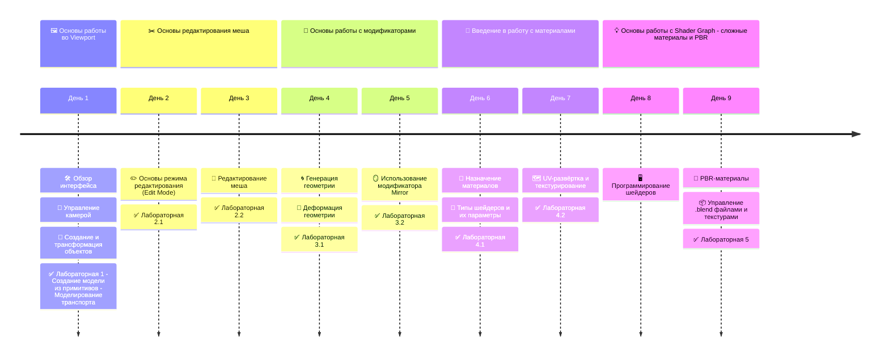
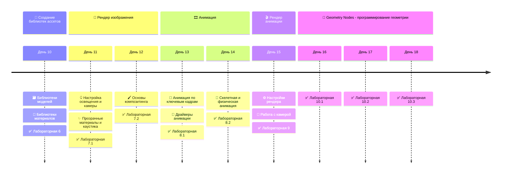

# 🎨 3D моделирование в Blender (2025)

📚 Данный репозиторий содержит методические материалы для курса "3D моделирование для профессиональной деятельности", которые предназначены для обучения и преподавания Blender.

## 🗂️ Структура курса

### 1. [🖼️ Основы работы во Viewport](01-viewport-basics.md)

- 🛠️ Обзор интерфейса Blender
- 🎥 Управление камерой
- 🧱 Создание и трансформация объектов

### 2. [✂️ Основы редактирования меша](02-mesh-editing.md)

- ✏️ Основы режима редактирования (Edit Mode)
- 🎯 Редактирование меша

### 3. 🧩 Основы работы с модификаторами

- 🌀 Генерация геометрии
- 🌊 Деформация геометрии
- 🪞 Использование модификатора Mirror

### 4. 🎨 Введение в работу с материалами

- 🎨 Назначение материалов
- 🌈 Типы шейдеров и их параметры
- 🗺️ UV-развёртка и текстурирование

### 5. 💡 Основы работы с Shader Graph: сложные материалы и PBR

- 🖥️ Программирование шейдеров
- 🧪 PBR-материалы
- 📦 Управление .blend файлами и текстурами

### 6. 📂 Создание библиотек ассетов

- 🗃️ Библиотеки моделей
- 🎨 Библиотеки материалов

### 7. 📸 Рендер изображения

- 💡 Настройка освещения и камеры
- ✨ Прозрачные материалы и каустика
- 🖌️ Основы композитинга

### 8. 🎞️ Анимация

- 🎥 Анимация по ключевым кадрам
- 🔧 Драйверы анимации
- 🦴 Скелетная и физическая анимация

### 9. 🎬 Рендер анимации

- ⚙️ Настройки рендера
- 🎯 Работа с камерой

### 10. 🔗 Geometry Nodes: программирование геометрии

- TODO ⚒️

## 🕑 Распределение тем по времени





## 📁 Структура репозитория

```txt
3d-course-blender-2025
├── README.md              # Обзор курса и основная навигация
├── 01-viewport-basics     # Основы работы во Viewport
├── 02-mesh-editing        # Основы редактирования меша
├── 03-modifiers           # Основы работы с модификаторами
├── 04-materials           # Введение в работу с материалами
├── 05-shader-graph        # Основы работы с Shader Graph
├── 06-asset-libraries     # Создание библиотек ассетов
├── 07-rendering           # Рендер изображения
├── 08-animation           # Основы анимации
├── 09-animation-rendering # Рендер анимации
├── 10-geometry-nodes      # Программирование геометрии
└── assets                 # Вспомогательные изображения и файлы
└── labs                   # Лабораторные работы
   └── examples            # Изображения и файлы для лабораторных работ
```

## 📁 Лабораторные работы

- (1) [Создание модели из примитивов - Моделирование транспорта](labs/lab1.md)
- (2.1) [Создание простых моделей с приминением Edit Mode - Стол, стул и посуда](labs/lab2-1.md)
- (2.2) [Создание простой комнаты с применением Edit Mode - Комната с кроватью и комодом](labs/lab2-2.md)

Work in progress ⚒️
