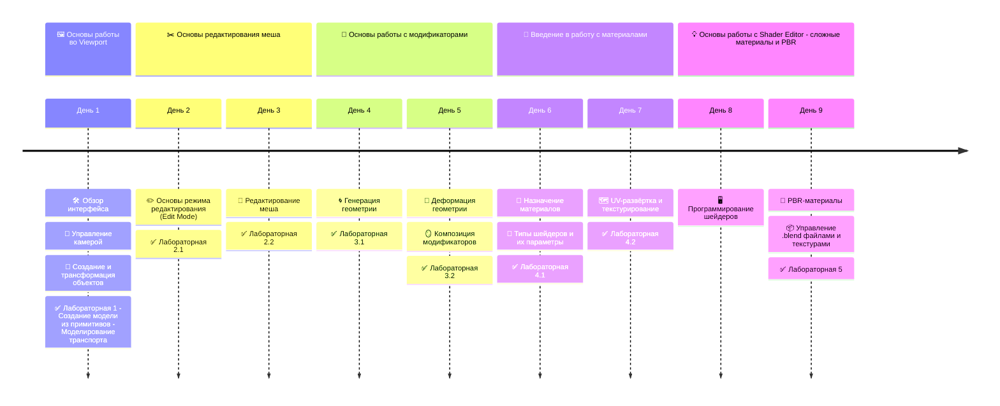
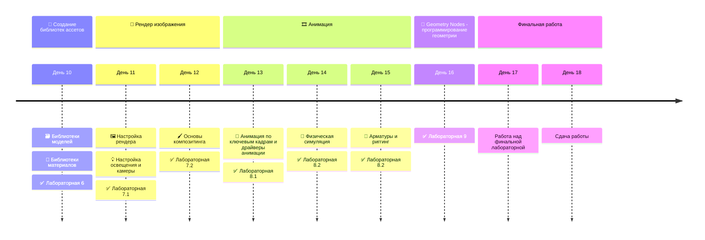

# 🎨 3D моделирование в Blender (2025)


📚 Данный репозиторий содержит методические материалы для курса "3D моделирование для профессиональной деятельности", которые предназначены для обучения и преподавания Blender.

## 🗂️ Структура курса

### 1. [🖼️ Основы работы во Viewport](01-viewport-basics.md)

- 🛠️ Обзор интерфейса Blender
- 🎥 Управление камерой
- 🧱 Создание и трансформация объектов

### 2. [✂️ Основы редактирования меша](02-mesh-editing.md)

- ✏️ Основы режима редактирования (Edit Mode)
- 🎯 Редактирование меша

### 3. [🧩 Основы работы с модификаторами](03-modifier-basics.md)

- 🌀 Генерация геометрии
- 🌊 Деформация геометрии
- 🪞 Композиция модификаторов

### 4. [🎨 Введение в работу с материалами](04-materials.md)

- 🎨 Назначение материалов
- 🖼️ Рендеры EVEE и Cycles
- 🌈 Типы шейдеров и их параметры
- 🗺️ UV-развёртка и текстурирование

### 5. [💡 Основы работы с Shader Editor: сложные материалы и PBR](05-shader-editor.md)

- 🖥️ Программирование шейдеров
- 🧪 PBR-материалы
- 📦 Управление .blend файлами и текстурами

### 6. [📂 Создание библиотек ассетов](06-asset-libraries.md)

- 🗃️ Библиотеки моделей
- 🎨 Библиотеки материалов

### 7. [📸 Рендер изображения](07-rendering.md)

- 🖼️ Настройка рендера
- 💡 Настройка освещения и камеры
- 🖌️ Основы композитинга

### 8. [🎞️ Анимация](08-animation.md)

- 🎥 Анимация по ключевым кадрам и драйверы анимации
- 🍎 Физическая симуляция
- 🦴 Арматуры и риггинг

### 9. 🔗 Geometry Nodes: программирование геометрии

- TODO ⚒️

## 🕑 Распределение тем по времени


```mermaid
timeline
    section 🖼️ Основы работы во Viewport
        День 1 :
            🛠️ Обзор интерфейса : 🎥 Управление камерой : 🧱 Создание и трансформация объектов :
            ✅ Лабораторная 1 - Создание модели из примитивов - Моделирование транспорта
    section ✂️ Основы редактирования меша
        День 2 : ✏️ Основы режима редактирования (Edit Mode) :
            ✅ Лабораторная 2.1
        День 3 : 🎯 Редактирование меша :
            ✅ Лабораторная 2.2
    section 🧩 Основы работы с модификаторами
        День 4 : 🌀 Генерация геометрии :
            ✅ Лабораторная 3.1
        День 5 : 🌊 Деформация геометрии : 🪞 Композиция модификаторов :
            ✅ Лабораторная 3.2
    section 🎨 Введение в работу с материалами
        День 6 : 🎨 Назначение материалов : 🌈 Типы шейдеров и их параметры :
            ✅ Лабораторная 4.1
        День 7 : 🗺️ UV-развёртка и текстурирование :
            ✅ Лабораторная 4.2
    section 💡 Основы работы с Shader Editor - сложные материалы и PBR
        День 8 : 🖥️ Программирование шейдеров
        День 9 : 🧪 PBR-материалы : 📦 Управление .blend файлами и текстурами :
            ✅ Лабораторная 5
```


```mermaid
timeline      
    section 📂 Создание библиотек ассетов
        День 10 : 🗃️ Библиотеки моделей : 🎨 Библиотеки материалов :
            ✅ Лабораторная 6
    section 📸 Рендер изображения
        День 11 : 🖼️ Настройка рендера : 💡 Настройка освещения и камеры :
            ✅ Лабораторная 7.1
        День 12 : 🖌️ Основы композитинга :
            ✅ Лабораторная 7.2
    section 🎞️ Анимация
        День 13 : 🎥 Анимация по ключевым кадрам и драйверы анимации :
            ✅ Лабораторная 8.1
        День 14 : 🍎 Физическая симуляция :
            ✅ Лабораторная 8.2
        День 15 : 🦴 Арматуры и риггинг :
            ✅ Лабораторная 8.2
    section 🔗 Geometry Nodes - программирование геометрии
        День 16 :
            ✅ Лабораторная 9
    section Финальная работа
        День 17 :
            Работа над финальной лабораторной
        День 18 :
            Сдача работы
```

## 📁 Структура репозитория

```txt
3d-course-blender-2025
├── README.md              # Обзор курса и основная навигация
├── 01-viewport-basics     # Основы работы во Viewport
├── 02-mesh-editing        # Основы редактирования меша
├── 03-modifiers           # Основы работы с модификаторами
├── 04-materials           # Введение в работу с материалами
├── 05-shader-editor       # Основы работы с Shader Editor
├── 06-asset-libraries     # Создание библиотек ассетов
├── 07-rendering           # Рендер изображения
├── 08-animation           # Основы анимации
├── 09-geometry-nodes      # Программирование геометрии
└── assets                 # Вспомогательные изображения и файлы
└── labs                   # Лабораторные работы
   └── examples            # Изображения и файлы для лабораторных работ
```

## 📁 Лабораторные работы

- (1) [Создание модели из примитивов - Моделирование транспорта](labs/lab1.md)
- (2.1) [Создание простых моделей с приминением Edit Mode - Стол, стул и посуда](labs/lab2-1.md)
- (2.2) [Создание простой комнаты с применением Edit Mode - Комната с кроватью и комодом](labs/lab2-2.md)
- (3.1) [Создание помещения общепита](labs/lab3-1.md)
- (3.2) [Создание модели мягкой игрушки с применением Subdiv + Mirror по референсу](labs/lab3-2.md)
- (4.1) [Применение материалов к комнате с кроватью](labs/lab4-1.md)
- (4.2) [Моделирование натюрморта по референсу](labs/lab4-2.md)
- (5) [Моделирование детской игровой площадки](labs/lab5.md)
- (6) [Создание библиотеки ассетов игровой площадки](labs/lab6.md)
- (7.1) [Размещение света и установка камеры на игровой площадке](labs/lab7-1.md)
- (7.2) [Моделирование лампочки и применение Compositing](labs/lab7-2.md)
- (8.1) [Создание модели часов с маятником или солнечной системы](labs/lab8-1.md)
- (8.2) [Симуляция физики](labs/lab8-2.md)

Work in progress ⚒️
