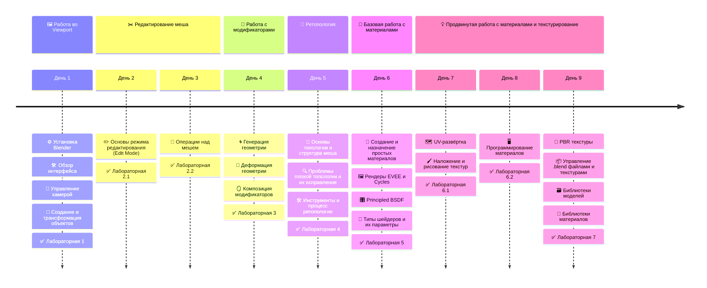
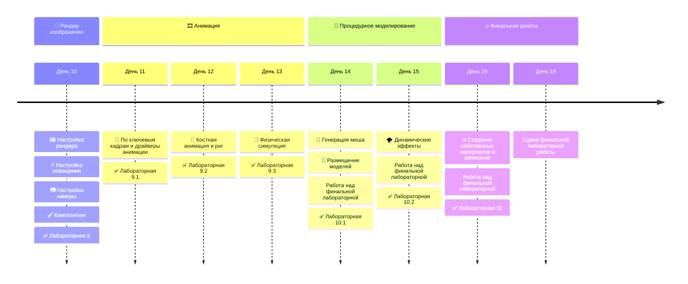

# 3D моделирование в Blender (2026)

- [Версия 2025 года](https://github.com/mvodya/3d-course-blender/tree/2025S1)
- [Blender.org](https://www.blender.org)

Данный репозиторий содержит методические материалы для курса "3D моделирование для профессиональной деятельности", которые предназначены для обучения и преподавания Blender.

## Структура курса

### 1. [🖼️ Работа во Viewport](01-viewport-basics.md)

- 🛠️ Обзор интерфейса
- 🎥 Управление камерой
- 🧱 Создание и трансформация объектов

### 2. [✂️ Редактирование меша](02-mesh-editing.md)

- ✏️ Основы режима редактирования (Edit Mode)
- 🎯 Операции над мешем

### 3. [🧩 Работа с модификаторами](03-modifiers.md)

- 🌀 Генерация геометрии
- 🌊 Деформация геометрии
- 🪞 Композиция модификаторов

### 4. 🔄 Ретопология (TODO)

- 📌 Основы топологии и структура меша
- 🔍 Проблемы плохой топологии и их исправление
- 🛠️ Инструменты и процесс ретопологии

### 5. 🎨 Базовая работа с материалами (TODO)

- 🎨 Создание и назначение простых материалов
- 🖼️ Рендеры EVEE и Cycles
- 🎛️ Principled BSDF
- 🌈 Типы шейдеров и их параметры

### 6. 💡 Продвинутая работа с материалами и текстурирование (TODO)

- 🗺️ UV-развёртка
- 🖌️ Наложение и рисование текстур
- 🖥️ Программирование материалов
- 🧪 PBR текстуры
- 📦 Управление .blend файлами и текстурами

### 7. 📂 Библиотеки асетов (TODO)

- 🗃️ Библиотеки моделей
- 🎨 Библиотеки материалов

### 8. 📸 Рендер изображения (TODO)

- 🖼️ Настройка рендера
- 💡 Настройка освещения
- 📷 Настройки камеры
- 🖌️ Композитинг

### 9. 🎞️ Анимация (TODO)

- 🎥 По ключевым кадрам и драйверы анимации
- 🦴 Костная анимация и риг
- 🍎 Физическая симуляция

### 10. 🧬 Процедурное моделирование (TODO)

- 🧱 Генерация меша
- 📍 Размещение моделей
- 🌪️ Динамические эффекты

### 11. 🔥 Создание собственных материалов и запекание (TODO)

## 🕑 Распределение тем и лабораторных по времени


```mermaid
timeline
    section 🖼️ Работа во Viewport
        День 1 :
            ⚙️ Установка Blender : 🛠️ Обзор интерфейса : 🎥 Управление камерой : 🧱 Создание и трансформация объектов :
            ✅ Лабораторная 1

    section ✂️ Редактирование меша
        День 2 :
            ✏️ Основы режима редактирования (Edit Mode) :
            ✅ Лабораторная 2.1
        День 3 :
            🎯 Операции над мешем :
            ✅ Лабораторная 2.2

    section 🧩 Работа с модификаторами
        День 4 :
            🌀 Генерация геометрии :
            🌊 Деформация геометрии : 🪞 Композиция модификаторов :
            ✅ Лабораторная 3

    section 🔄 Ретопология
        День 5 :
            📌 Основы топологии и структура меша :
            🔍 Проблемы плохой топологии и их исправление : 🛠️ Инструменты и процесс ретопологии :
            ✅ Лабораторная 4

    section 🎨 Базовая работа с материалами
        День 6 :
            🎨 Создание и назначение простых материалов :
            🖼️ Рендеры EVEE и Cycles :
            🎛️ Principled BSDF :
            🌈 Типы шейдеров и их параметры :
            ✅ Лабораторная 5

    section 💡 Продвинутая работа с материалами и текстурирование
        День 7 :
            🗺️ UV-развёртка : 🖌️ Наложение и рисование текстур :
            ✅ Лабораторная 6.1
        День 8 :
            🖥️ Программирование материалов :
            ✅ Лабораторная 6.2
        День 9 :
            🧪 PBR текстуры : 📦 Управление .blend файлами и текстурами : 🗃️ Библиотеки моделей : 🎨 Библиотеки материалов :
            ✅ Лабораторная 7
```


```mermaid
timeline
    section 📸 Рендер изображения
        День 10 :
            🖼️ Настройка рендера :
            💡 Настройка освещения :
            📷 Настройки камеры :
            🖌️ Композитинг :
            ✅ Лабораторная 8

    section 🎞️ Анимация
        День 11 :
            🎥 По ключевым кадрам и драйверы анимации :
            ✅ Лабораторная 9.1
        День 12 :
            🦴 Костная анимация и риг :
            ✅ Лабораторная 9.2
        День 13 :
            🍎 Физическая симуляция :
            ✅ Лабораторная 9.3

    section 🧬 Процедурное моделирование
        День 14 :
            🧱 Генерация меша :
            📍 Размещение моделей :
            Работа над финальной лабораторной :
            ✅ Лабораторная 10.1
        День 15 :
            🌪️ Динамические эффекты :
            Работа над финальной лабораторной :
            ✅ Лабораторная 10.2

    section 🔥 Финальная работа
        День 16 :
            🔥 Создание собственных материалов и запекание :
            Работа над финальной лабораторной :
            ✅ Лабораторная 11
        День 18 :
            Сдача финальной лабораторной работы
```

## 📁 Структура репозитория

```txt
3d-course-blender-2025
├── README.md                 # Обзор курса и основная навигация
├── 01-viewport-basics        # 🖼️ Работа во Viewport
├── 02-mesh-editing           # ✂️ Редактирование меша
├── 03-modifiers              # 🧩 Работа с модификаторами
├── 04-retopology             # 🔄 Ретопология
├── 05-materials              # 🎨 Базовая работа с материалами
├── 06-shader-editor          # 💡 Продвинутая работа с материалами и текстурирование
├── 07-asset-libraries        # 📂 Библиотеки асетов
├── 08-rendering              # 📸 Рендер изображения
├── 09-animation              # 🎞️ Анимация
├── 10-procedural-modeling    # 🧬 Процедурное моделирование
├── 11-baking-materials       # 🔥 Создание собственных материалов и запекание
├── assets                    # Вспомогательные изображения и файлы
└── labs                      # Лабораторные работы
    └── examples              # Изображения и файлы для лабораторных работ
```

## 📁 Лабораторные работы

- (1) [Создание модели из примитивов - Моделирование транспорта](labs/lab1.md)
- (2.1) [Создание простых моделей с применением Edit Mode - Моделирование стола, стула и посуды](labs/lab2-1.md)
- (2.2) [Создание простой комнаты с применением Edit Mode - Моделирование кровати, комода и окна](labs/lab2-2.md)
- (3) [Моделирование сундука с сокровищами с использованием модификаторов](labs/lab3.md)