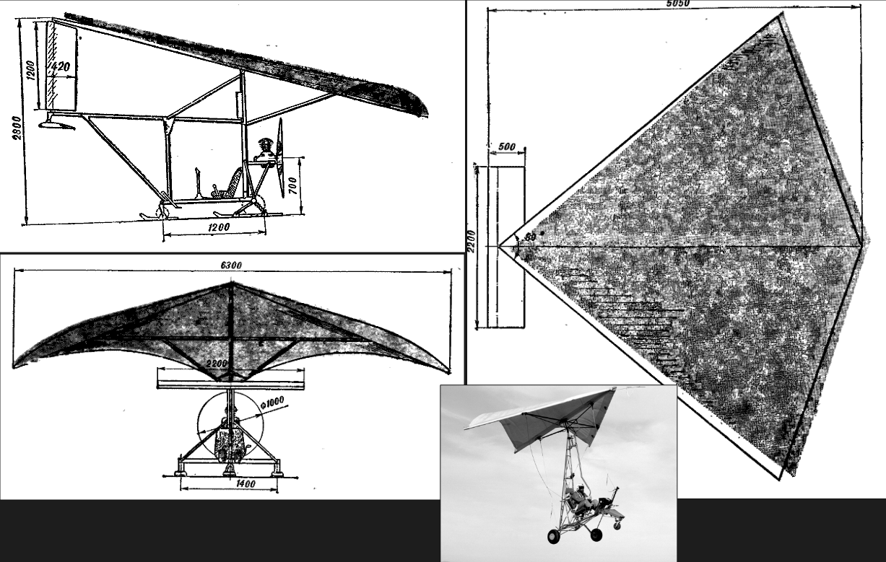

# Лабораторная 1

Создание модели из примитивов - Моделирование транспорта

## Требования

* Использовать только примитивы и трансформацию примитивов
* **НЕЛЬЗЯ** использовать Edit Mode
* Все работы должны быть разными (нельзя сделать одну и ту же модель/тип самолета или автомобиля)
* Всем примитивам неободимо назначить цвет объекта (Properties / Viewport Display / Color)
* В работе должно быть **НЕ МЕНЕЕ** 9 примитивов (максимальное количество не ограничено)
* Моделируемый объект должен быть реальным (например в случае автомобиля - реальная марка и модель, а не просто "машина")

## Варианты

1. Автомобиль
2. Морской транспорт
3. Воздушный транспорт
4. Самокат / Велосипед / Моноколесо / и т.п.

Подварианты:

| №   | Автомобили                     | Морской транспорт                       | Воздушный транспорт                               | Самокаты, велосипеды, моноколесо |
| --- | ------------------------------ | --------------------------------------- | ------------------------------------------------- | -------------------------------- |
| 1   | Грузовой автомобиль с прицепом | Контейнеровоз                           | Низкоплан с двумя турбовентиляторными двигателями | Самокат                          |
| 2   | Седан                          | Яхта                                    | Биплан с поршневым двигателем                     | Велосипед                        |
| 3   | Самосвал                       | Рыболовное судно                        | Летающее крыло                                    | Моноколесо                       |
| 4   | Кроссовер                      | Нефтеналивное судно (танкер)            | Самолет-амфибия с поплавками                      | Гироскутер                       |
| 5   | Минивэн                        | Круизный лайнер                         | Одновинтовой вертолет с рулевым винтом            | Сигвей                           |
| 6   | Грузовик                       | Паром                                   | Вертолет с двумя продольными винтами              | Трицикл                          |
| 7   | Спортивный автомобиль          | Рыболовный траулер                      | Вертолет с соосной схемой                         | Гироскутер                       |
| 8   | Универсал                      | Пожарное судно                          | Легкий планер без мотора                          | Мотороллер                       |
| 9   | Кабриолет                      | Судно на подводных крыльях              | Дельтаплан                                        | Электроплатформа                 |
| 10  | Пикап                          | Спасательный катер на воздушной подушке | Шестимоторный турбовентиляторный высокоплан       | Трициклопод                      |

Подвариант можно выбрать самостоятельно. Ограничиваться списком выше не обязательно.

**НУЖНО**: Найти определенную модели и производителя, сохранить схемы и фотографии.

## Пример - Воздушный транспорт / Дельталет

Из таблицы подвариантов находим понравившийся нам "Дельтаплан". Вместо планера без двигателя, будем делать его с силовой установкой, т.е. Дельталет.

Находим в поисковике схемы для строительства своего дельталета.

TODO