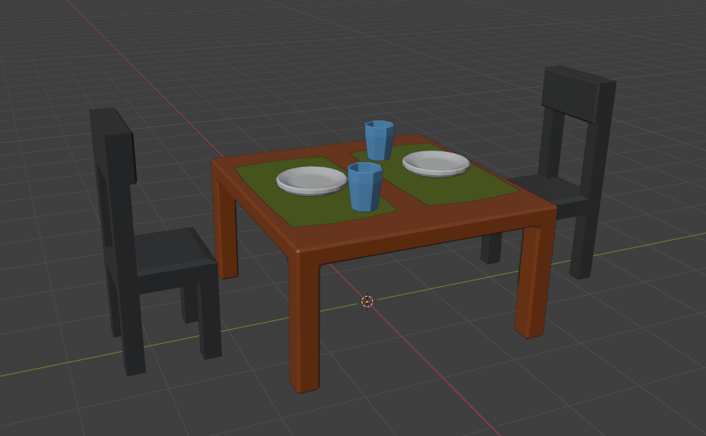
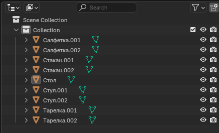

# Лабораторная 2.1

Создание простых моделей с применением Edit Mode. Моделирование стола, стула и посуды

## Требования

* Сделать стол, стул и посуду (тарелку, стакан, столовые приборы)
* Размеры моделируемых объектов должны быть близки к реальным
* Не менее 4-х уникальных объектов, сделанных с применением Edit Mode
* Все объекты должны быть названы (например "Стол" или "Table")
* Всем объектам необходимо назначить цвет объекта (Properties / Viewport Display / Color), не использовать материалы
* Нельзя использовать модификаторы, материалы и т.д.

## Пример работы

Готовая сцена:

Список объектов в сцене:

## Примечание

Данная работа может быть полностью скопирована с данного примера. При сдаче лабораторной работы преподаватель может попросить воспроизвести процесс создания моделей
