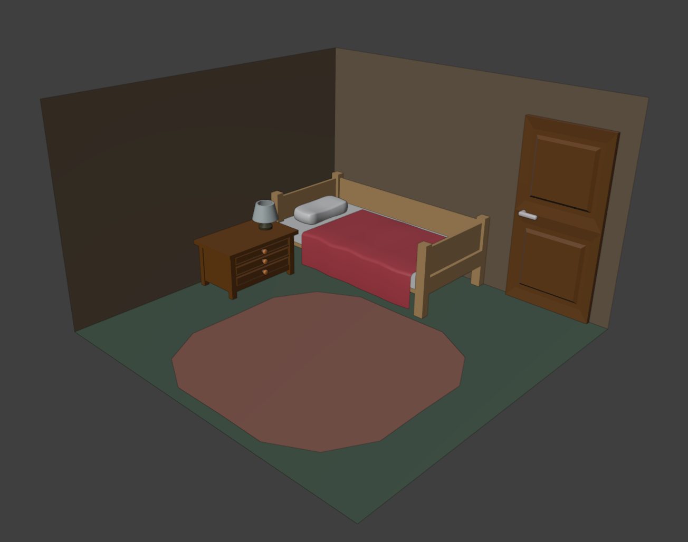
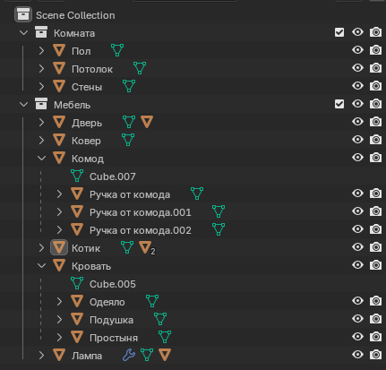

# Лабораторная 2.2

Создание простой комнаты с применением Edit Mode. Моделирование кровати и комода.

## Требования

* Сделать кровать, комод, лампу и дверь
* Кровать должна иметь одеяло, простыню и подушку
* У комода должны быть ящики (уметь открываться им не обязательно)
* Лампа должна стоять на комоде
* В комнате должна быть размещена дверь
* Размеры моделируемых объектов должны быть близки к реальным
* Для моделирования объектов использовать Edit Mode
* Все объекты должны быть названы (например "Кровать" или "Bed")
* Всем объектам неободимо назначить цвет объекта (Properties / Viewport Display / Color)
* Нельзя использовать модификаторы, материалы и т.д.
* ⚠️ Под кроватью **НУЖНО** спрятать пасхалку _(в примере спрятана)_ смоделированную при помощи Edit Mode
* Необходимо назначить родителей объектам, где это применимо (например у одеяла родитель - кровать)

## Пример работы

Готовая сцена:

Список объектов в сцене:

## Примечание

Данная работа может быть полностью скопировнна с данного примера. При сдаче лабораторной работы преподаватель может попросить воспроизвести процесс создания моделей.
