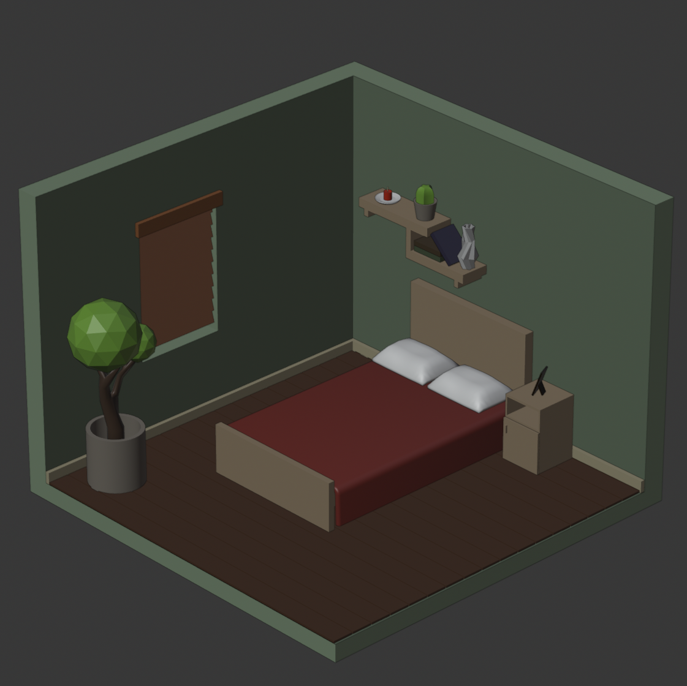
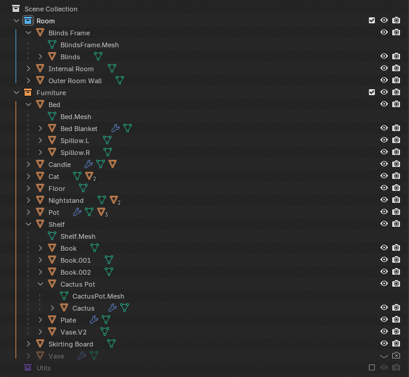

# Лабораторная 2.2

Создание простой комнаты с применением Edit Mode. Моделирование кровати, комода и окна.

## Требования

* Сделать кровать, комод, предмет на комоде (лампу, фоторамку), полку с предметами, горшок с растением и окно
* Кровать должна иметь одеяло и подушку
* У комода должны быть ящики (уметь открываться им не обязательно)
* Хотя бы один предмет должен стоять на комоде (лампа, фоторамка)
* Хотя бы два предмета должны лежать на полке
* В комнате должно быть размещено окно
* Размеры моделируемых объектов должны быть близки к реальным
* Для моделирования объектов использовать Edit Mode
* Все объекты должны быть названы (например "Кровать" или "Bed")
* Использовать настройки shading'а (Shade Flat / Smooth) там, где это необходимо + все нормали (в т.ч. ориентация граней) в сцене должны быть корректными
* Всем объектам необходимо назначить цвет объекта (Properties / Viewport Display / Color)
* Нельзя использовать модификаторы, материалы и т.д.
* ⚠️ Под кроватью **НУЖНО** спрятать пасхалку _(в примере спрятана)_ смоделированную при помощи Edit Mode
* Необходимо назначить родителей объектам, где это применимо (например у одеяла родитель - кровать)

## Пример работы

Готовая сцена:

Список объектов в сцене:

## Примечание

Данная работа может быть полностью скопирована с данного примера. При сдаче лабораторной работы преподаватель может попросить воспроизвести процесс создания моделей.
