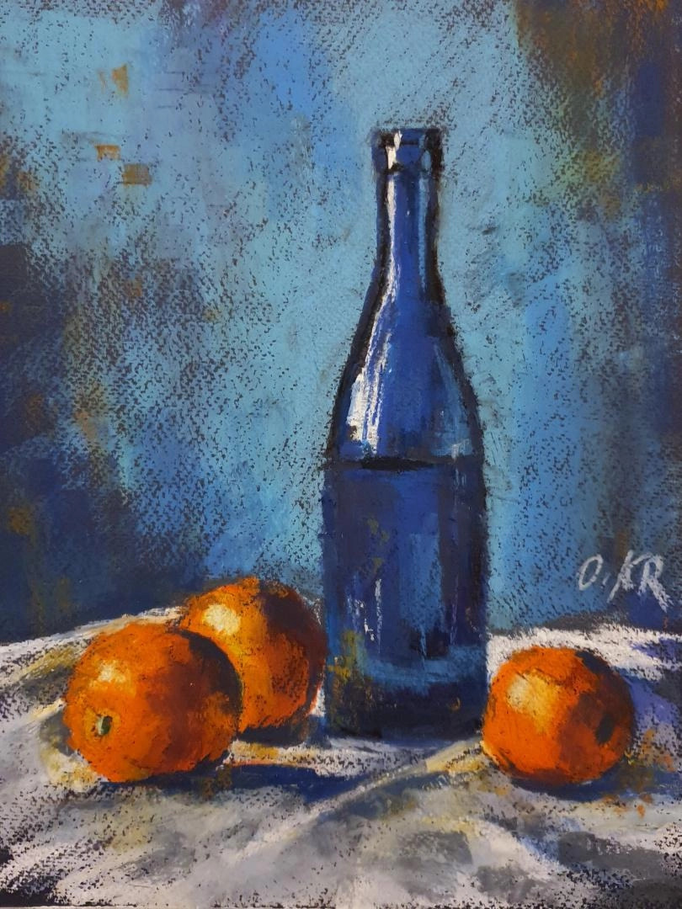
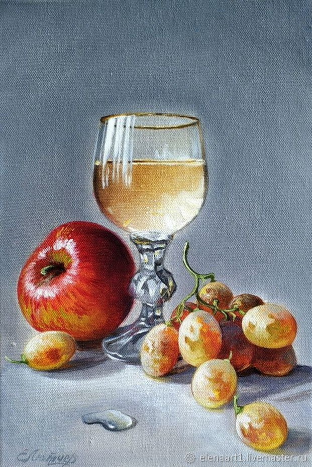
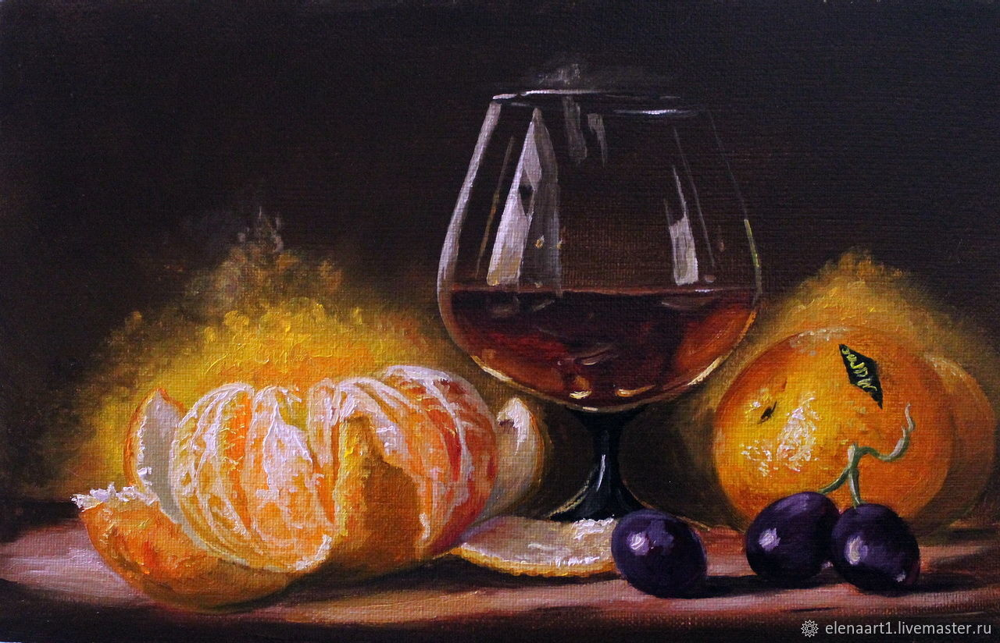

# Лабораторная 4.2

Моделирование натюрморта по референсу. Всего три варианта:

| #   | Референс                    |
| --- | --------------------------- |
| 1   |  |
| 1   |  |
| 1   |  |

Вариант выбирается по списку группы.

## Требования

* Наложить материалы на **все объекты**
* У всех объектов должна быть **правильная UV развертка** (без существенных искажений)
* Картинка должна быть смоделирована как можно точнее по референсу, не нужно пропускать никакие объекты
* Добавлять того, чего нет на референсе, нельзя
* У всех прозрачных объектов (стекло и жидкость) должны быть указаны правильные IOR
* Для всех материалов требуется корректно настроить все параметры (например Roughness, Metalic)
* Для всех материалов следует правильно подобрать шейдер (для стекла, фрукта/овоща, ткани)
* Модели должны быть гладкими (нельзя Lowpoly), используйте subdiv и smooth