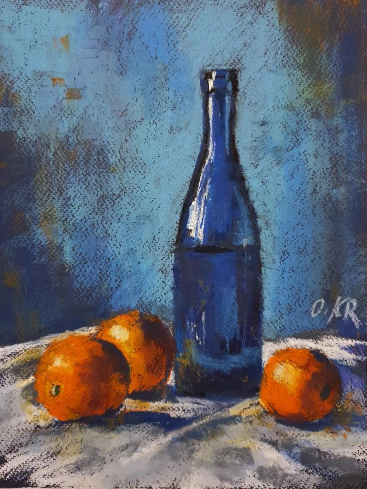
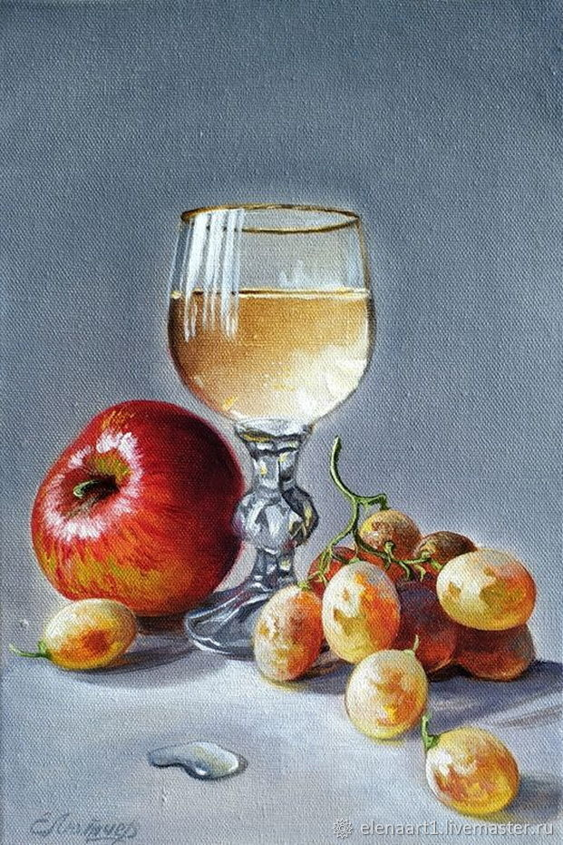
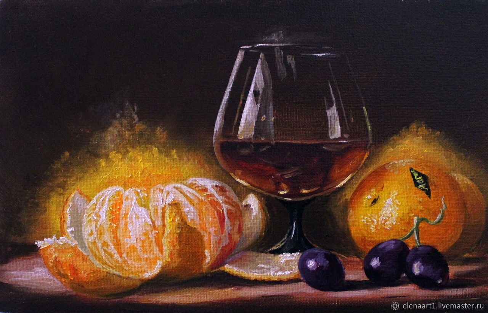

# Лабораторная 5

Моделирование натюрморта по референсу. Всего три варианта:

| #   | Референс                                             | Описание                    |
| --- | ---------------------------------------------------- | --------------------------- |
| 1   |          | Бутылка и апельсины         |
| 2   |     | Бокал, яблоко и виноград    |
| 3   |  | Бокал, мандарины и виноград |

Вариант выбирается по списку группы

## Требования

### Сцена

* Воссоздать сцену по референсу
* Сохранять композицию, пропорции и ракурс
* Нельзя добавлять или убирать объекты (строго по референсу)
* Осмысленные названия объектов
* Применён масштаб (`Ctrl + A -> Scale`)

### Модели

* Все объекты моделируются вручную c Edit Mode
* Чистая геометрия, без артефактов
* Использовать:
  * `Subdivision Surface`
  * `Shade Smooth`
* Без low-poly
* Стекло - с толщиной

### Материалы

Использовать Principled BSDF (или прочие шейдеры, основанные на нем)

Для всех материалов должны быть настроены (минимум):

* Base Color
* Roughness

Для стекла / жидкости:

* Transmission
* Корректный IOR (обязательно, он разный для стекла и жидкости)

Все материалы должны соответствовать референсу и быть максимально похожими на него

### Рендер

* Использовать Cycles или EEVEE
* Есть свет, тени, отражения
* Без пересвета и полной темноты
