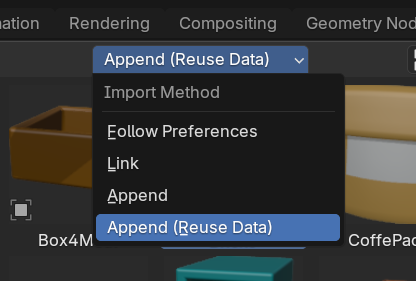

# Лабораторная 6

Работа групповая на два человека, но делается индивидуально (оценивается и сдается).

(часть 1 - 50%)

Сделать библиотеку ассетов из файла [лабораторной 5](lab5.md) - детской игровой площадки. Необходимо все объекты (кроме элементов окружения, например земли) пометить как ассеты. Убедитесь, что ассеты работают корректно и правильно размещаются. Полученной библиотекой нужно поделится с любым товарищем в группе.

(часть 2 - 50%)

Взять библиотеку ассетов ващего товарища и составить с ее помощью свою собственную игровую площадку. Разрешается добавлять объекты окружения (например землю), но не новые элементы площадки. Использовать референс не обязательно.

## Требования

* Для сдачи лабораторной работы требуется два файла - ваша библиотека ассетов и новая игровая площадка, построенная на базе ассетов ващего товарища
* Вы можете передать свою библиотеку ассетов не более чем 3-м людям
* **СРАЗУ ПРОВЕРЬТЕ** чтобы библиотека ассетов ващего товарища была сделана правильно без изъянов. В случае проблем - попросите ассеты у другого товарища (если это не нарушает его лимит в 3 человека)
* Ассеты допускается маштабировать для добавления рандомности (если требуется). Однако если все ассеты на сцене отмаштабированы из-за не правильных размеров - работа не будет принята
* Структура сцены должна быть **организована по коллекциям** (например: "Песочница", "Качели" и т.п.)
* Все объекты должны быть **логично размещены** в сцене
* **НЕОБХОДИМО** использовать Append (Reuse Data) копии
* Проверьте, чтобы у всех объектов были осмысленные имена
* У всех объектов должны быть материалы с текстурами (они должны подтянуться из библиотеки)
* У объектов в библиотеке origin (точка отсчета) должен быть размещен внизу объекта (у его основания)

---

Сдать можно часть 1 и часть 2 раздельно или только одну из частей.
