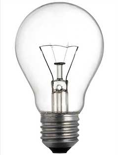
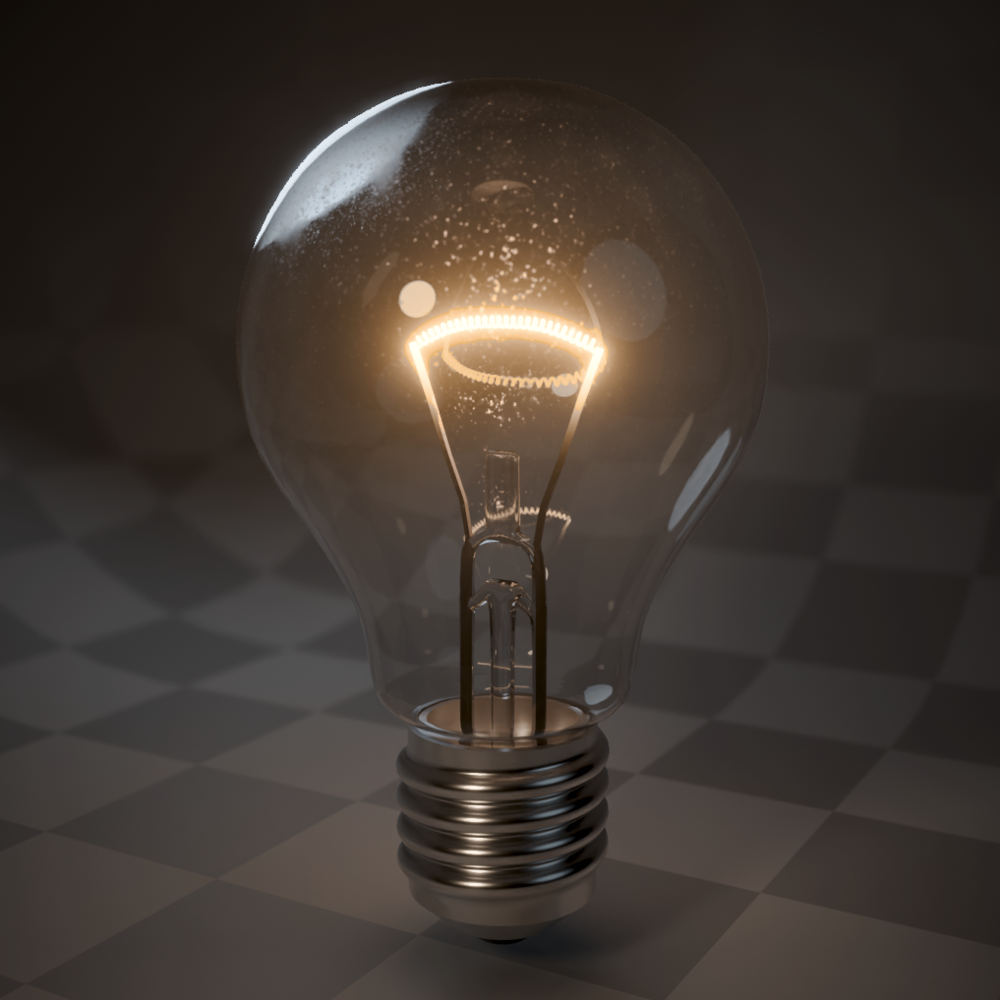

# Лабораторная 7.2

Создать реалистичную модель лампы накаливания и настроить композитинг.

Для моделирования необходимо воспользоваться референсом:

Референс полного размера [доступен тут](examples/ref_lab7-2.png).

Ожидаемый результат:

| Без Compositing           | С Compositing             |
| ------------------------- | ------------------------- |
|  |  |

[❓ Инструкция как сделать](lab7-2-how-to.md) (использовать не обязательно).

## Требования

* Сделать модель лампочки по референсу
* Референс обязательно добавить в Blender и моделировать по нему
* Использовать Cycles рендер
* Добавить окружение (например стены и пол)
* Стеклянная колба лампы должна иметь толщину
* На все объекты обязательно наложить материалы
* Для материала стекла необходимо добавить загрязнения (шум или картинка)
* Сделать 3 источника света (key, fill, rim) и отключить ambient light
* Использовать Compositing для настройки конечного результата
  * Нить накаливания должна светиться (Glare)
  * Сделать эффект [виньетирования](https://ru.wikipedia.org/wiki/Виньетирование)
  * Сделать цветокоррекцию (на свой вкус)
* Размеры лампочки должны быть реалистичными (ориентировочно: длина ~12 см, диаметр ~6 см)
* Электроды нити накаливания должны иметь плавный переход от металла к свечению
* Настроить камеру (ракурс и DoF)
* Результат рендера сохранить (с композитингом и без)
