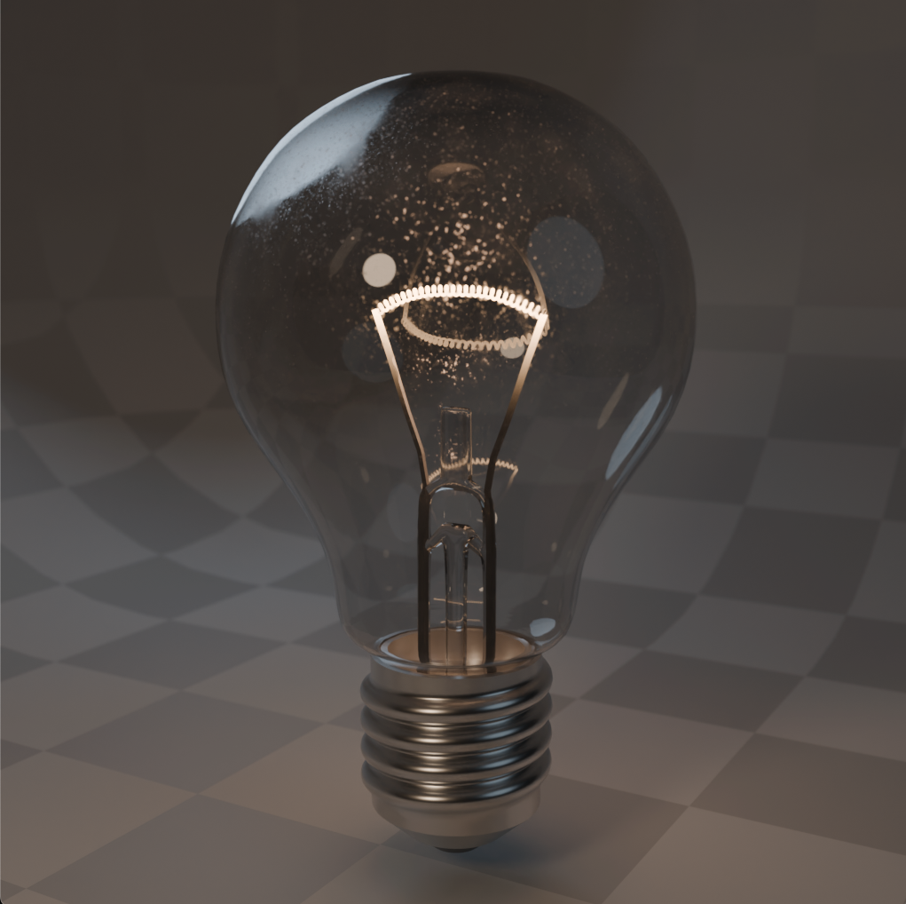

# Лабораторная 8

Композитинг лампочки

## Требования

Используя [предоставленную сцену (bright-old-lamp-work.blend)](examples/bright-old-lamp-work.blend) с моделькой лампочки реализовать необходимые материалы, настроить свет, сделать композитинг. Результатом должна быть работа и рендер, максимально приближенный к следующим примерам:

| Без Compositing                                   | С Compositing                                 |
| ------------------------------------------------- | --------------------------------------------- |
|  |  |

* Стекло лампочки должно быть прозрачным и иметь загрязнения
* Нить накаливания должна светиться и иметь Glare эффект
* Держатель нити накаливания должен иметь плавный переход (от не светящегося до раскаленного металла)
* У камеры должен быть настроен ракурс
* У камеры должна быть настроена глубина резкости (DoF), задний фон должен быть немного заблюрен (эффект боке)
* Использовать систему из 3-х источников света (key, fill, rim) и отключить ambient light
* В композитинге должно быть настроено виньетирование и цветокоррекция (отдельно фона и отдельно лампочки)
* Результат рендера сохранить (с композитингом и без)
